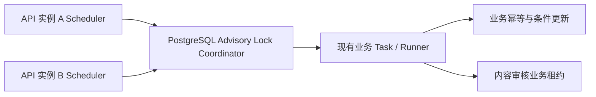

# 多实例自动任务架构

本文说明衣货通 API 进程内四类自动任务的最终运行架构。实现不单独部署 Worker，也不引入 Redis、消息队列或通用任务表；每个 API 实例都随进程启动 Scheduler，通过 PostgreSQL Advisory Lock 竞争同类任务的执行权。

完整系统架构见[项目技术架构](product/technical-architecture.md)，生产参数与排障步骤见[多实例自动任务部署与运维](deployment.md)。

## 运行时拓扑



[应用启动入口](../backend/app/app.go)为每个 API 进程创建同一套四个 Scheduler 和一个 `PostgresCoordinator`。Scheduler 启动后立即执行一轮，随后按各自 `Interval` 串行触发；同一进程中的慢任务不会跨周期重入。每一轮由[统一 Scheduler 运行时](../backend/app/internal/task/scheduler_runtime.go)调用 Coordinator，再进入已有 Task / Runner。

## 两层正确性保护

第一层是任务级 PostgreSQL 会话 Advisory Lock。Coordinator 从连接池取得专用 `*sql.Conn`，在同一数据库会话上执行 `pg_try_advisory_lock`、业务 Runner 和 `pg_advisory_unlock`。连接到同一应用数据库的 API 实例中，同类任务同一时刻最多有一个执行者；不同任务锁号不同，仍可并发。进程退出或数据库连接断开后，PostgreSQL 会释放会话锁，其他 API 实例在下一次触发时自动接管。Advisory Lock 不跨 PostgreSQL 数据库协调；若将同一应用拆到多个数据库，必须另行设计跨库协调。

第二层是业务幂等、条件更新与内容审核租约。Advisory Lock 只减少重复扫描和第三方调用，不是唯一正确性保障。数据库连接异常时锁可能先于业务函数释放，因此资源状态条件、消息唯一索引、支付状态条件和清理时间条件都必须保留。内容审核还使用 `audit_processing_by` 与 `audit_lease_until`，阻止租约过期的旧实例覆盖新实例结果。

## 稳定任务与模块职责

锁名和编号在[任务协调器](../backend/app/internal/task/coordinator.go)中固定。已发布编号只能追加，不能改号或复用。

| 模块 | 触发周期与超时 | 锁名 / 编号 | 业务幂等依据 | 失败恢复 | 关键日志事件 | 主要代码入口 |
|---|---|---|---|---|---|---|
| 资源生命周期 | `ResourceLifecycleInterval`，生产模板 `1h`；超时 `5m` | `resource_lifecycle` / `1001` | 只把 `published` 且已到期资源条件更新为 `expired`；生命周期消息唯一索引配合 `ON CONFLICT DO NOTHING` | 中断后下一周期重新扫描；已过期但缺消息的资源会被补查，重复运行不会重复建消息 | 通用 `task_skipped_lock_held`、`task_coordination_completed`、失败/超时事件；领域完成日志含 `expired`、`expiring` | [Scheduler](../backend/app/internal/task/resource_lifecycle_scheduler.go)、[Task](../backend/app/internal/task/resource_lifecycle_task.go)、[Model](../backend/app/internal/model/message_model.go) |
| 内容审核自动重试 | `ContentAuditRetryInterval`，生产模板 `1m`；批次超时 `10m`；每条租约 `2m`；每批 `20`，最多重试 `5` 次 | `content_audit_retry` / `1002` | `FOR UPDATE SKIP LOCKED` 领取；资源保持 `audit_retry`；后续写入必须同时匹配 `audit_processing_by` 且 `audit_lease_until > NOW()` | 实例崩溃后租约到期可重领；旧持有者得到 `ErrResourceAuditLeaseLost` 后丢弃结果；达到上限转 `manual_review` | 通用协调事件；领域事件 `content_audit_retry_manual_review`、`content_audit_retry_lease_lost`、`content_audit_retry_failed` | [Scheduler](../backend/app/internal/task/content_audit_retry_scheduler.go)、[Task](../backend/app/internal/task/content_audit_retry_task.go)、[ResourceModel](../backend/app/internal/model/resource_model.go)、[租约迁移](../backend/migrations/000035_resource_audit_retry_lease.up.sql) |
| 微信支付补偿 | `PaymentReconcileInterval`，生产模板 `1m`；超时 `5m`；查询延迟 `2m`；每批 `100` | `payment_reconciliation` / `1003` | 只扫描 pending 订单；到账沿用支付通知事务校验；关单按业务订单 ID、`out_trade_no`、`status = 'pending'` 条件更新，`sql.ErrNoRows` 视为状态已被其他路径推进 | 单笔微信查单/关单失败计入 `FailedCount` 并继续批次；整体数据库错误或超时由下一周期重扫 pending 订单 | 通用协调事件；领域完成日志含 `scanned`、`paid`、`closed`、`pending`、`failed` | [Scheduler](../backend/app/internal/task/payment_reconciliation_scheduler.go)、[Task](../backend/app/internal/task/payment_reconciliation_task.go)、[Model](../backend/app/internal/model/payment_reconciliation_model.go) |
| 商家地图行为清理 | `MerchantMapEventCleanupInterval`，生产模板 `24h`；超时 `10m`；保留 `90` 天 | `merchant_map_event_cleanup` / `1004` | 只执行 `DELETE ... WHERE created_at < cutoff`，重复执行不会删除保留窗口内数据 | SQL 失败，或数据库驱动响应超时 Context 并返回后，下一周期按同一时间条件重试 | 通用协调事件；有删除时领域完成日志含 `deleted` | [Scheduler](../backend/app/internal/task/merchant_map_event_cleanup_scheduler.go)、[Task](../backend/app/internal/task/merchant_map_event_cleanup_task.go)、[Model](../backend/app/internal/model/merchant_map_events_model.go) |

四个 Scheduler 共享以下真实结构化事件名：

- `task_skipped_lock_held`：锁已由另一实例持有，本轮正常跳过，不是失败。
- `task_coordination_completed`：持锁 Runner 成功完成。
- `task_coordination_runner_failed`：Runner 返回业务或依赖错误。
- `task_coordination_runner_context_done`：任务 Context 已取消或超过配置超时；结合 `error` 判断 `context deadline exceeded` 或取消。
- `task_coordination_unlock_failed`：显式解锁失败；协调器会丢弃锁状态未知的物理连接，防止带锁连接回池复用。
- `task_coordination_connection_error`、`task_coordination_lock_error`：申请专用连接或尝试加锁失败。

协调日志字段使用代码中的 snake_case：`event`、`task`、`lock_key`、`instance_id`、`duration_ms`。Coordinator 会直接把 Runner 或协调过程返回的 `error` 写入错误日志，不提供统一脱敏层；因此调用方、第三方适配器和错误构造必须禁止把 DSN、Token、密钥或完整第三方敏感载荷放入错误文本。实例标识由主机名和 PID 组成，格式为 `<hostname>:<pid>`，只用于日志与审核租约诊断，不替代 PostgreSQL 会话锁。

## 内容审核租约状态机

到期记录的领取条件为：

```text
status = 'audit_retry'
audit_retry_at <= NOW()
audit_lease_until IS NULL OR audit_lease_until <= NOW()
deleted_at IS NULL
```

领取 SQL 在同一语句中使用 `FOR UPDATE SKIP LOCKED`，增加 `audit_retry_count` 并写入当前实例与租约截止时间，且不会预先把资源改成 `pending`。审核通过、驳回、再次延期、转人工或成功创建异步图片审核任务时，都通过带租约 guard 的条件更新推进状态并清空租约。只有创建了新的异步图片任务后，资源才进入 `pending` 等待回调。

这套状态机确保三种异常都可恢复：任务锁连接断开后业务幂等仍有效；实例在领取后崩溃时记录仍保持 `audit_retry` 并可在租约到期后重领；旧实例晚到的第三方结果因租约 guard 不匹配而不能覆盖新一代结果。

## 启停边界

`Tasks.Enabled` 未配置时默认启用。`false` 只用于维护窗口或事故应急停用全部自动任务，不是多实例主从部署策略。所有健康 API 实例应使用相同的启用配置，让 Advisory Lock 负责选主和故障接管。

进程停止时取消 Scheduler 根 Context，并调用四个 Scheduler 的 `Wait()`，等待已开始的本轮实际返回；在此之前数据库连接池保持可用。配置超时通过 Context 发出协作式取消，只有 Runner、数据库驱动和第三方依赖正确响应 Context 时，任务才会在截止时间附近返回；忽略 Context 的调用可能继续占用专用连接。专用连接正常关闭或异常断开都会使 PostgreSQL 最终释放会话 Advisory Lock。
