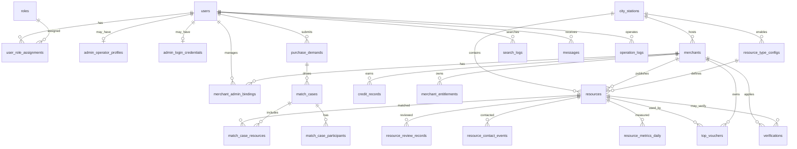

# 服装产业带资源撮合平台数据库设计与 ER 图

版本：v0.1  
日期：2026-06-27  
输入文档：

- `docs/product/apparel-industry-platform-prd.md`
- `docs/product/domain-model-ddd.md`

## 1. 设计目标

数据库设计围绕 DDD 领域模型展开，核心目标是：

- 以 `resources` 作为统一资源表，承载货源、库存、工厂产能、订单、招聘、出租、服务等资源类型。
- 通过 `resource_type_configs` 定义字段模板、有效期、审核规则和展示规则，避免为每种业务复制一套表。
- 稳定字段关系化，业务扩展字段 JSONB 化。
- 支持城市站扩展、商家认证、发布效果、权益核销、人工撮合、消息通知和操作审计。
- MVP 先保证核心闭环，复杂推荐、交易、合同、支付暂不建表。

默认数据库：PostgreSQL。  
主键类型：`uuid`。  
时间字段：`timestamptz`。  
扩展字段：`jsonb`。  
软删除：使用 `deleted_at`，不物理删除关键业务数据。

## 2. ER 总览



## 3. 核心建模策略

### 3.1 统一资源模型

所有可发布、可审核、可搜索、可联系、可过期、可统计效果的对象都进入 `resources` 表。

例如：

- 库存：`resource_type = inventory`
- 货源：`resource_type = goods`
- 工厂产能：`resource_type = factory`
- 订单需求：`resource_type = order`
- 招聘：`resource_type = job`
- 出租/转让：`resource_type = rental`
- 服务：`resource_type = service`

不同资源的差异字段进入 `resources.attributes JSONB`，字段规则由 `resource_type_configs.field_schema JSONB` 定义。

### 3.2 核心字段关系化

以下字段是平台通用能力依赖，必须关系化：

- `merchant_id`
- `city_station_id`
- `resource_type_config_id`
- `status`
- `title`
- `category`
- `price_text`
- `quantity_text`
- `published_at`
- `refreshed_at`
- `expires_at`
- `archived_at`

这些字段服务于搜索、列表、生命周期、统计和运营后台。

### 3.3 扩展字段 JSONB 化

服装产业字段变化快，不为每种业务增加独立列。

示例：

```json
{
  "season": "春款",
  "sizeRange": "90-140",
  "allowLiveSale": true,
  "allowSample": true,
  "packagePrice": "18元/件"
}
```

后续可以对高频字段增加表达式索引或冗余关系列。

## 4. 表结构设计

### 4.1 users

用户账号表。

| 字段 | 类型 | 约束 | 说明 |
|---|---|---|---|
| id | uuid | PK | 用户 ID |
| phone | varchar(32) | UNIQUE NULL | 手机号 |
| wechat_openid | varchar(128) | UNIQUE NULL | 微信 openid |
| nickname | varchar(64) | NULL | 昵称 |
| avatar_url | text | NULL | 头像 |
| default_city_station_id | uuid | FK -> city_stations.id NULL | 默认城市站 |
| status | varchar(32) | NOT NULL | active, disabled |
| last_login_at | timestamptz | NULL | 最近登录 |
| created_at | timestamptz | NOT NULL | 创建时间 |
| updated_at | timestamptz | NOT NULL | 更新时间 |
| deleted_at | timestamptz | NULL | 软删除 |

约束：

- `phone` 和 `wechat_openid` 至少一个非空。

索引：

- `idx_users_phone`
- `idx_users_wechat_openid`
- `idx_users_default_city`

### 4.2 roles

角色表。

| 字段 | 类型 | 约束 | 说明 |
|---|---|---|---|
| id | uuid | PK | 角色 ID |
| code | varchar(64) | UNIQUE NOT NULL | normal_user, merchant_admin, platform_operator, super_admin |
| name | varchar(64) | NOT NULL | 角色名称 |
| description | text | NULL | 描述 |
| permissions | jsonb | NOT NULL DEFAULT '[]' | 权限编码 |
| created_at | timestamptz | NOT NULL | 创建时间 |
| updated_at | timestamptz | NOT NULL | 更新时间 |

### 4.3 user_role_assignments

用户角色绑定表。

| 字段 | 类型 | 约束 | 说明 |
|---|---|---|---|
| id | uuid | PK | 绑定 ID |
| user_id | uuid | FK -> users.id NOT NULL | 用户 |
| role_id | uuid | FK -> roles.id NOT NULL | 角色 |
| city_station_id | uuid | FK -> city_stations.id NULL | 城市站权限范围 |
| merchant_id | uuid | FK -> merchants.id NULL | 商家权限范围 |
| created_at | timestamptz | NOT NULL | 创建时间 |

唯一约束：

- `uniq_user_role_scope(user_id, role_id, city_station_id, merchant_id)`

### 4.3.1 admin_operator_profiles

后台运营人员资料表。后台不单独建立一套用户主体，仍然关联 `users`。

| 字段 | 类型 | 约束 | 说明 |
|---|---|---|---|
| id | uuid | PK | 运营资料 ID |
| user_id | uuid | FK -> users.id UNIQUE NOT NULL | 用户 |
| real_name | varchar(64) | NOT NULL | 运营人员姓名 |
| managed_city_station_ids | jsonb | NOT NULL DEFAULT '[]' | 可管理城市站 |
| status | varchar(32) | NOT NULL | active, disabled |
| last_login_at | timestamptz | NULL | 最近后台登录 |
| created_at | timestamptz | NOT NULL | 创建时间 |
| updated_at | timestamptz | NOT NULL | 更新时间 |

### 4.3.2 admin_login_credentials

管理后台登录凭证表。小程序前期只做微信登录，后台使用账号/手机号 + 密码登录。

| 字段 | 类型 | 约束 | 说明 |
|---|---|---|---|
| id | uuid | PK | 凭证 ID |
| user_id | uuid | FK -> users.id UNIQUE NOT NULL | 用户 |
| login_name | varchar(64) | UNIQUE NOT NULL | 后台登录账号，可为手机号 |
| password_hash | text | NOT NULL | bcrypt 密码哈希 |
| status | varchar(32) | NOT NULL | enabled, disabled |
| failed_attempts | int | NOT NULL DEFAULT 0 | 连续失败次数 |
| locked_until | timestamptz | NULL | 临时锁定截止时间 |
| password_changed_at | timestamptz | NULL | 密码修改时间 |
| last_login_at | timestamptz | NULL | 最近登录时间 |
| created_by | uuid | FK -> users.id NULL | 创建人 |
| created_at | timestamptz | NOT NULL | 创建时间 |
| updated_at | timestamptz | NOT NULL | 更新时间 |

索引：

- `idx_admin_login_credentials_login_name`
- `idx_admin_login_credentials_status`

### 4.4 city_stations

城市站表。

| 字段 | 类型 | 约束 | 说明 |
|---|---|---|---|
| id | uuid | PK | 城市站 ID |
| code | varchar(64) | UNIQUE NOT NULL | zhili, guangzhou |
| name | varchar(64) | NOT NULL | 织里、广州 |
| province | varchar(64) | NULL | 省份 |
| city | varchar(64) | NULL | 城市 |
| primary_category | varchar(64) | NULL | 主品类 |
| status | varchar(32) | NOT NULL | planned, active, disabled |
| config | jsonb | NOT NULL DEFAULT '{}' | 城市站配置 |
| created_at | timestamptz | NOT NULL | 创建时间 |
| updated_at | timestamptz | NOT NULL | 更新时间 |

索引：

- `idx_city_stations_status`

### 4.5 merchants

商家主体表。

| 字段 | 类型 | 约束 | 说明 |
|---|---|---|---|
| id | uuid | PK | 商家 ID |
| city_station_id | uuid | FK -> city_stations.id NOT NULL | 所属主城市站 |
| name | varchar(128) | NOT NULL | 商家名称 |
| merchant_type | varchar(64) | NOT NULL | factory, stall, stockist, service_provider, buyer |
| main_categories | jsonb | NOT NULL DEFAULT '[]' | 主营品类 |
| description | text | NULL | 简介 |
| contact_name | varchar(64) | NOT NULL | 联系人 |
| contact_phone | varchar(32) | NOT NULL | 电话 |
| contact_wechat | varchar(64) | NULL | 微信 |
| address_text | varchar(255) | NULL | 地址 |
| location | jsonb | NOT NULL DEFAULT '{}' | 经纬度或定位信息 |
| images | jsonb | NOT NULL DEFAULT '[]' | 图片 |
| verification_status | varchar(32) | NOT NULL | unverified, pending, verified, rejected |
| status | varchar(32) | NOT NULL | active, suspended, disabled |
| last_active_at | timestamptz | NULL | 最近活跃 |
| created_at | timestamptz | NOT NULL | 创建时间 |
| updated_at | timestamptz | NOT NULL | 更新时间 |
| deleted_at | timestamptz | NULL | 软删除 |

索引：

- `idx_merchants_city_type(city_station_id, merchant_type)`
- `idx_merchants_verification_status`
- `idx_merchants_last_active_at`

### 4.6 merchant_admin_bindings

商家管理员绑定表。

| 字段 | 类型 | 约束 | 说明 |
|---|---|---|---|
| id | uuid | PK | 绑定 ID |
| merchant_id | uuid | FK -> merchants.id NOT NULL | 商家 |
| user_id | uuid | FK -> users.id NOT NULL | 用户 |
| role | varchar(32) | NOT NULL | owner, admin, operator_proxy |
| status | varchar(32) | NOT NULL | active, revoked |
| created_by | uuid | FK -> users.id NULL | 创建人 |
| created_at | timestamptz | NOT NULL | 创建时间 |
| revoked_at | timestamptz | NULL | 取消时间 |

唯一约束：

- `uniq_active_merchant_user(merchant_id, user_id)` where `status = 'active'`

### 4.7 resource_type_configs

资源类型配置表。

| 字段 | 类型 | 约束 | 说明 |
|---|---|---|---|
| id | uuid | PK | 配置 ID |
| city_station_id | uuid | FK -> city_stations.id NULL | 为空表示全局类型 |
| type_code | varchar(64) | NOT NULL | inventory, goods, factory, order, job, rental, service |
| type_name | varchar(64) | NOT NULL | 类型名称 |
| field_schema | jsonb | NOT NULL DEFAULT '{}' | 字段模板 |
| required_fields | jsonb | NOT NULL DEFAULT '[]' | 必填字段 |
| filter_fields | jsonb | NOT NULL DEFAULT '[]' | 筛选字段 |
| display_template | jsonb | NOT NULL DEFAULT '{}' | 列表和详情展示模板 |
| review_rules | jsonb | NOT NULL DEFAULT '{}' | 审核规则 |
| sort_weights | jsonb | NOT NULL DEFAULT '{}' | 排序权重 |
| message_rules | jsonb | NOT NULL DEFAULT '{}' | 消息规则 |
| default_valid_days | integer | NOT NULL | 默认有效天数 |
| status | varchar(32) | NOT NULL | active, disabled |
| created_at | timestamptz | NOT NULL | 创建时间 |
| updated_at | timestamptz | NOT NULL | 更新时间 |

唯一约束：

- `uniq_resource_type_scope(city_station_id, type_code)`

索引：

- `idx_resource_type_configs_type_code`
- `idx_resource_type_configs_status`

### 4.8 resources

统一资源表。

| 字段 | 类型 | 约束 | 说明 |
|---|---|---|---|
| id | uuid | PK | 资源 ID |
| merchant_id | uuid | FK -> merchants.id NOT NULL | 所属商家 |
| city_station_id | uuid | FK -> city_stations.id NOT NULL | 城市站 |
| resource_type_config_id | uuid | FK -> resource_type_configs.id NOT NULL | 资源类型配置 |
| type_code | varchar(64) | NOT NULL | 冗余类型编码，便于查询 |
| status | varchar(32) | NOT NULL | draft, pending, published, rejected, expired, dealt, taken_down, archived |
| title | varchar(128) | NOT NULL | 标题 |
| category | varchar(64) | NOT NULL | 品类 |
| district | varchar(128) | NULL | 区域 |
| price_text | varchar(128) | NULL | 价格描述 |
| quantity_text | varchar(128) | NULL | 数量/产能描述 |
| cover_url | text | NULL | 封面 |
| description | text | NOT NULL | 描述 |
| attributes | jsonb | NOT NULL DEFAULT '{}' | 扩展字段 |
| tags | jsonb | NOT NULL DEFAULT '[]' | 标签 |
| images | jsonb | NOT NULL DEFAULT '[]' | 图片 |
| contact_name | varchar(64) | NOT NULL | 联系人 |
| contact_phone | varchar(32) | NOT NULL | 电话 |
| contact_wechat | varchar(64) | NULL | 微信 |
| is_verified | boolean | NOT NULL DEFAULT false | 是否有认证背书 |
| published_at | timestamptz | NULL | 发布时间 |
| refreshed_at | timestamptz | NULL | 刷新时间 |
| expires_at | timestamptz | NULL | 过期时间 |
| dealt_at | timestamptz | NULL | 成交/强意向时间 |
| taken_down_at | timestamptz | NULL | 下架时间 |
| archived_at | timestamptz | NULL | 归档时间 |
| reject_reason | text | NULL | 驳回原因 |
| take_down_reason | text | NULL | 下架原因 |
| created_by | uuid | FK -> users.id NULL | 创建人 |
| created_at | timestamptz | NOT NULL | 创建时间 |
| updated_at | timestamptz | NOT NULL | 更新时间 |
| deleted_at | timestamptz | NULL | 软删除 |

索引：

- `idx_resources_city_type_status(city_station_id, type_code, status)`
- `idx_resources_merchant_status(merchant_id, status)`
- `idx_resources_category_status(category, status)`
- `idx_resources_refreshed_at(refreshed_at DESC)`
- `idx_resources_expires_at(expires_at)`
- `idx_resources_attributes_gin` using GIN on `attributes`
- `idx_resources_search_text` 可后续使用全文索引

### 4.9 resource_review_records

资源审核记录表。

| 字段 | 类型 | 约束 | 说明 |
|---|---|---|---|
| id | uuid | PK | 审核记录 ID |
| resource_id | uuid | FK -> resources.id NOT NULL | 资源 |
| reviewer_id | uuid | FK -> users.id NOT NULL | 审核人 |
| action | varchar(32) | NOT NULL | approve, reject, take_down |
| reason | text | NULL | 原因 |
| snapshot | jsonb | NOT NULL DEFAULT '{}' | 审核时资源快照 |
| created_at | timestamptz | NOT NULL | 创建时间 |

索引：

- `idx_resource_review_records_resource`
- `idx_resource_review_records_reviewer`

### 4.10 verifications

认证申请表。

| 字段 | 类型 | 约束 | 说明 |
|---|---|---|---|
| id | uuid | PK | 认证 ID |
| merchant_id | uuid | FK -> merchants.id NOT NULL | 商家 |
| resource_id | uuid | FK -> resources.id NULL | 可选资源认证 |
| verification_type | varchar(64) | NOT NULL | factory, stall, inventory, service_provider |
| status | varchar(32) | NOT NULL | pending, approved, rejected, revoked |
| applicant_user_id | uuid | FK -> users.id NOT NULL | 申请人 |
| business_name | varchar(128) | NULL | 主体名称 |
| license_url | text | NULL | 营业执照 |
| storefront_url | text | NULL | 门头或工厂照片 |
| materials | jsonb | NOT NULL DEFAULT '{}' | 其他材料 |
| review_note | text | NULL | 审核说明 |
| reviewed_by | uuid | FK -> users.id NULL | 审核人 |
| submitted_at | timestamptz | NOT NULL | 提交时间 |
| reviewed_at | timestamptz | NULL | 审核时间 |
| created_at | timestamptz | NOT NULL | 创建时间 |
| updated_at | timestamptz | NOT NULL | 更新时间 |

索引：

- `idx_verifications_merchant_status`
- `idx_verifications_resource`

### 4.11 credit_records

信用记录表。

| 字段 | 类型 | 约束 | 说明 |
|---|---|---|---|
| id | uuid | PK | 信用记录 ID |
| merchant_id | uuid | FK -> merchants.id NOT NULL | 商家 |
| resource_id | uuid | FK -> resources.id NULL | 相关资源 |
| source_type | varchar(64) | NOT NULL | verification, deal_feedback, complaint, platform_check |
| tag_code | varchar(64) | NOT NULL | verified_factory, recent_active, risk_flag |
| tag_label | varchar(64) | NOT NULL | 展示标签 |
| description | text | NULL | 说明 |
| visibility | varchar(32) | NOT NULL | public, internal |
| created_by | uuid | FK -> users.id NULL | 创建人 |
| created_at | timestamptz | NOT NULL | 创建时间 |
| revoked_at | timestamptz | NULL | 撤销时间 |

索引：

- `idx_credit_records_merchant_visibility`
- `idx_credit_records_tag_code`

### 4.12 purchase_demands

采购需求表。

| 字段 | 类型 | 约束 | 说明 |
|---|---|---|---|
| id | uuid | PK | 需求 ID |
| user_id | uuid | FK -> users.id NOT NULL | 发布用户 |
| city_station_id | uuid | FK -> city_stations.id NULL | 城市站 |
| demand_type | varchar(64) | NOT NULL | goods, factory, inventory, service |
| status | varchar(32) | NOT NULL | pending, reviewed, matching, matched, expired, closed |
| title | varchar(128) | NOT NULL | 需求标题 |
| category | varchar(64) | NOT NULL | 品类 |
| price_range | jsonb | NOT NULL DEFAULT '{}' | 价格区间 |
| quantity_requirement | jsonb | NOT NULL DEFAULT '{}' | 数量/产能要求 |
| attributes | jsonb | NOT NULL DEFAULT '{}' | 尺码、季节、风格等 |
| contact_name | varchar(64) | NOT NULL | 联系人 |
| contact_phone | varchar(32) | NOT NULL | 电话 |
| contact_wechat | varchar(64) | NULL | 微信 |
| expires_at | timestamptz | NULL | 过期时间 |
| created_at | timestamptz | NOT NULL | 创建时间 |
| updated_at | timestamptz | NOT NULL | 更新时间 |

索引：

- `idx_purchase_demands_city_type_status`
- `idx_purchase_demands_user_status`
- `idx_purchase_demands_attributes_gin`

### 4.13 search_logs

搜索记录表。

| 字段 | 类型 | 约束 | 说明 |
|---|---|---|---|
| id | uuid | PK | 搜索记录 ID |
| user_id | uuid | FK -> users.id NULL | 用户 |
| city_station_id | uuid | FK -> city_stations.id NULL | 城市站 |
| keyword | varchar(128) | NOT NULL | 搜索词 |
| filters | jsonb | NOT NULL DEFAULT '{}' | 筛选条件 |
| result_count | integer | NOT NULL DEFAULT 0 | 结果数量 |
| clicked_resource_id | uuid | FK -> resources.id NULL | 点击资源 |
| generated_demand_id | uuid | FK -> purchase_demands.id NULL | 转化需求 |
| created_at | timestamptz | NOT NULL | 搜索时间 |

索引：

- `idx_search_logs_keyword`
- `idx_search_logs_city_created`
- `idx_search_logs_result_count`

### 4.14 match_cases

撮合记录表。

| 字段 | 类型 | 约束 | 说明 |
|---|---|---|---|
| id | uuid | PK | 撮合 ID |
| purchase_demand_id | uuid | FK -> purchase_demands.id NULL | 关联需求 |
| city_station_id | uuid | FK -> city_stations.id NULL | 城市站 |
| status | varchar(32) | NOT NULL | open, contacted, succeeded, failed, closed |
| source | varchar(32) | NOT NULL | manual, system |
| operator_id | uuid | FK -> users.id NULL | 运营人员 |
| result_note | text | NULL | 结果说明 |
| created_at | timestamptz | NOT NULL | 创建时间 |
| updated_at | timestamptz | NOT NULL | 更新时间 |
| closed_at | timestamptz | NULL | 关闭时间 |

索引：

- `idx_match_cases_demand`
- `idx_match_cases_operator_status`

### 4.15 match_case_resources

撮合资源关联表。

| 字段 | 类型 | 约束 | 说明 |
|---|---|---|---|
| id | uuid | PK | ID |
| match_case_id | uuid | FK -> match_cases.id NOT NULL | 撮合 |
| resource_id | uuid | FK -> resources.id NOT NULL | 资源 |
| role | varchar(32) | NOT NULL | supply, demand |
| created_at | timestamptz | NOT NULL | 创建时间 |

唯一约束：

- `uniq_match_case_resource(match_case_id, resource_id)`

### 4.16 match_case_participants

撮合参与方表。

| 字段 | 类型 | 约束 | 说明 |
|---|---|---|---|
| id | uuid | PK | ID |
| match_case_id | uuid | FK -> match_cases.id NOT NULL | 撮合 |
| user_id | uuid | FK -> users.id NULL | 用户 |
| merchant_id | uuid | FK -> merchants.id NULL | 商家 |
| participant_role | varchar(32) | NOT NULL | buyer, supplier, operator |
| contact_status | varchar(32) | NOT NULL | pending, contacted, no_response, interested |
| created_at | timestamptz | NOT NULL | 创建时间 |
| updated_at | timestamptz | NOT NULL | 更新时间 |

约束：

- `user_id` 和 `merchant_id` 至少一个非空。

### 4.17 merchant_entitlements

商家权益表。

| 字段 | 类型 | 约束 | 说明 |
|---|---|---|---|
| id | uuid | PK | 权益 ID |
| merchant_id | uuid | FK -> merchants.id NOT NULL | 商家 |
| entitlement_type | varchar(64) | NOT NULL | posting_quota, refresh_quota, top_voucher, profile, data, matching |
| source_type | varchar(64) | NOT NULL | verification_gift, membership_plan, operator_grant, purchase |
| total_amount | integer | NOT NULL | 总额度 |
| used_amount | integer | NOT NULL DEFAULT 0 | 已使用 |
| remaining_amount | integer | NOT NULL | 剩余 |
| starts_at | timestamptz | NOT NULL | 生效时间 |
| expires_at | timestamptz | NULL | 过期时间 |
| status | varchar(32) | NOT NULL | active, expired, revoked |
| created_at | timestamptz | NOT NULL | 创建时间 |
| updated_at | timestamptz | NOT NULL | 更新时间 |

索引：

- `idx_merchant_entitlements_merchant_type_status`
- `idx_merchant_entitlements_expires_at`

### 4.18 top_vouchers

置顶券表。

| 字段 | 类型 | 约束 | 说明 |
|---|---|---|---|
| id | uuid | PK | 券 ID |
| merchant_id | uuid | FK -> merchants.id NOT NULL | 商家 |
| entitlement_id | uuid | FK -> merchant_entitlements.id NULL | 来源权益 |
| source_type | varchar(64) | NOT NULL | verification_gift, membership_plan, operator_grant, purchase |
| allowed_type_codes | jsonb | NOT NULL DEFAULT '[]' | 可用资源类型 |
| top_duration_hours | integer | NOT NULL | 置顶时长 |
| used_resource_id | uuid | FK -> resources.id NULL | 使用资源 |
| used_at | timestamptz | NULL | 使用时间 |
| expires_at | timestamptz | NULL | 过期时间 |
| status | varchar(32) | NOT NULL | unused, used, expired, voided |
| created_at | timestamptz | NOT NULL | 创建时间 |

索引：

- `idx_top_vouchers_merchant_status`
- `idx_top_vouchers_used_resource`

### 4.19 resource_contact_events

资源联系事件表。

| 字段 | 类型 | 约束 | 说明 |
|---|---|---|---|
| id | uuid | PK | 联系事件 ID |
| resource_id | uuid | FK -> resources.id NOT NULL | 资源 |
| user_id | uuid | FK -> users.id NULL | 联系用户 |
| merchant_id | uuid | FK -> merchants.id NOT NULL | 资源商家 |
| action | varchar(32) | NOT NULL | phone, wechat, merchant_profile, share |
| created_at | timestamptz | NOT NULL | 创建时间 |

索引：

- `idx_resource_contact_events_resource_action`
- `idx_resource_contact_events_merchant_created`

### 4.20 resource_metrics_daily

资源每日效果统计表。

| 字段 | 类型 | 约束 | 说明 |
|---|---|---|---|
| id | uuid | PK | 统计 ID |
| resource_id | uuid | FK -> resources.id NOT NULL | 资源 |
| merchant_id | uuid | FK -> merchants.id NOT NULL | 商家 |
| stat_date | date | NOT NULL | 日期 |
| exposure_count | integer | NOT NULL DEFAULT 0 | 曝光 |
| search_exposure_count | integer | NOT NULL DEFAULT 0 | 搜索曝光 |
| list_exposure_count | integer | NOT NULL DEFAULT 0 | 列表曝光 |
| detail_view_count | integer | NOT NULL DEFAULT 0 | 详情浏览 |
| contact_click_count | integer | NOT NULL DEFAULT 0 | 联系点击 |
| phone_click_count | integer | NOT NULL DEFAULT 0 | 电话点击 |
| wechat_copy_count | integer | NOT NULL DEFAULT 0 | 微信复制 |
| favorite_count | integer | NOT NULL DEFAULT 0 | 收藏 |
| share_count | integer | NOT NULL DEFAULT 0 | 分享 |
| deal_feedback_count | integer | NOT NULL DEFAULT 0 | 成交反馈 |
| created_at | timestamptz | NOT NULL | 创建时间 |
| updated_at | timestamptz | NOT NULL | 更新时间 |

唯一约束：

- `uniq_resource_metric_daily(resource_id, stat_date)`

索引：

- `idx_resource_metrics_daily_merchant_date`

### 4.21 messages

消息表。

| 字段 | 类型 | 约束 | 说明 |
|---|---|---|---|
| id | uuid | PK | 消息 ID |
| recipient_user_id | uuid | FK -> users.id NULL | 接收用户 |
| recipient_role_code | varchar(64) | NULL | 后台角色接收 |
| message_type | varchar(64) | NOT NULL | review, lifecycle, interaction, matching, system |
| trigger_type | varchar(64) | NOT NULL | resource, merchant, verification, match, entitlement |
| trigger_id | uuid | NULL | 触发对象 ID |
| title | varchar(128) | NOT NULL | 标题 |
| content | text | NOT NULL | 内容 |
| target_url | text | NULL | 跳转目标 |
| channel | varchar(32) | NOT NULL | in_app, wechat_service, sms, admin |
| status | varchar(32) | NOT NULL | pending, sent, read, suppressed, failed |
| read_at | timestamptz | NULL | 阅读时间 |
| created_at | timestamptz | NOT NULL | 创建时间 |
| sent_at | timestamptz | NULL | 发送时间 |

索引：

- `idx_messages_recipient_status`
- `idx_messages_trigger`

### 4.22 operation_logs

操作日志表。

| 字段 | 类型 | 约束 | 说明 |
|---|---|---|---|
| id | uuid | PK | 日志 ID |
| operator_id | uuid | FK -> users.id NOT NULL | 操作人 |
| operator_role | varchar(64) | NOT NULL | 操作角色 |
| object_type | varchar(64) | NOT NULL | resource, merchant, credit, entitlement |
| object_id | uuid | NOT NULL | 对象 ID |
| action | varchar(64) | NOT NULL | approve, reject, take_down, grant, revoke |
| before_snapshot | jsonb | NOT NULL DEFAULT '{}' | 操作前 |
| after_snapshot | jsonb | NOT NULL DEFAULT '{}' | 操作后 |
| reason | text | NULL | 原因 |
| created_at | timestamptz | NOT NULL | 创建时间 |

索引：

- `idx_operation_logs_object`
- `idx_operation_logs_operator`
- `idx_operation_logs_created_at`

## 5. 状态枚举

### 5.1 resources.status

- `draft`
- `pending`
- `published`
- `rejected`
- `expired`
- `dealt`
- `taken_down`
- `archived`

### 5.2 merchants.status

- `active`
- `suspended`
- `disabled`

### 5.3 verification_status

- `unverified`
- `pending`
- `verified`
- `rejected`

### 5.4 top_vouchers.status

- `unused`
- `used`
- `expired`
- `voided`

## 6. 扩展字段设计

### 6.1 resource_type_configs.field_schema

示例：库存资源字段模板。

```json
{
  "fields": [
    { "key": "season", "label": "季节", "type": "select", "options": ["春款", "夏款", "秋款", "冬款"] },
    { "key": "sizeRange", "label": "尺码段", "type": "text" },
    { "key": "allowLiveSale", "label": "是否支持直播", "type": "boolean" },
    { "key": "allowSample", "label": "是否支持拿样", "type": "boolean" }
  ]
}
```

### 6.2 resources.attributes

示例：库存资源扩展字段。

```json
{
  "season": "春款",
  "sizeRange": "90-140",
  "allowLiveSale": true,
  "allowSample": true,
  "packagePrice": "18元/件"
}
```

### 6.3 city_stations.config

示例：城市站配置。

```json
{
  "enabledTypeCodes": ["inventory", "goods", "factory", "order", "job", "rental", "service"],
  "primaryCategories": ["童装", "加工厂", "库存尾货"],
  "hotSearchKeywords": ["女童卫衣库存", "小单快反工厂"]
}
```

## 7. 关键关系说明

### 7.1 商家与资源

- 一个商家可以发布多条资源。
- 一条资源只归属一个商家。
- 资源联系数据汇总到商家发布效果。

### 7.2 城市站与资源

- 一个城市站包含多条资源。
- 一条资源归属一个城市站。
- 跨城搜索通过 city_station_id 过滤或放开。

### 7.3 资源类型配置与资源

- 一条资源必须绑定一个资源类型配置。
- 资源类型配置决定字段校验、展示、有效期和审核规则。
- 资源表不因新增业务类型新增表。

### 7.4 权益与资源

- 商家权益归属商家。
- 置顶券只能用于该商家的已发布资源。
- 权益使用需要写入操作日志或权益流水。

### 7.5 搜索与采购需求

- 搜索记录可转化为采购需求。
- 搜索无结果词进入运营补货清单。
- 采购需求可进入人工撮合。

## 8. 索引与性能建议

MVP 重点索引：

- `resources(city_station_id, type_code, status)`
- `resources(merchant_id, status)`
- `resources(refreshed_at DESC)`
- `resources(expires_at)`
- `resources USING GIN(attributes)`
- `purchase_demands(city_station_id, demand_type, status)`
- `resource_metrics_daily(merchant_id, stat_date)`
- `resource_contact_events(resource_id, action)`
- `messages(recipient_user_id, status)`

后续可增强：

- PostgreSQL full-text search for resources title and description.
- trigram index for fuzzy keyword search.
- dedicated search engine when cross-city search volume grows.

## 9. MVP 建表范围

MVP 必建：

- users
- roles
- user_role_assignments
- city_stations
- merchants
- merchant_admin_bindings
- resource_type_configs
- resources
- resource_review_records
- verifications
- credit_records
- purchase_demands
- search_logs
- match_cases
- match_case_resources
- match_case_participants
- merchant_entitlements
- top_vouchers
- resource_contact_events
- resource_metrics_daily
- messages
- operation_logs

MVP 暂不建：

- 在线支付订单表
- 担保交易表
- 合同表
- 物流履约表
- 即时聊天消息表
- 发票表

## 10. 待确认问题

1. 是否需要在 MVP 支持一个商家绑定多个城市站。
2. `resources.attributes` 中哪些字段需要在织里站首版加表达式索引。
3. 搜索是否先用 PostgreSQL 全文检索，还是直接接入搜索服务。
4. 认证年费和会员套餐是否需要立即设计支付订单表。
5. 电话和微信是否需要脱敏展示或联系前授权。
6. 资源图片是否只存 URL，还是需要单独 asset 表管理。
