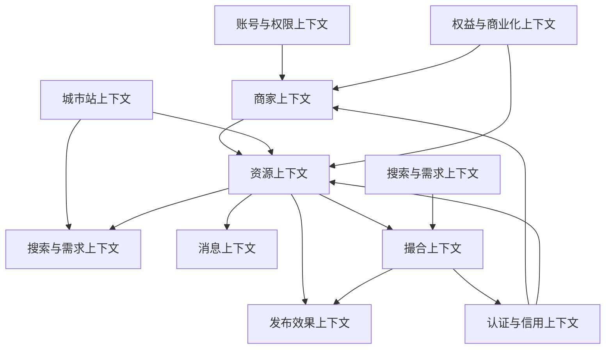

# 服装产业带资源撮合平台 DDD 领域模型设计

版本：v0.1  
日期：2026-06-27  
输入文档：`docs/product/apparel-industry-platform-prd.md`

## 1. 设计目标

本设计用于把产品规划转换为领域模型。目标不是按页面或功能拆系统，而是按服装产业资源撮合的领域对象、业务规则和上下文边界建模。

核心原则：

- 围绕领域对象设计平台，而不是围绕功能页面设计平台。
- 资源是平台核心抽象，货源、库存、工厂、订单、招聘、出租、服务都是资源类型。
- 新业务优先通过资源类型配置扩展，而不是新增独立系统。
- 发布、审核、搜索、联系、生命周期、消息、效果数据、信用和撮合是公共能力。
- MVP 保持模型完整但实现克制，复杂策略可由运营人工替代。

## 2. 统一语言

| 术语 | 定义 |
|---|---|
| 用户 | 使用平台的自然人账号，可以浏览、搜索、联系、提交需求或管理商家。 |
| 商家 | 工厂、档口、库存商、服务商、采购商等经营主体。 |
| 商家管理员 | 代表商家维护主页、发布资源、查看效果数据的用户。 |
| 资源 | 可被搜索、展示、联系和撮合的供给或需求，是平台核心业务对象。 |
| 资源类型 | 资源的业务分类，如库存、货源、工厂产能、订单、招聘、出租、服务。 |
| 资源类型配置 | 定义某类资源的字段、有效期、审核规则、展示模板、排序权重等。 |
| 采购需求 | 买家、主播、电商卖家、订单方提交的明确找货、找厂或找服务需求。 |
| 城市站 | 织里、广州、虎门、杭州等产业带运营单元。 |
| 认证 | 平台对商家、库存、服务能力等真实性进行核验。 |
| 信用记录 | 认证、成交反馈、投诉、平台核实等事实形成的信用依据。 |
| 联系行为 | 电话点击、微信复制、进入商家主页、分享等用户联系动作。 |
| 撮合 | 平台将需求方和供给方进行对接的过程，可人工或系统推荐。 |
| 发布效果 | 资源发布后的曝光、浏览、联系、收藏、分享、成交反馈等数据。 |
| 权益 | 商家因认证、会员、运营赠送或购买获得的发布额度、刷新次数、置顶券等。 |
| 置顶券 | 可让指定资源获得一定时长置顶展示的权益凭证。 |

## 3. 限界上下文

### 3.1 资源上下文

职责：

- 管理资源、资源类型配置和资源生命周期。
- 支持不同资源类型复用发布、审核、搜索、联系、过期、归档能力。
- 保证资源状态流转合法。

核心对象：

- Resource
- ResourceTypeConfig
- ResourceLifecycle
- ResourceAttribute
- ResourceStatus

不负责：

- 商家认证真实性判断。
- 搜索排序实现细节。
- 商家权益扣减规则。

### 3.2 商家上下文

职责：

- 管理商家主体、商家主页、商家管理员绑定。
- 沉淀商家发布记录、认证状态、信用标签和基础资料。

核心对象：

- Merchant
- MerchantProfile
- MerchantAdminBinding
- MerchantType

不负责：

- 资源审核。
- 权益发放。
- 发布效果统计。

### 3.3 账号与权限上下文

职责：

- 管理用户、角色、权限、商家绑定和敏感操作日志。
- 控制普通用户、商家管理员、平台运营、超级管理员的边界。

核心对象：

- User
- Role
- Permission
- OperatorScope
- OperationLog

不负责：

- 业务规则判断，如资源是否可发布。
- 商家是否真实可信。

### 3.4 认证与信用上下文

职责：

- 处理商家、库存、服务商等认证。
- 维护信用记录和对外展示的信用标签。
- 接收成交反馈、投诉、平台核实事件。

核心对象：

- Verification
- CreditRecord
- CreditTag
- Complaint
- RiskFlag

不负责：

- 复杂信用分。
- 担保交易。

### 3.5 搜索与需求上下文

职责：

- 管理搜索记录、采购需求和搜索无结果兜底。
- 将需求数据反向反馈给供给增长和运营。

核心对象：

- SearchQuery
- SearchResult
- PurchaseDemand
- DemandProfile
- NoResultSearch

不负责：

- 搜索引擎底层实现。
- 资源生命周期状态变更。

### 3.6 撮合上下文

职责：

- 记录平台人工或系统推荐产生的供需对接。
- 管理撮合进度、结果和成交反馈。

核心对象：

- MatchCase
- MatchParticipant
- MatchStatus
- MatchResult

不负责：

- 在线交易。
- 合同、支付、履约。

### 3.7 权益与商业化上下文

职责：

- 管理认证商家权益、发布额度、刷新次数、置顶券、会员套餐。
- 控制权益发放、使用、过期和核销。

核心对象：

- MerchantEntitlement
- PostingQuota
- RefreshQuota
- TopVoucher
- MembershipPlan
- EntitlementLedger

不负责：

- 支付实现。
- 发票和复杂财务结算。

### 3.8 消息上下文

职责：

- 管理审核、过期、认证、撮合、发布效果反馈等消息。
- 控制站内消息、微信服务通知、短信和后台提醒。

核心对象：

- Message
- MessageTemplate
- MessageChannel
- NotificationPolicy

不负责：

- 营销群发。
- 复杂推荐通知。

### 3.9 发布效果上下文

职责：

- 统计资源曝光、详情浏览、电话点击、微信复制、收藏、分享、成交反馈。
- 向商家和运营展示发布效果。

核心对象：

- ResourceMetric
- MerchantMetricSummary
- EffectInsight
- MetricDefinition

不负责：

- 虚假效果包装。
- 真实成交金额统计。

### 3.10 城市站上下文

职责：

- 管理城市站、产业带、品类、资源类型启用和运营配置。
- 支持织里、广州等站点差异化运营，但复用统一领域模型。

核心对象：

- CityStation
- IndustryCluster
- CategoryConfig
- StationResourceTypeConfig

不负责：

- 为每个城市复制独立系统。

## 4. 上下文关系



关系说明：

- 资源上下文是业务核心，其他上下文围绕资源产生认证、搜索、联系、撮合、效果数据和权益消耗。
- 商家上下文提供资源归属和信任承载。
- 城市站上下文提供本地化配置，不复制业务系统。
- 认证与信用上下文通过事实记录影响资源展示和商家信任。
- 权益与商业化上下文通过额度和券影响发布、刷新、置顶，但不能绕过审核。

## 5. 聚合设计

### 5.1 Resource 聚合

聚合根：Resource

职责：

- 管理单条资源的核心字段、状态、生命周期和归属关系。
- 执行发布、审核、刷新、过期、成交、下架、归档等状态变化。

实体和值对象：

- ResourceId
- ResourceType
- MerchantId
- CityStationId
- ResourceStatus
- ResourceAttributes
- ContactInfo
- ResourceValidity
- ReviewRecord

核心不变量：

- 资源必须归属一个商家。
- 资源必须有资源类型。
- 资源字段必须满足资源类型配置的必填规则。
- 待审核资源不能进入前台搜索和列表。
- 已过期、已下架、已归档资源默认不进入搜索和列表。
- 关键字段变更后必须重新审核。
- 置顶不能改变审核状态，也不能让违规资源展示。

核心行为：

- createDraft()
- submitForReview()
- approve()
- reject(reason)
- publish()
- refresh()
- expire()
- markDealFeedback()
- takeDown(reason)
- archive()
- updateAttributes()

领域事件：

- ResourceSubmitted
- ResourceApproved
- ResourceRejected
- ResourcePublished
- ResourceRefreshed
- ResourceExpiringSoon
- ResourceExpired
- ResourceDealMarked
- ResourceTakenDown
- ResourceArchived

### 5.2 ResourceTypeConfig 聚合

聚合根：ResourceTypeConfig

职责：

- 定义某类资源的字段、展示、审核、有效期和运营规则。
- 支持新业务通过配置扩展。

核心不变量：

- 类型编码全局唯一。
- 启用中的资源类型必须有字段模板和默认有效期。
- 必填字段必须存在于字段模板中。
- 资源类型停用后，不影响历史资源归档和查看。

核心行为：

- createType()
- updateFieldTemplate()
- updateReviewRules()
- updateValidityRule()
- enable()
- disable()

领域事件：

- ResourceTypeCreated
- ResourceTypeConfigChanged
- ResourceTypeEnabled
- ResourceTypeDisabled

### 5.3 Merchant 聚合

聚合根：Merchant

职责：

- 管理商家主体、主页资料、管理员绑定和公开展示信息。
- 承载资源归属和长期信用资产。

实体和值对象：

- MerchantId
- MerchantProfile
- MerchantType
- MerchantContact
- MerchantAdminBinding
- MerchantStatus

核心不变量：

- 商家必须有主管理员或运营代管标记。
- 已认证商家的认证标签只能由认证与信用上下文授予。
- 商家主页公开前必须有名称、类型、城市站和联系方式。
- 被封禁商家不能发布新资源。

领域事件：

- MerchantCreated
- MerchantProfileUpdated
- MerchantAdminBound
- MerchantVerified
- MerchantSuspended

### 5.4 Verification 聚合

聚合根：Verification

职责：

- 管理认证申请、审核材料、审核结果。

核心不变量：

- 认证必须绑定商家或资源。
- 审核通过后生成事实信用记录。
- 审核驳回必须有原因。

领域事件：

- VerificationSubmitted
- VerificationApproved
- VerificationRejected
- CreditRecordCreated

### 5.5 PurchaseDemand 聚合

聚合根：PurchaseDemand

职责：

- 管理买家提交的找货、找厂、找库存、找服务需求。
- 承接搜索无结果后的采购需求处理。

核心不变量：

- 采购需求必须有需求类型、城市或产业带、品类和联系方式。
- 过期需求不进入待处理列表。
- 需求方联系方式不直接暴露给商家，除非运营确认或用户主动联系。

领域事件：

- PurchaseDemandSubmitted
- PurchaseDemandReviewed
- PurchaseDemandMatched
- PurchaseDemandExpired

### 5.6 MatchCase 聚合

聚合根：MatchCase

职责：

- 管理一次供需撮合的参与方、资源、需求、进度和结果。

核心不变量：

- 撮合必须至少有一个需求方和一个供给方。
- 撮合结果不能直接等同于成交，成交需要反馈确认。
- 撮合记录必须保留运营人员或系统来源。

领域事件：

- MatchCaseCreated
- MatchParticipantAdded
- MatchCaseContacted
- MatchCaseSucceeded
- MatchCaseFailed

### 5.7 MerchantEntitlement 聚合

聚合根：MerchantEntitlement

职责：

- 管理商家的发布额度、刷新次数、置顶券、主页权益、数据权益和撮合权益。

核心不变量：

- 权益必须归属商家。
- 权益必须有来源：认证赠送、会员套餐、运营赠送、单独购买。
- 已过期权益不能使用。
- 置顶券只能用于当前商家的资源。
- 赠送置顶不能绕过资源审核。

领域事件：

- EntitlementGranted
- PostingQuotaConsumed
- RefreshQuotaConsumed
- TopVoucherIssued
- TopVoucherRedeemed
- EntitlementExpired

### 5.8 Message 聚合

聚合根：Message

职责：

- 管理消息内容、接收对象、渠道和已读状态。

核心不变量：

- 消息必须有接收用户或后台角色。
- 微信服务通知必须有用户授权或符合平台规则。
- 普通互动消息按策略汇总，避免打扰。

领域事件：

- MessageCreated
- MessageSent
- MessageRead
- MessageSuppressedByPolicy

### 5.9 ResourceMetric 聚合

聚合根：ResourceMetric

职责：

- 按资源和日期统计曝光、浏览、联系、收藏、分享、成交反馈。

核心不变量：

- 指标口径必须来自 MetricDefinition。
- 商家端只能看到聚合数据，不展示具体访问用户隐私。
- 指标不能承诺真实成交金额。

领域事件：

- ResourceExposed
- ResourceViewed
- ResourceContactClicked
- ResourceShared
- ResourceFavorited
- ResourceMetricSummarized

### 5.10 User 聚合

聚合根：User

职责：

- 管理自然人账号、登录身份、默认城市、角色和商家绑定关系。
- 支持普通用户、商家管理员、平台运营、超级管理员的身份判断。

实体和值对象：

- UserId
- PhoneNumber
- WechatOpenId
- UserRole
- DefaultCity
- MerchantBinding

核心不变量：

- 用户手机号或微信 openid 至少有一个可识别登录身份。
- 商家管理员必须绑定至少一个商家。
- 平台运营和超级管理员的权限范围必须可追溯。
- 普通用户不能直接修改商家认证、信用标签和资源审核状态。

领域事件：

- UserRegistered
- UserLoggedIn
- UserRoleChanged
- UserBoundToMerchant
- UserUnboundFromMerchant

### 5.11 CityStation 聚合

聚合根：CityStation

职责：

- 管理城市站、产业带、启用资源类型、分类字段和运营配置。
- 支持织里、广州等城市差异化配置，但不复制业务系统。

实体和值对象：

- CityStationId
- CityCode
- IndustryCluster
- CategoryConfig
- StationResourceTypeConfig
- StationStatus

核心不变量：

- 城市站编码唯一。
- 启用城市站必须配置至少一个资源类型。
- 城市站可以有本地化字段和榜单，但必须复用统一资源模型。
- 停用城市站不删除历史资源和商家数据。

领域事件：

- CityStationCreated
- CityStationEnabled
- CityStationDisabled
- StationResourceTypeEnabled
- StationCategoryConfigChanged

### 5.12 OperationLog 聚合

聚合根：OperationLog

职责：

- 记录运营代发、审核、下架、修改信用标签、权益发放等敏感操作。

核心不变量：

- 敏感操作必须记录操作人、角色、对象、前后状态、原因和时间。
- 操作日志不可被普通运营删除。

领域事件：

- SensitiveOperationRecorded

## 6. 值对象

| 值对象 | 字段 | 说明 |
|---|---|---|
| ContactInfo | name, phone, wechat | 资源或商家联系方式。 |
| CityCode | code, name | 城市站编码和名称。 |
| ResourceValidity | publishedAt, expiresAt, archivedAt | 资源有效期。 |
| PriceRange | min, max, text | 价格区间或价格描述。 |
| QuantityRequirement | quantity, unit, text | 数量、产能、库存件数。 |
| ReviewReason | code, message | 审核驳回或下架原因。 |
| CreditTag | code, label, visibility | 对外展示信用标签。 |
| EntitlementBalance | total, used, remaining | 权益额度。 |
| MetricCount | type, count, date | 单类指标统计。 |

## 7. 领域服务

### 7.1 ResourcePublishingService

职责：

- 根据资源类型配置校验发布字段。
- 创建资源草稿或提交审核。
- 触发 ResourceSubmitted 事件。

### 7.2 ResourceReviewService

职责：

- 执行审核通过、驳回、下架。
- 写入审核记录和操作日志。
- 触发审核消息。

### 7.3 ResourceLifecycleService

职责：

- 扫描即将过期和已过期资源。
- 触发过期提醒、自动过期和归档。

### 7.4 EntitlementPolicyService

职责：

- 判断商家是否有发布额度、刷新额度、置顶券。
- 扣减额度或核销券。
- 确保权益不能绕过审核。

### 7.5 MatchingService

职责：

- 根据采购需求、资源类型、城市站、品类、认证状态寻找候选资源。
- 创建人工撮合记录。

### 7.6 SearchDemandService

职责：

- 记录搜索词和筛选条件。
- 在无结果时引导创建采购需求。
- 输出热门搜索和供给缺口。

### 7.7 EffectInsightService

职责：

- 根据发布效果数据生成简单建议。
- 识别高曝光低联系、高联系未反馈、即将过期高价值资源。

## 8. 仓储接口

第一阶段建议按聚合定义仓储接口：

- ResourceRepository
- ResourceTypeConfigRepository
- MerchantRepository
- VerificationRepository
- CreditRecordRepository
- PurchaseDemandRepository
- MatchCaseRepository
- MerchantEntitlementRepository
- MessageRepository
- ResourceMetricRepository
- OperationLogRepository
- CityStationRepository
- UserRepository

仓储职责：

- 只负责聚合持久化和查询。
- 不承载跨聚合业务规则。
- 跨聚合规则放在领域服务或应用服务。

## 9. 领域事件清单

### 资源事件

- ResourceSubmitted
- ResourceApproved
- ResourceRejected
- ResourcePublished
- ResourceRefreshed
- ResourceExpiringSoon
- ResourceExpired
- ResourceDealMarked
- ResourceTakenDown
- ResourceArchived

### 商家事件

- MerchantCreated
- MerchantProfileUpdated
- MerchantAdminBound
- MerchantVerified
- MerchantSuspended

### 用户与城市站事件

- UserRegistered
- UserRoleChanged
- UserBoundToMerchant
- CityStationCreated
- CityStationEnabled
- StationResourceTypeEnabled

### 需求与撮合事件

- PurchaseDemandSubmitted
- PurchaseDemandReviewed
- PurchaseDemandMatched
- PurchaseDemandExpired
- MatchCaseCreated
- MatchCaseSucceeded
- MatchCaseFailed

### 权益事件

- EntitlementGranted
- PostingQuotaConsumed
- RefreshQuotaConsumed
- TopVoucherIssued
- TopVoucherRedeemed
- EntitlementExpired

### 信用事件

- VerificationSubmitted
- VerificationApproved
- VerificationRejected
- CreditRecordCreated
- ComplaintSubmitted
- RiskFlagAdded

### 效果数据事件

- ResourceExposed
- ResourceViewed
- ResourceContactClicked
- ResourceFavorited
- ResourceShared
- ResourceMetricSummarized

### 消息事件

- MessageCreated
- MessageSent
- MessageRead
- MessageSuppressedByPolicy

## 10. 关键业务流程

### 10.1 商家认证后发布资源

1. 用户注册并绑定商家。
2. 商家提交认证。
3. 认证通过后，认证与信用上下文生成信用记录。
4. 权益上下文发放发布额度、刷新次数和置顶券。
5. 商家按资源类型配置发布资源。
6. 资源进入待审核。
7. 审核通过后资源发布。
8. 发布效果上下文统计曝光和联系。

### 10.2 买家搜索无结果后提交需求

1. 买家搜索资源。
2. 搜索结果为空或不足。
3. 搜索与需求上下文记录 NoResultSearch。
4. 用户提交采购需求。
5. 运营审核需求。
6. 撮合上下文创建 MatchCase。
7. 运营匹配商家或资源。
8. 撮合结果进入效果数据和信用记录。

### 10.3 认证商家使用置顶券

1. 商家选择已发布资源。
2. 权益上下文检查是否有可用置顶券。
3. 资源上下文检查资源是否已发布且未过期。
4. 权益上下文核销置顶券。
5. 资源获得置顶展示权重。
6. 操作日志记录核销行为。

### 10.4 资源过期归档

1. 生命周期服务扫描资源。
2. 到期前触发 ResourceExpiringSoon。
3. 消息上下文提醒商家刷新或标记成交。
4. 到期未处理则 ResourceExpired。
5. 过期 7 天未刷新则 ResourceArchived。
6. 发布效果数据保留，搜索默认隐藏。

## 11. MVP 建模边界

MVP 必须建模：

- Resource
- ResourceTypeConfig
- Merchant
- User
- Verification
- PurchaseDemand
- MerchantEntitlement
- TopVoucher 作为 MerchantEntitlement 聚合内实体
- ResourceMetric
- Message
- OperationLog
- CityStation

MVP 可以简化：

- 信用只做事实标签，不做信用分。
- 消息只做审核、过期、认证和效果基础提醒。
- 撮合上下文首期暂不上线；MatchCase 作为后续版本预留模型，不进入当前 MVP 验收。
- 权益只做发布额度、刷新次数、置顶券。
- 发布效果只做曝光、详情浏览、电话点击、微信复制。
- 多商家管理员后置，MVP 先一个主管理员。

MVP 不建模：

- 担保交易。
- 在线支付结算。
- 合同履约。
- 复杂即时通讯。
- 复杂营销自动化。

## 12. 模块到代码的建议映射

后续工程实现时，可以先按限界上下文组织模块：

```text
domain/
  account/
  merchant/
  resource/
  verification/
  demand/
  matching/
  entitlement/
  messaging/
  metrics/
  city-station/
```

每个上下文内部建议包含：

```text
entities/
value-objects/
aggregates/
repositories/
services/
events/
policies/
```

第一阶段不要过度抽象基础设施，先保证领域边界清楚、聚合行为集中、公共能力可复用。

## 13. 待确认问题

这些问题不阻塞 DDD 初版，但会影响后续实现细节：

1. 商家认证年费是否按自然年、购买日起一年，还是按城市站周期计算。
2. 认证商家每月发布额度和置顶券是否自然月清零。
3. 商家是否允许同时属于多个城市站。
4. 采购需求后续是否前台公开展示，还是继续只进入后台运营处理。
5. 普通用户是否允许直接发布资源，还是必须先创建商家。
6. 运营代发资源是否在前台展示“平台代发”标记。
