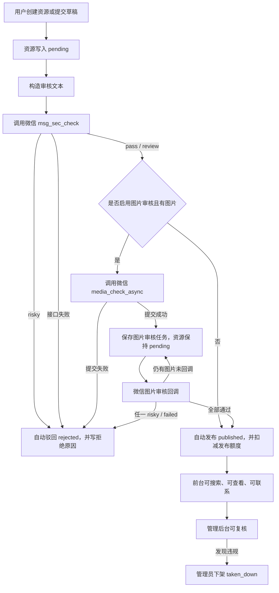

# 供需信息自动内容审核流程文档

版本：v1.0  
日期：2026-07-15  
状态：已实现  
适用范围：小程序供需信息发布、草稿重新提交、管理后台复核与下架

关联代码：

- `backend/app/internal/logic/resource/create_resource_logic.go`
- `backend/app/internal/logic/resource/submit_resource_logic.go`
- `backend/app/internal/logic/contentaudit/wechat_auditor.go`
- `backend/app/internal/logic/contentaudit/media_callback_logic.go`
- `backend/app/internal/model/resource_model.go`
- `backend/migrations/000025_resource_content_audit_tasks.up.sql`

## 1. 文档目标

本文档说明用户提交供需信息后，系统如何自动完成文字和图片审核，并决定资源最终发布或驳回。

当前业务规则为：

- 资源必须等文字和图片都审核通过后，才可以正常发布出来。
- 微信内容安全接口返回 `risky` 时，无论是文字还是图片，都直接拒绝发布。
- 拒绝后必须给用户明确拒绝理由，并允许用户重新编辑后再次提交。
- `pass` 和 `review` 暂时都不进入人工审核，按非风险处理。
- 管理后台可以随时浏览、复核所有供需信息，并可随时下架违规资源。

## 2. 核心结论

供需信息发布不再依赖人工审核队列作为默认路径。用户提交后，系统先把资源保存为 `pending`，随后自动调用微信内容安全能力：

- 文字审核通过且没有图片审核任务：自动发布为 `published`。
- 文字审核通过且有图片：保存图片审核任务，等待微信异步回调。
- 任一文字或图片审核为 `risky`：自动改为 `rejected`。
- 图片全部回调通过：自动发布为 `published`。
- 管理员后续发现违规：通过后台复核接口下架为 `taken_down`。

发布额度只在资源最终自动上架时扣减。图片异步审核期间不会提前扣减发布额度，避免审核失败后误扣。

## 3. 资源状态

| 状态 | 含义 | 对用户可见性 | 可编辑性 |
|---|---|---|---|
| `draft` | 草稿，尚未提交发布 | 不公开 | 可编辑 |
| `pending` | 已提交，等待自动内容审核完成 | 不公开 | 通常不编辑，等待审核结果 |
| `published` | 审核通过并已发布 | 公开展示 | 可刷新、下架、标记成交 |
| `rejected` | 自动审核未通过或无法完成审核 | 不公开 | 可重新编辑为草稿后提交 |
| `taken_down` | 管理员或商家下架 | 不公开 | 可按业务规则处理 |
| `expired` | 有效期结束 | 不公开 | 可再发类似 |

## 4. 总体流程



## 5. 用户提交新资源

入口：`POST /api/v1/resources`

处理步骤：

1. 后端校验商家、城市站、供需类型配置、必填字段、动态字段、联系方式和发布策略。
2. 校验通过后，先创建一条 `pending` 资源。
3. 如果配置了自动审核，读取用户微信 `openid`，构造文字审核内容。
4. 调用微信文字审核。
5. 根据审核结果进入自动发布、图片异步审核或自动驳回。

特殊规则：

- 后台代发布没有小程序用户 `openid`，无法完成微信内容审核，会自动驳回，提示由商家在小程序提交。
- 用户缺少 `openid` 时会自动驳回，提示重新登录后编辑提交。
- 微信内容审核服务异常时，不发布资源，自动驳回并提示稍后重新提交。

## 6. 草稿重新提交

入口：`POST /api/v1/resources/{resourceId}/submit`

处理步骤：

1. 后端确认资源当前为 `draft`。
2. 将资源状态更新为 `pending`。
3. 读取资源审核快照，包括标题、分类、地区、数量、价格、描述、标签、扩展属性、联系人、微信号、图片和创建用户 `openid`。
4. 调用微信文字审核。
5. 按同一套自动审核规则发布、等待图片回调或驳回。

如果用户曾经被驳回，需要先编辑保存为草稿，再重新提交。这样可以确保用户确实修改过内容，而不是对同一份违规内容重复提交。

## 7. 文字审核

系统会把供需信息的核心字段拼成一段审核文本，提交给微信 `msg_sec_check`。

审核文本包含：

- 标题
- 分类
- 地区
- 数量
- 价格
- 描述
- 联系人
- 微信号
- 标签
- 动态扩展字段中的可读内容

结果处理：

| 微信结果 | 系统处理 |
|---|---|
| `risky` | 资源自动驳回为 `rejected` |
| `pass` | 继续图片审核或自动发布 |
| `review` | 暂按非风险处理，继续图片审核或自动发布 |
| 接口错误 | 资源自动驳回，提示审核服务暂不可用 |

## 8. 图片审核

图片审核使用微信 `media_check_async`。这是异步能力，提交成功后不会立即得到最终结论。

处理步骤：

1. 系统把资源图片地址规范化为可公网访问 URL。
2. 对每张图片调用微信异步图片审核。
3. 微信返回 `trace_id` 后，系统创建图片审核任务。
4. 资源继续保持 `pending`。
5. 微信回调到系统后，系统根据 `trace_id` 更新对应任务。
6. 所有图片任务都通过后，资源自动发布。

如果图片地址无法用于微信审核、图片审核任务提交失败，或微信没有返回 `trace_id`，系统不会发布资源，而是自动驳回，要求用户重新编辑后提交。

## 9. 图片回调

入口：`POST /api/v1/wechat/content-audit/media-callback`

系统读取回调中的：

- `trace_id`
- `errcode`
- `result.suggest`
- `result.label`
- `detail[].label`

处理规则：

| 回调结果 | 系统处理 |
|---|---|
| `errcode != 0` | 当前图片任务标记为 `failed`，资源自动驳回 |
| `result.suggest = risky` | 当前图片任务标记为 `rejected`，资源自动驳回 |
| `pass` 或 `review` | 当前图片任务标记为 `pass` |
| 仍有其他图片未回调 | 资源保持 `pending` |
| 所有图片均通过 | 资源自动发布为 `published` |

微信重复回调或资源状态已变化时，系统只记录日志，不重复发布或重复驳回。

## 10. 自动发布

自动发布发生在两种情况下：

- 文字审核通过，且没有需要等待的图片审核任务。
- 文字审核通过，所有图片审核任务也已通过。

发布时系统会：

1. 锁定 `pending` 资源。
2. 再次读取供需类型商业规则。
3. 如果分类已被禁用，自动驳回。
4. 如果分类免费发布，不扣发布额度。
5. 如果分类需要发布额度，扣减商家发布额度。
6. 将资源状态改为 `published`。
7. 写入 `published_at`、`refreshed_at`、`expires_at`。
8. 给商家发送“资源已自动发布”消息。

如果发布额度不足，资源会自动驳回，提示用户开通 VIP 或购买发布包后重新提交。

## 11. 自动驳回

触发自动驳回的情况包括：

- 文字审核 `risky`。
- 图片审核 `risky`。
- 图片审核回调失败。
- 微信内容审核接口不可用。
- 缺少用户 `openid`，无法完成微信审核。
- 图片地址无法提交给微信审核。
- 自动发布时发布额度不足。
- 自动发布时供需类型已被禁用。

驳回后系统会：

1. 将资源状态改为 `rejected`。
2. 写入 `reject_reason`。
3. 给商家发送审核未通过消息。
4. 用户可重新编辑，保存为草稿后再次提交。

常见拒绝原因映射：

| 微信 label | 用户提示 |
|---|---|
| `10001` | 内容疑似包含广告营销信息，请修改后重新提交 |
| `20001` | 内容疑似涉及敏感时政信息，请修改后重新提交 |
| `20002` | 内容疑似包含色情低俗信息，请修改后重新提交 |
| `20003` | 内容疑似包含辱骂攻击信息，请修改后重新提交 |
| `20006` | 内容疑似包含违法违规信息，请修改后重新提交 |
| `20008` | 内容疑似包含欺诈风险信息，请修改后重新提交 |
| `20012` | 内容疑似包含低俗信息，请修改后重新提交 |
| `20013` | 内容疑似涉及版权风险，请修改后重新提交 |
| `21000` | 内容疑似存在安全风险，请修改后重新提交 |

## 12. 管理后台复核和下架

后台能力分为两类：

### 12.1 浏览全部资源

入口：

```text
GET /api/v1/admin/resources
```

支持查询参数：

- `cityCode`
- `typeCode`
- `status`
- `page`
- `pageSize`

如果不传 `status`，默认返回全部状态资源。运营可用它浏览已发布、待审核、已驳回、已下架等全部供需信息。

兼容旧入口：

```text
GET /api/v1/admin/resources/pending
```

该入口仍只返回 `pending` 资源。

### 12.2 复核、驳回和下架

入口：

```text
POST /api/v1/admin/resources/{resourceId}/review
```

动作：

| action | 说明 |
|---|---|
| `approve` | 管理员手动通过并发布 |
| `reject` | 管理员驳回，需要填写原因 |
| `take_down` | 管理员下架，需要填写原因 |

虽然默认流程不再要求人工参与审核，后台仍保留复核能力，用于处理误判、投诉、抽检和已发布后的违规下架。

## 13. 数据存储

新增表：`resource_content_audit_tasks`

用途：保存图片异步审核任务和微信回调结果。

核心字段：

| 字段 | 说明 |
|---|---|
| `resource_id` | 对应供需信息 |
| `trace_id` | 微信图片审核任务唯一标识 |
| `audit_type` | 当前为 `image` |
| `media_url` | 提交给微信审核的图片地址 |
| `status` | `pending`、`pass`、`rejected`、`failed` |
| `suggest` | 微信返回的建议结果 |
| `label` | 微信返回的风险标签 |
| `reason` | 系统生成的拒绝原因 |
| `raw_payload` | 微信原始回调内容 |
| `completed_at` | 任务完成时间 |

迁移文件：

- `backend/migrations/000025_resource_content_audit_tasks.up.sql`
- `backend/migrations/000025_resource_content_audit_tasks.down.sql`

## 14. 配置要求

生产配置必须开启内容审核：

```yaml
ContentAudit:
  Enabled: true
  TextScene: 3
  MediaEnabled: true
  MediaScene: 3
  RequestTimeout: 5s
  MaxTextChars: 2500
```

生产校验要求：

- `ContentAudit.Enabled` 必须为 `true`。
- `ContentAudit.MediaEnabled` 必须为 `true`。
- `Wechat.AppID` 和 `Wechat.AppSecret` 必须配置。
- `Storage.PublicBaseURL` 必须是图片可被微信访问的公网地址。

微信后台需要把图片审核异步回调配置到：

```text
/api/v1/wechat/content-audit/media-callback
```

## 15. 用户端交互要求

小程序端应按资源状态展示不同操作：

| 状态 | 用户看到的结果 | 用户可做操作 |
|---|---|---|
| `pending` | 内容审核中，审核通过后将自动发布 | 等待 |
| `published` | 已发布 | 查看、刷新、下架、标记成交 |
| `rejected` | 审核未通过，并展示拒绝原因 | 重新编辑并提交 |
| `taken_down` | 已下架 | 查看原因、按业务规则重新发布 |

驳回提示必须展示后端返回的 `message` 或资源详情里的 `rejectReason`，不能只显示“审核失败”。

## 16. 验收标准

功能验收：

- 提交包含违规文字的资源，资源最终为 `rejected`，前台不展示，并返回明确原因。
- 提交文字通过但图片违规的资源，图片回调后资源最终为 `rejected`。
- 提交文字和图片均通过的资源，资源最终为 `published`。
- 图片多张时，只有全部图片回调通过后才发布。
- 微信接口失败时，资源不发布。
- 发布额度不足时，不发布并驳回。
- 后台可以查看全部资源，并能对已发布资源下架。

技术验收：

- 新增迁移可以正常执行。
- `go test ./...` 通过。
- 生产配置未开启文字或图片审核时，服务启动校验失败。
- 图片审核任务保存了 `trace_id` 和原始回调内容，便于后续排查。

## 17. 当前已完成项

- 已接入微信文字审核。
- 已接入微信图片异步审核提交。
- 已新增图片审核任务表。
- 已新增图片审核回调处理。
- 已实现文字和图片审核通过后自动发布。
- 已实现文字或图片 `risky` 自动驳回。
- 已实现审核失败、缺少 `openid`、额度不足、分类禁用等异常场景的自动驳回。
- 已实现后台全量资源列表。
- 已保留后台复核、驳回和下架能力。
- 已补充后端单元测试，并通过全量测试。
