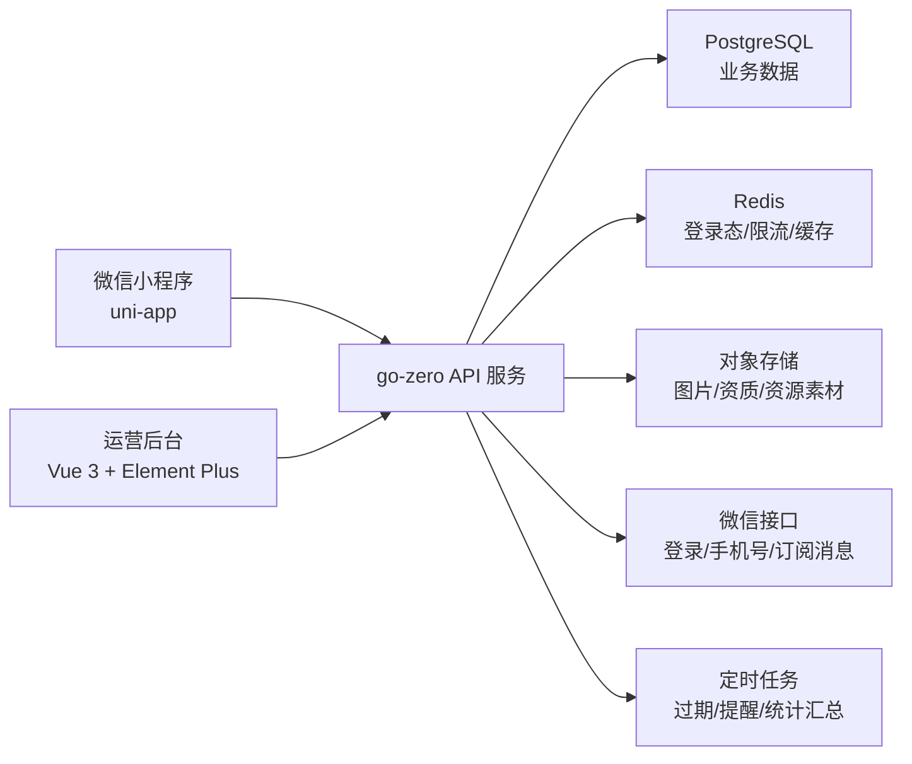
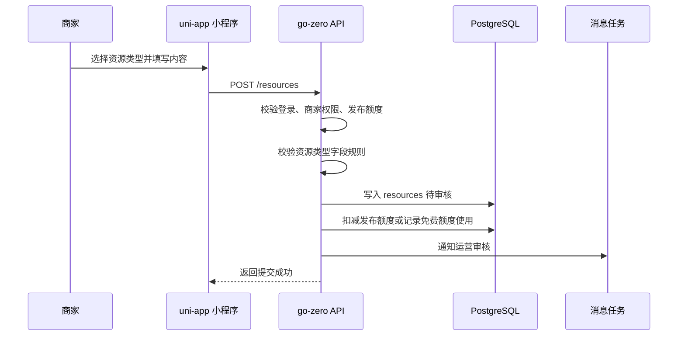
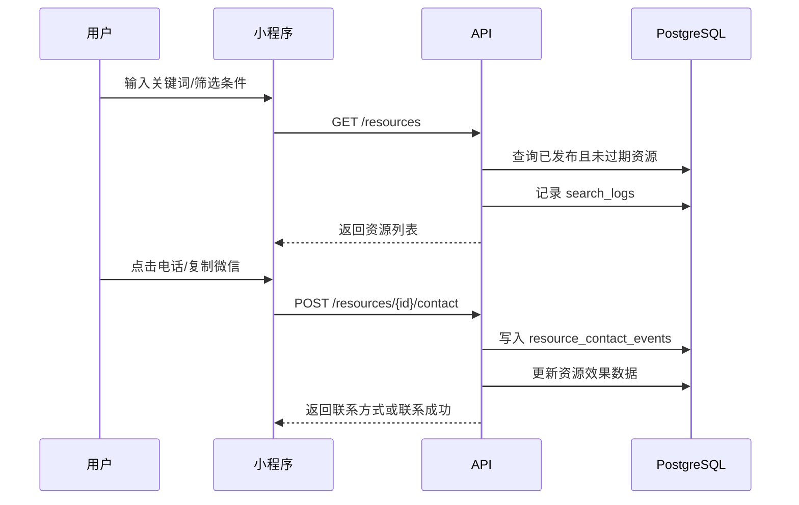
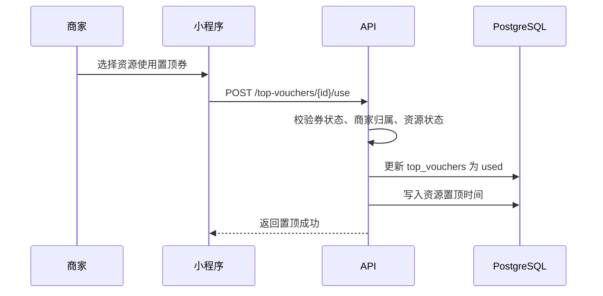

# 服装产业带资源撮合平台技术架构设计

版本：v0.1  
日期：2026-06-27  
技术选型确认：

- 小程序端：uni-app，首发微信小程序。
- 管理后台前端：Vue 3 + Vite + Element Plus，独立 `admin-web/` 工程。
- 服务端：Go + go-zero，参考 `/Users/ldh/code/wpmall` 的工程分层和开发规范。
- 数据库：PostgreSQL，延续 ER 设计中的 `jsonb` 扩展字段策略。
- 缓存与异步：Redis 作为可选基础设施，MVP 只用于登录态、限流、热点缓存和轻量任务去重。

输入文档：

- `docs/product/apparel-industry-platform-prd.md`
- `docs/product/domain-model-ddd.md`
- `docs/product/database-er-design.md`
- `docs/product/api-contract-design.md`

## 1. 架构目标

技术架构必须服务于一个核心目标：快速验证服装产业资源撮合闭环，并支持后续从织里扩展到广州、虎门、杭州等产业带。

设计原则：

- 前端先做微信小程序，不同时铺 App、H5 和 PC。
- 后端采用 go-zero 单体 API 服务起步，按领域模块清晰分包，暂不拆微服务。
- 资源、商家、需求、认证、权益、消息和数据统计复用公共能力。
- 新城市、新资源类型优先通过配置扩展，不新增独立系统。
- 技术复杂度服务业务闭环，不提前建设复杂推荐、IM、支付交易和 BI 系统。

## 2. 总体架构



首期只要求小程序端 + go-zero API + PostgreSQL 跑通。运营后台可以先用简单管理接口和低成本页面承接，等资源量和审核量上来后再完善独立后台体验。

## 3. 工程目录规划

参考 `wpmall`，建议仓库按前后端分离组织：

```text
wplink/
  backend/
    go.mod
    app/
      app.go
      api/
        app.api
        auth.api
        merchant.api
        resource.api
        demand.api
        verification.api
        entitlement.api
        message.api
        admin.api
      etc/
        app.yaml
      internal/
        config/
        handler/
        logic/
        svc/
        types/
        middleware/
        session/
        permission/
        wx/
        oss/
        task/
      goctl/
      script/
    model/
    common/
      response/
      errx/
    migrations/
  wxapp/
    package.json
    pages.json
    manifest.json
    main.js
    App.vue
    api/
    common/
    components/
    pages/
    store/
    static/
    utils/
    uni.scss
  admin-web/
    package.json
    index.html
    vite.config.js
    src/
      api/
      layouts/
      router/
      stores/
      views/
      styles/
  docs/
    product/
```

目录约束：

- `backend/app/api/*.api` 是后端接口契约单一事实来源。
- `backend/app/internal/handler` 只负责解析请求、调用 Logic、返回响应。
- `backend/app/internal/logic` 承载业务流程和领域规则。
- `backend/model` 承载数据库访问，不在 handler 中直接写 SQL。
- `backend/common/response` 和 `backend/common/errx` 统一响应结构和错误映射。
- `wxapp/api` 封装接口请求，不在页面里散落 `uni.request`。
- `wxapp/pages` 按业务页面组织，公共组件放入 `components`。
- `admin-web` 只服务平台运营人员，不作为商家后台或普通用户入口。

## 4. 后端技术架构

### 4.1 go-zero 分层

后端采用 go-zero API 服务，MVP 不拆 RPC 服务。

分层职责：

| 层 | 目录 | 职责 |
|---|---|---|
| API 契约 | `backend/app/api` | 定义接口、请求、响应、路由分组 |
| Handler | `backend/app/internal/handler` | 参数解析、调用 Logic、统一返回 |
| Logic | `backend/app/internal/logic` | 业务流程、权限判断、状态流转、事务编排 |
| SvcContext | `backend/app/internal/svc` | 依赖注入，持有 model、配置、Redis、微信、OSS 客户端 |
| Model | `backend/model` | 数据访问、事务方法、复杂查询 |
| Common | `backend/common` | 响应、错误码、公共工具 |

Handler 规则沿用 `wpmall`：

- 使用 `httpx.Parse(r, &req)` 解析请求。
- 创建对应 Logic 并调用方法。
- 不在 Handler 中访问 `svcCtx.*Model`。
- 不在 Handler 中写 SQL、事务或业务分支。
- 统一使用 `response.Response(w, resp, err)` 或同类封装。

### 4.2 领域模块映射

go-zero 的 API group 和 Logic 包应按领域对象组织，而不是按页面组织。

| 领域上下文 | API group | Logic 包 | 主要职责 |
|---|---|---|---|
| 账号与权限 | `auth`、`me` | `auth`、`account` | 微信登录、手机号、角色、商家绑定 |
| 城市站 | `city` | `city` | 城市站列表、资源类型启停、城市配置 |
| 商家 | `merchant` | `merchant` | 商家主页、资料、管理员绑定 |
| 资源 | `resource` | `resource` | 发布、审核、搜索、详情、刷新、成交、归档 |
| 采购需求 | `demand` | `demand` | 买家需求提交、线索池、撮合入口 |
| 认证与信用 | `verification` | `verification` | 商家认证、资源核验、信用标签 |
| 权益与商业化 | `entitlement` | `entitlement` | 发布额度、刷新次数、置顶券、核销 |
| 消息 | `message` | `message` | 审核通知、过期提醒、撮合进度 |
| 发布效果 | `metrics` | `metrics` | 曝光、浏览、联系、成交反馈统计 |
| 运营后台 | `admin` | `admin` | 审核、配置、代发、人工撮合、操作日志 |

后台登录单独使用 `/api/v1/admin/auth/login`，但不单独建立后台用户主体。后台账号通过 `admin_login_credentials` 关联 `users`，并通过 `roles` / `user_role_assignments` 判断是否具备 `platform_operator` 或 `super_admin` 权限。

### 4.3 数据访问策略

ER 设计选择 PostgreSQL，原因是统一资源模型大量依赖扩展字段：

- `resources.attributes jsonb`
- `resource_type_configs.field_schema jsonb`
- `resource_type_configs.display_schema jsonb`
- 审核、认证、消息和日志中的上下文快照字段

与 `wpmall` 的差异：

- `wpmall` 更接近 MySQL + goctl model 生成模式。
- 本项目为了资源类型扩展，建议 PostgreSQL 优先。
- 如果后续必须使用 MySQL，应把 `jsonb` 调整为 `json`，并重新评估索引和复杂搜索能力。

MVP 推荐：

- 数据库使用 PostgreSQL。
- 简单 CRUD 可以使用 go-zero `sqlx`。
- 涉及 `jsonb` 查询、资源搜索、统计汇总的 model 方法手写 SQL。
- 不强依赖 goctl model 自动生成，避免被 MySQL 生成能力限制。
- 所有多表写在 Logic 中开启事务，由 model 提供 `WithSession` 方法。

### 4.4 响应与错误

接口响应沿用 API 契约设计，但实现上可以参考 `wpmall` 的统一响应封装。

推荐结构：

```json
{
  "code": 200,
  "msg": "ok",
  "data": {}
}
```

错误要求：

- 小程序展示的 `msg` 必须是中文、明确、可操作。
- 后端日志记录真实错误和业务上下文。
- 接口不返回 SQL、堆栈、内部表名、密钥、微信接口原始敏感信息。
- 权限、登录、额度不足、状态冲突、审核失败要有稳定错误码，方便前端分支处理。

### 4.5 定时任务

MVP 可先放在 go-zero API 服务内，通过 `task` 包承接轻量定时任务。

首期任务：

- 资源到期自动过期。
- 过期前提醒。
- 置顶券到期释放。
- 每日发布效果汇总。
- 搜索日志聚合。

当任务量增加后，再拆独立 worker 服务。

## 5. 小程序技术架构

### 5.1 技术栈

小程序端使用 uni-app，首发微信小程序。

参考 `wpmall/wxapp`：

- 使用 `wxapp/` 作为小程序工程目录。
- 使用 HBuilderX/uni-app CLI 构建微信小程序。
- 保留 `dev:mp-weixin` 和 `build:mp-weixin` 脚本。
- 组件优先使用 uni-app 原生能力和 `uni-ui`，避免引入过重 UI 框架。

### 5.2 前端分层

```text
wxapp/
  api/
    request.js
    auth.js
    city.js
    merchant.js
    resource.js
    demand.js
    verification.js
    entitlement.js
    message.js
    metrics.js
  common/
    constants.js
    enums.js
  components/
    resource-card/
    merchant-card/
    search-bar/
    filter-panel/
    empty-state/
  pages/
    home/
    search/
    resource-detail/
    publish/
    merchant-home/
    demand/
    message/
    mine/
  store/
    user.js
    city.js
  utils/
    format.js
    validator.js
```

前端约束：

- 页面只处理展示、交互和跳转。
- 接口调用统一走 `api/request.js`。
- 登录态、当前城市、当前商家身份进入轻量 store。
- 资源类型字段由后端配置驱动，发布页按 `fieldSchema` 渲染。
- 列表页统一使用资源卡片，招聘、出租、库存、工厂等只改变标签和字段展示。

### 5.3 首期页面

MVP 小程序页面：

| 页面 | 目标 |
|---|---|
| 首页 | 城市站入口、搜索、资源分类、推荐资源 |
| 搜索页 | 按关键词、资源类型、品类、认证状态筛选 |
| 资源详情 | 展示资源、商家、联系入口、收藏、举报 |
| 发布页 | 按资源类型配置动态发布 |
| 商家主页 | 沉淀商家资料、认证、资源和信用标签 |
| 采购需求 | 用户提交找货、找厂、清库存相关需求 |
| 消息中心 | 审核、过期、认证、撮合消息 |
| 我的 | 登录、商家管理、发布记录、权益、数据效果 |

## 6. 管理后台前端架构

管理后台前端使用 Vue 3 + Vite + Element Plus，单独放在 `admin-web/`，不使用 uni-app。

选择原因：

- 后台主要是表格、筛选、弹窗、审核和权限菜单，Element Plus 更适合 PC 运营工具。
- uni-app 保持专注小程序端，避免移动端框架承担 PC 后台复杂交互。
- 不引入重型 admin template，减少删除示例、改造权限和清理无用功能的成本。

首期后台页面：

- 登录页
- 数据概览
- 资源审核
- 商家管理
- 采购需求
- 认证审核
- 权益发放
- 操作日志

接口约束：

- 后台前端访问同一个 go-zero API 服务。
- 后台接口统一使用 `/api/v1/admin/*`。
- 登录接口为 `/api/v1/admin/auth/login`。
- 后台 token 存在前端本地存储中，后续请求通过 `Authorization: Bearer <token>` 传递。
- 前端只做展示和交互校验，权限判断以后端为准。

## 7. 数据流设计

### 7.1 发布资源



关键规则：

- 发布字段由 `resource_type_configs.field_schema` 控制。
- 认证商家可使用免费发布额度。
- 关键字段变更后需要重新审核。
- 运营代发也必须记录操作日志。

### 7.2 搜索并联系



关键规则：

- 搜索结果只展示 `published` 且未过期资源。
- 无结果时引导提交采购需求。
- 联系行为是发布效果和平台价值证明的核心数据，必须记录。

### 7.3 置顶核销



关键规则：

- 认证商户可获得免费置顶券。
- 置顶券是商业化权益，不直接写死为资源字段。
- 后台可追踪每张券的来源、使用资源和有效期。

## 8. API 生成与开发命令

参考 `wpmall` 的 go-zero 生成方式：

```bash
cd backend/app
goctl api go -api ./api/app.api -dir . -home ./goctl
```

后端构建验证：

```bash
cd backend/app
go build -o /dev/null .
```

小程序构建脚本可参考 `wpmall/wxapp/package.json`，将路径替换为本项目：

```json
{
  "scripts": {
    "dev:mp-weixin": "UNI_INPUT_DIR=/Users/ldh/code/wplink/wxapp UNI_OUTPUT_DIR=/Users/ldh/code/wplink/wxapp/dist NODE_ENV=development UNI_PLATFORM=mp-weixin ... dev:mp-weixin",
    "build:mp-weixin": "UNI_INPUT_DIR=/Users/ldh/code/wplink/wxapp UNI_OUTPUT_DIR=/Users/ldh/code/wplink/wxapp/dist NODE_ENV=production UNI_PLATFORM=mp-weixin ... build:mp-weixin"
  }
}
```

实际落地时应根据本机 HBuilderX 安装路径调整脚本。

管理后台前端：

```bash
cd admin-web
npm install
npm run dev
npm run build
```

## 9. MVP 技术边界

首期必须做：

- 微信登录和手机号绑定。
- 城市站和资源类型配置。
- 商家主页和商家管理员绑定。
- 统一资源发布、审核、搜索、详情、联系、过期、归档。
- 采购需求提交和人工撮合记录。
- 商家认证和轻量信用标签。
- 发布额度、刷新次数、置顶券。
- 消息中心基础通知。
- 发布效果数据统计。
- 运营审核、代发、下架和操作日志。

首期暂不做：

- 原生 App。
- 独立 PC 商家后台。
- 复杂 IM 聊天。
- 在线担保交易和订单支付。
- 自动智能推荐引擎。
- 多服务拆分和微服务网关。
- 实时数仓和复杂 BI。

## 10. 部署建议

MVP 可采用简单部署：

```text
1 台应用服务器：
  - go-zero API
  - 定时任务

托管基础设施：
  - PostgreSQL
  - Redis
  - 对象存储
  - CDN
```

扩展阶段再拆分：

- API 服务和 worker 服务分离。
- 搜索能力从 PostgreSQL 查询升级到 OpenSearch/Elasticsearch。
- 运营后台独立前端工程。
- 图片、视频、资质文件进入更完整的素材管理。

## 11. 与现有文档的关系

| 文档 | 作用 |
|---|---|
| PRD | 定义业务目标、用户、资源类型、商业化、验收标准 |
| DDD | 定义领域对象、限界上下文、聚合和领域事件 |
| ER | 定义表结构、主外键、扩展字段和索引方向 |
| API 契约 | 定义小程序和后台调用的接口边界 |
| 技术架构 | 定义 uni-app、go-zero、工程目录、数据流和技术边界 |

后续进入开发时，优先顺序应为：

1. 根据 API 契约整理 `backend/app/api/*.api`。
2. 根据 ER 设计编写 PostgreSQL migration。
3. 搭建 go-zero API 工程骨架。
4. 搭建 uni-app 小程序工程骨架。
5. 搭建 Vue 管理后台工程骨架。
6. 先跑通登录、城市站、资源列表、资源发布、资源详情和联系记录。

## 12. 关键决策

本阶段确认以下技术决策：

- 使用 uni-app 开发微信小程序。
- 使用 Vue 3 + Vite + Element Plus 开发管理后台。
- 使用 go-zero 开发服务端 API。
- 使用 PostgreSQL 支撑统一资源模型和 JSON 扩展字段。
- 采用单体 API 服务起步，不拆微服务。
- 按 DDD 领域上下文组织 API group 和 Logic 包。
- 资源类型配置驱动发布页和资源展示，避免为招聘、出租、库存等业务复制系统。
- 认证赠送的发布次数、刷新次数和置顶次数进入权益系统，不能写成一次性活动逻辑。
