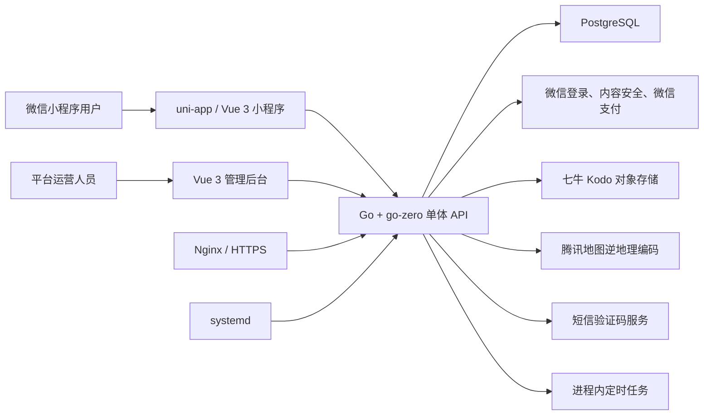
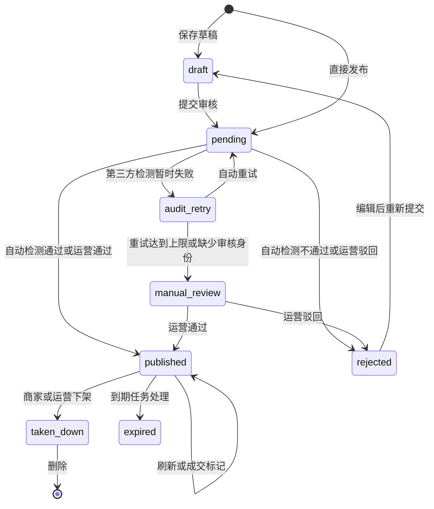
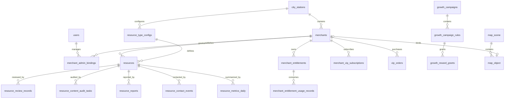
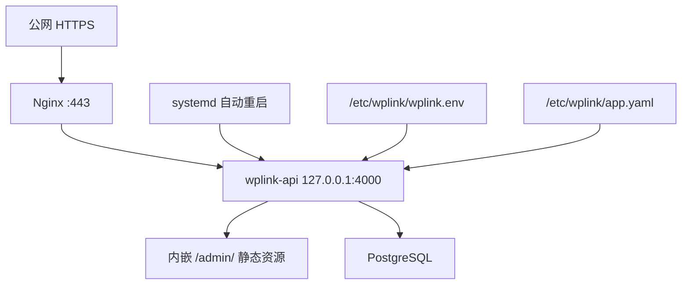

# 衣货通项目现状架构与系统维护手册

版本：v1.0

基线日期：2026-08-04

适用仓库：`wplink`

文档性质：当前实现说明，不是未来规划

## 1. 文档目标与事实来源

本文用于让开发、测试和运维人员在不通读全部代码的情况下，理解衣货通当前系统的整体架构、模块职责、核心业务流程、数据关系、外部依赖和维护入口。

本文以当前主工作区代码为准，主要事实来源如下：

- 后端接口契约：`backend/app/api/*.api`
- 后端运行时路由：`backend/app/internal/server/`
- 后端业务逻辑：`backend/app/internal/logic/`
- 后端数据访问：`backend/app/internal/model/`
- 数据库结构：`backend/migrations/*.sql`
- 小程序页面与接口：`wxapp/pages.json`、`wxapp/pages/`、`wxapp/api/`
- 管理后台页面与接口：`admin-web/src/router/`、`admin-web/src/views/`、`admin-web/src/api/`
- 部署与运行：`backend/app/app.go`、`backend/etc/`、`deploy/`
- 统一验证入口：根目录 `Makefile`

维护时如果本文与代码不一致，应先以运行时代码和数据库迁移为准，再同步更新本文。

## 2. 系统定位与核心业务模型

衣货通是面向服装产业带的供需信息平台。当前系统围绕三类核心主体组织：

- 用户：通过微信小程序登录、浏览、搜索、收藏、关注和联系，也可以管理自己的默认商家。
- 商家：承载公开资料、联系方式、供需信息、地图位置、会员、权益和经营指标。
- 资源：平台统一的供需信息对象，通过 `direction` 区分供应方向和需求方向，通过 `type_code` 区分具体业务类型。

最重要的建模原则是：所有供需内容统一落在 `resources` 表，不按业务类别拆独立内容表；不同类别的发布字段、展示名称和商业规则由 `resource_type_configs` 配置驱动。

当前普通用户侧采用“一用户一商家”模型：首次微信登录时自动创建或恢复默认商家，小程序从登录态取得当前商家，不提供多商家切换入口。数据库保留 `merchant_admin_bindings` 关系表，为权限校验和后续扩展提供基础。

## 3. 总体架构


```mermaid
flowchart LR
  user["微信小程序用户"] --> wxapp["uni-app / Vue 3 小程序"]
  operator["平台运营人员"] --> admin["Vue 3 管理后台"]
  wxapp --> api["Go + go-zero 单体 API"]
  admin --> api
  api --> pg["PostgreSQL"]
  api --> wechat["微信登录、内容安全、微信支付"]
  api --> qiniu["七牛 Kodo 对象存储"]
  api --> tmap["腾讯地图逆地理编码"]
  api --> sms["短信验证码服务"]
  api --> tasks["进程内定时任务"]
  nginx["Nginx / HTTPS"] --> api
  systemd["systemd"] --> api
```

### 3.1 当前运行形态

系统采用单仓库、三端工程、单体后端、单数据库的部署形态：

| 工程 | 目录 | 运行形态 | 主要职责 |
|---|---|---|---|
| 微信小程序 | `wxapp/` | uni-app 编译为微信小程序 | 用户登录、浏览搜索、发布管理、地图、会员权益、互动 |
| 管理后台 | `admin-web/` | Vue 3 SPA，构建后嵌入 Go 二进制 | 审核、配置、运营、权限、日志和地图数据管理 |
| API 服务 | `backend/` | Go 1.23 + go-zero 单体服务 | 业务规则、权限、数据访问、第三方集成和定时任务 |
| 数据库 | `backend/migrations/` | PostgreSQL | 业务数据、审计数据、任务状态和配置数据 |
| 部署 | `deploy/` | Nginx + systemd + Shell | 构建、上传、迁移、重启和健康检查 |

截至本文基线，仓库包含 32 对数据库迁移、53 张唯一业务/支撑表、24 个注册小程序页面、14 个后台业务路由、69 个非测试 Logic 文件和 64 个非测试 Model 文件。

### 3.2 当前不包含的基础设施

- 没有独立微服务或 go-zero RPC 服务。
- 没有实际接入 Redis；登录态使用自包含 HMAC Token，短信等进程内限流仍不具备跨实例一致性，自动任务则由 PostgreSQL Advisory Lock 协调。
- 没有独立消息队列或任务 Worker；自动任务随 API 进程启动。
- 没有独立搜索引擎；搜索依赖 PostgreSQL 文本匹配、`pg_trgm` 和 GIN 索引。
- 没有独立静态站点服务；管理后台资源通过 Go `embed` 提供。

## 4. 仓库结构与代码边界

```text
wplink/
├── backend/
│   ├── app/
│   │   ├── api/                 # go-zero .api 契约
│   │   ├── internal/
│   │   │   ├── config/          # YAML 加载、环境变量展开、生产校验
│   │   │   ├── handler/         # 已迁移的 goctl Handler
│   │   │   ├── logic/           # 业务规则和流程编排
│   │   │   ├── model/           # PostgreSQL 数据访问和事务
│   │   │   ├── permission/      # 后台模块权限
│   │   │   ├── server/          # go-zero 与兼容路由装配
│   │   │   ├── session/         # 用户/后台 Token
│   │   │   ├── svc/             # 依赖注入
│   │   │   ├── task/            # 进程内自动任务
│   │   │   └── adminweb/        # 嵌入的后台静态资源
│   │   └── app.go               # 服务启动入口
│   ├── common/                   # 统一错误与响应
│   ├── migrations/               # PostgreSQL up/down 迁移
│   ├── scripts/                  # 契约、迁移、嵌入构建验证
│   └── etc/                      # 开发/生产配置模板
├── wxapp/
│   ├── api/                      # 小程序请求封装
│   ├── common/                   # 领域常量和纯函数
│   ├── components/               # 资源卡片、发布表单等组件
│   ├── pages/                    # 页面
│   ├── store/                    # 本地会话
│   └── scripts/                  # 页面与流程静态校验
├── admin-web/
│   ├── src/api/                  # Axios API 封装
│   ├── src/router/               # 页面路由与前端权限守卫
│   ├── src/stores/               # Pinia 登录状态
│   └── src/views/                # 运营页面
├── deploy/                       # 发布脚本、Nginx、systemd
├── prototypes/                   # 历史高保真原型，不参与生产构建
├── design/                       # 品牌与设计源文件，不参与运行
└── docs/product/                 # 产品、架构、部署和验收文档
```

核心边界要求：

- `.api` 文件描述外部契约；修改请求或响应字段时，应同步生成/更新 `internal/types` 并执行契约测试。
- Handler/路由只解析身份和参数、调用 Logic、返回统一响应，不应承载 SQL 或复杂状态流转。
- Logic 负责权限之外的业务校验、状态机、第三方调用和流程编排。
- Model 负责 SQL、事务、行锁、幂等约束和数据映射。
- 小程序页面不直接散写 `uni.request`，统一经过 `wxapp/api/request.js`。
- 管理后台不直接使用原始 Axios，统一经过 `admin-web/src/api/http.js`。

## 5. 后端技术架构

### 5.1 启动流程

`backend/app/app.go` 的启动顺序如下：

1. 读取 `-f` 指定的 YAML 配置，严格解析并展开 `${ENV_NAME}` 占位符。
2. 初始化 go-zero `logx` 日志。
3. 在生产模式执行强配置校验，关键配置缺失时直接退出。
4. 初始化嵌入式管理后台 Handler。
5. 建立 PostgreSQL 连接池。
6. 创建 `ServiceContext`，装配 Model、Token、微信、短信、支付、审核、上传和地图客户端。
7. 启动资源生命周期、内容审核重试、支付补偿、地图行为清理任务。
8. 创建业务 API Router。
9. 创建 go-zero HTTP Server，注册健康检查和已迁移 Handler。
10. 监听配置的 Host/Port 并开始服务。

任何生产必需依赖装配失败都会阻止启动，避免服务在部分功能不可用的状态下接入流量。

### 5.2 路由架构：迁移期双轨制

当前路由并非全部由 goctl 生成，实际由两层组成：

- go-zero 直接路由：`/healthz`、`/readyz`、后台登录、城市站列表、城市资源类型列表。
- 兼容 API Router：其余业务接口由 `http.ServeMux` 在 `backend/app/internal/server/` 中注册，再通过 go-zero NotFound Handler 转发。

`backend/app/internal/server/goctl_routes.go` 明确说明城市站和后台登录已经迁移；其他端点仍由兼容 Router 承接。当前兼容 Router 中约有 147 条注册语句，而 `.api` 契约约有 126 条端点声明，两者不是自动生成关系。

维护影响：

- 新接口必须同时检查 `.api` 契约和运行时注册，不能只改其中一处。
- 现有 `backend/scripts/api_contract.test.mjs` 主要校验字段和已下线能力，不会完整比较运行时路由集合。
- 后续迁移应按领域逐组转成 goctl Handler，迁移完成后删除对应兼容注册，避免重复路由和契约漂移。

### 5.3 分层和依赖注入

`ServiceContext` 是后端依赖入口，主要成员包括：

- `APIStore`：组合城市、资源、商家、会员、权益、消息、互动、地图、增长、后台等 Model。
- `AdminLoginService` / `AdminTokenService`：后台登录与会话实时校验。
- `UserTokenService`：小程序用户 Token 签发和账号状态实时校验。
- `WechatSessionClient`：微信 `code2session` 和手机号能力。
- `SMSVerifier`：开发固定验证码或 HTTP 验证码服务。
- `WechatPayGateway`：微信支付下单、回调解密、查询和关单。
- `ContentAuditor`：微信文字和图片内容安全。
- `UploadTokenService`：七牛上传凭证签发。
- `LocationGeocoder`：腾讯地图逆地理编码。

Logic 通过小接口声明所需能力，`APIStore` 依靠 Go 接口组合满足不同模块。这降低了单元测试替身成本，但也使“接口是否被 Store 满足”决定某些兼容路由是否会注册，新增 Model 方法时需要检查路由装配结果。

### 5.4 数据访问与事务

后端同时使用标准库 `database/sql` 和 go-zero `sqlx`：

- 主体业务 Model 多使用 `database/sql` 手写 PostgreSQL SQL。
- goctl 生成的基础 Model 和部分新 Model 使用 `sqlx.SqlConn`。
- `backend/app/internal/model/db.go` 提供连接池设置和 `WithTx` 事务包装。
- 资源发布、权益扣减、支付到账、会员权益发放、地图绑定等关键流程在数据库事务中执行。
- 并发安全主要依赖条件更新、唯一索引、事务和必要的行锁，不依赖进程内互斥锁。

所有 bigint ID 通过 PostgreSQL `next_tsid()` 生成，API 层统一转成字符串，避免 JavaScript 对 64 位整数的精度丢失。`postgresTextIDRows` 会将 `id`、`*_id`、`created_by`、`reviewed_by` 等字段转换为文本读取。

### 5.5 统一错误、响应与日志

成功响应格式：

```json
{
  "code": 200,
  "msg": "ok",
  "data": {}
}
```

错误响应包含 HTTP 状态、稳定的 `errorCode` 和可展示的中文 `msg`。主要错误码包括：

- `VALIDATION_FAILED`
- `UNAUTHORIZED`
- `FORBIDDEN`
- `RESOURCE_NOT_FOUND`
- `MERCHANT_NOT_FOUND`
- `STATE_CONFLICT`
- `QUOTA_NOT_ENOUGH`
- `PAYMENT_REQUIRED`
- `REVIEW_REQUIRED`
- `RATE_LIMITED`
- `INTERNAL_ERROR`

未知内部错误对外统一显示“操作失败，请稍后重试”，真实错误、资源 ID、商家 ID、操作者 ID、动作和第三方上下文写入服务日志。生产日志要求文件/卷模式、JSON 编码、按日轮转，保留天数不超过 7 天。

### 5.6 身份与权限

系统维护两套完全独立的会话：

| 会话 | 主体 | 签名密钥 | 核心校验 |
|---|---|---|---|
| 用户 Token | `users` | `UserAuth.TokenSecret` | 签名、过期时间、账号是否 active |
| 后台 Token | `admin_operators` | `AdminAuth.TokenSecret` | 签名、过期时间、状态、`auth_version`、角色和模块权限 |

后台账号连续失败 5 次锁定 15 分钟；同一 IP 15 分钟内失败 20 次触发限流。生产环境禁止后台万能密码，且用户和后台密钥必须不同并至少 32 字节。

后台角色为 `super_admin` 和 `platform_operator`。超级管理员拥有全部模块；平台运营员默认只有资源审核和举报处理权限，也可以由超级管理员配置模块集合。后端根据 URL 映射模块并再次校验，前端路由守卫只负责体验，不构成安全边界。

商家私有操作使用“用户 Token + `merchant_admin_bindings` active 关系”校验。带 `resourceId` 的操作会先从数据库读取真实商家归属，不信任前端传入的 `merchantId`。

## 6. 业务模块详解

### 6.1 账号、登录与隐私

功能：微信登录、当前用户资料、手机号绑定、协议同意记录、账号注销。

核心流程：

1. 小程序调用 `wx.login` 获取 code，并提交当前隐私政策和用户协议版本。
2. 后端调用微信 `code2session` 取得 OpenID，通过 `UpsertWechatUser` 创建或更新用户。
3. 写入 `user_consents`；版本与后端常量不一致时拒绝登录。
4. 若用户没有管理中的商家，自动创建默认商家并建立 owner 绑定。
5. 首次登录事件尝试触发新手成长权益，失败只记日志，不阻断登录。
6. 签发用户 Token，小程序保存 `token`、`userId`、`merchantId`。

账号注销要求输入固定确认文字，后端停用账号并执行个人资料匿名化，旧 Token 因实时状态校验立即失效。

主要代码：`logic/auth/`、`model/user_model.go`、`session/user_token.go`、`wxapp/pages/login/`、`wxapp/pages/account/`。

主要数据：`users`、`roles`、`user_role_assignments`、`user_consents`、`user_account_deletion_requests`、`sms_send_limits`。

### 6.2 城市站与资源类型配置

功能：城市站列表、城市级资源类型启停、供应/需求方向筛选、动态发布字段和商业规则。

`resource_type_configs` 是配置驱动发布的核心表，包含：

- `type_code`、`direction`、城市范围和状态。
- `field_schema`：发布表单字段、必填项、选项和地址类型字段。
- `display_schema`：显示名称和展示规则。
- `commercial_rules`：发布模式和联系方式解锁模式。
- `version`：后台编辑时的乐观锁版本。

小程序发布前先读取城市资源类型，再根据字段配置渲染 `ResourcePublishForm`。后台 `ResourceTypeConfigView` 维护配置，更新时携带版本，避免两个运营人员互相覆盖。

主要代码：`logic/city/`、`logic/admin/resource_type_config_logic.go`、`model/resource_type_config_model.go`。

主要数据：`city_stations`、`resource_type_configs`。

### 6.3 商家与公开主页

功能：默认商家、商家公开资料、商家资料维护、最近入驻商家、管理权限关系。

商家资料包括名称、商家类型、主营分类、简介、联系人、电话、微信、地址、坐标、Logo、相册、资料完整状态和入驻时间。公开读取会隐藏或脱敏敏感联系方式；商家 owner 编辑时才返回可编辑信息。

商家名称有独立业务校验；商家类型变更写入 `merchant_type_change_logs`。`merchant_no` 使用独立序列生成稳定的展示编号，不使用主键直接作为业务编号。

主要代码：`logic/merchant/`、`model/merchant_model.go`、`wxapp/pages/merchant/`。

主要数据：`merchants`、`merchant_admin_bindings`、`merchant_type_change_logs`、`credit_records`。

### 6.4 资源发布与生命周期

功能：保存草稿、提交发布、动态字段校验、列表、搜索、详情、相关推荐、我的发布、刷新、成交反馈、下架、删除和再发类似。

资源状态机：


```mermaid
stateDiagram-v2
  [*] --> draft: 保存草稿
  draft --> pending: 提交审核
  [*] --> pending: 直接发布
  pending --> published: 自动检测通过或运营通过
  pending --> rejected: 自动检测不通过或运营驳回
  pending --> audit_retry: 第三方检测暂时失败
  audit_retry --> pending: 自动重试
  audit_retry --> manual_review: 重试达到上限或缺少审核身份
  manual_review --> published: 运营通过
  manual_review --> rejected: 运营驳回
  published --> taken_down: 商家或运营下架
  published --> expired: 到期任务处理
  published --> published: 刷新或成交标记
  rejected --> draft: 编辑后重新提交
  taken_down --> [*]: 删除
```

发布时的关键规则：

- 商家资料状态必须允许发布。
- 城市和 `type_code` 必须匹配有效配置。
- `direction` 以后端配置为准。
- 固定字段和 `field_schema` 动态字段都需要校验；地址字段会校验文本、经纬度范围和结构。
- 标签必须在配置选项内，图片、标签、描述等必填规则由配置决定。
- 列表标题和摘要字段可以按配置从动态字段派生。
- 联系电话优先使用商家已保存电话，避免前端任意覆盖。
- `type_snapshot` 保存发布时的类型配置快照，防止后续配置修改改变历史资源语义。
- 发布模式支持 `consume_quota`、`free`、`disabled`。

公开列表只返回可展示状态；“我的发布”按真实商家归属返回草稿和各生命周期状态。相关推荐以当前资源的城市、方向、类型等信息为种子查询，并排除当前资源。

主要代码：`logic/resource/`、`model/resource_model.go`、`wxapp/components/ResourcePublishForm.vue`、`wxapp/pages/publish/`、`wxapp/pages/resource/`、`wxapp/pages/my-resources/`。

主要数据：`resources`、`resource_review_records`、`resource_type_configs`、`merchant_entitlement_usage_records`。

### 6.5 内容安全审核

功能：资源文字检测、图片异步检测、回调验签、失败重试和人工兜底。

流程：

1. 创建或提交资源后，后端从资源创建用户取得真实微信 OpenID。
2. 标题、分类、地区、描述、标签、动态字段和联系方式被整理为最多 2500 字的检测文本。
3. 微信文字检测返回 `pass`、`review` 或 `risky`。
4. `risky` 直接驳回；无图片的 `pass` 可自动发布。
5. 有图片时创建 `resource_content_audit_tasks`，等待微信异步回调。
6. 回调校验签名和时间偏差，根据 `trace_id` 幂等完成任务。
7. 全部图片通过后自动发布，任一图片不通过则驳回。
8. 第三方失败进入 `audit_retry`；自动任务最多重试 5 次，超限转 `manual_review`。

每次决策写入 `resource_content_audit_runs`，便于追踪检测来源、结论、原因、标签和 trace ID。内容审核失败不能静默放行。

主要代码：`logic/resource/content_audit.go`、`logic/contentaudit/`、`task/content_audit_retry_*`。

主要数据：`resource_content_audit_tasks`、`resource_content_audit_runs`、`resources`。

### 6.6 发现、首页、专题与搜索

功能：首页运营位、资源流、最近入驻商家、热门搜索词、专题资源、搜索和 H5 链接白名单验证。

首页运营配置由 `banner_topics` 提供，按城市、状态和生效时间筛选。首页资源流和专题资源最终仍查询统一资源表。最近入驻模块按 `onboarded_at` 排序，并只返回公开安全字段。

资源搜索支持关键词、城市、方向、类型、品类、地区、分页等条件。PostgreSQL 使用 `pg_trgm` 索引支持模糊搜索，标签使用 GIN 索引。每次搜索写入 `search_logs`，匿名搜索允许记录；有 Token 时只采用后端解析的用户 ID。

外部 H5 先调用 `/webview/validate` 校验允许域名，小程序不能直接打开任意 URL。

主要代码：`logic/discovery/`、`logic/resource/search_resources_logic.go`、`model/banner_topic_model.go`、`model/search_log_model.go`。

主要数据：`banner_topics`、`hot_search_keywords`、`search_logs`、`resources`。

### 6.7 收藏、关注和保存搜索

功能：收藏资源、关注商家、保存搜索条件和个人列表。

所有接口要求用户登录。收藏自己的资源会被限制，但允许取消历史收藏。保存搜索至少需要一个有效条件，后端会规范化关键词和筛选条件，并生成默认名称。

关系记录采用状态字段而不是简单删除，方便恢复和分析；数据库唯一约束保证同一用户与同一对象只保留一个逻辑关系。

主要代码：`logic/favorite/`、`model/favorite_model.go`、`wxapp/pages/favorites/`。

主要数据：`user_favorite_resources`、`user_followed_merchants`、`user_saved_searches`。

### 6.8 联系方式解锁与商业规则

功能：按资源类别决定联系方式是否登录免费、付费、VIP 免费、仅 VIP 或禁用。

联系方式规则来自资源类型的 `commercial_rules.contactUnlock`：

- `login_free`：登录后免费查看。
- `paid`：创建解锁订单并支付。
- `paid_or_vip`：VIP 免费，普通用户付费。
- `vip_only`：仅有效 VIP 可查看。
- `disabled`：不开放联系方式。

详情接口返回 `contactAccess` 描述当前用户的访问状态，不直接依赖前端判断。已支付解锁写入 `resource_contact_unlocks`，可配置重复解锁有效天数。电话点击和微信复制必须在获得访问权后才计入联系指标。

主要代码：`logic/resource/contact_unlock_order_logic.go`、`logic/payment/contact_unlock_payment_logic.go`、`model/resource_contact_unlock_model.go`。

主要数据：`resource_contact_unlock_orders`、`resource_contact_unlocks`、`resource_contact_events`。

### 6.9 VIP、次数包与权益

功能：VIP 套餐、次数包、促销配置、商家会员状态、订单、支付、发布额度、刷新额度和置顶权益。

VIP 商品分为套餐和次数包：

- VIP 套餐按月数创建订单，支付成功后创建或延长 `merchant_vip_subscriptions`，并按权益快照发放月度权益。
- 次数包支付成功后一次性发放对应权益。
- 单次置顶服务要求绑定目标资源，支付成功后直接执行对应置顶权益。

订单保存商品和权益快照，后续后台改价不会改变历史订单。权益使用写入 `merchant_entitlement_usage_records`，记录使用前后余额、动作和关联资源。置顶券核销会同时校验券、资源状态、商家归属、允许类型和有效期。

主要代码：`logic/vip/`、`logic/entitlement/`、`logic/payment/vip_payment_logic.go`、`model/vip_model.go`、`model/merchant_entitlement_model.go`。

主要数据：`vip_plans`、`vip_plan_versions`、`vip_quota_packs`、`vip_promotions`、`vip_orders`、`merchant_vip_subscriptions`、`merchant_entitlements`、`merchant_entitlement_usage_records`。

### 6.10 微信支付与补偿

当前统一支付回调只处理两类业务：`contact_unlock` 和 `vip`。商户订单号前缀、回调 `attach` 中的业务类型和业务订单 ID 必须互相匹配。

支付流程：

1. 业务 Logic 创建本地 pending 订单并生成商户订单号。
2. 支付 Gateway 创建微信支付单，返回小程序支付参数。
3. 微信回调 `/api/v1/wechat-pay/notify` 完成验签和解密。
4. 根据 `attach` 分派到联系方式解锁或 VIP 到账事务。
5. 数据库校验金额、订单号、业务订单 ID 和状态，幂等写入支付结果。
6. 回调丢失时，支付补偿任务查询超过延迟窗口的 pending 订单；已支付则补记到账，超时未支付则关单。

开发模式可启用支付 Mock，生产配置强制禁止 Mock。微信支付整体可关闭；关闭时购买入口应由前端做不可购买提示，后端仍会拒绝真实支付请求。

主要代码：`logic/payment/`、`task/payment_reconciliation_*`、`model/payment_reconciliation_model.go`。

### 6.11 增长活动与新手权益

功能：配置活动和规则，按事件发放商家权益，向小程序展示任务进度。

支持的主要事件包括首次登录、首条资源通过、通过数量达到阈值、分享带来有效浏览或联系。事件进入 `TriggerGrowthEvent` 后，会查询生效活动和规则、校验条件与时间窗口、检查用户/资源/每日发放上限，再创建发放记录和权益。

`growth_reward_grants` 是幂等和审计依据。登录或审核主流程触发奖励失败时只记录错误，不能回滚登录或审核结果；维护时需要通过后台发放记录排查和补偿。

主要代码：`logic/growth/`、`logic/admin/growth_campaign_logic.go`、`model/growth_campaign_model.go`。

主要数据：`growth_campaigns`、`growth_campaign_rules`、`growth_reward_grants`、`merchant_entitlements`。

### 6.12 消息与资源生命周期任务

功能：站内消息、未读状态、资源到期和即将到期提醒。

消息可面向用户或商家角色 `merchant:<merchantId>`。商家角色消息读取时会校验当前用户是否能管理该商家。生命周期任务启动后立即执行一次，再按配置间隔循环：

- 将超过 `expires_at` 的已发布资源改为 `expired`。
- 为到期资源创建“已过期”消息。
- 为即将到期资源创建提醒消息。

消息表对生命周期触发类型建立唯一索引，避免同一资源重复提醒。

主要代码：`logic/message/`、`task/resource_lifecycle_*`、`model/message_model.go`。

主要数据：`messages`、`resources`。

### 6.13 指标与行为数据

功能：资源曝光、详情浏览、联系动作、商家汇总指标和地图行为事件。

资源列表通过 `ResourceExposure` 组件批量上报曝光，后端写入明细事件并更新每日聚合。详情浏览、电话、微信、分享等行为进入对应指标。商家和单资源指标属于私有经营数据，需要商家管理权限或后台权限。

地图行为支持匿名 `visitorKey` 和登录用户归因。接口限制请求体大小、拒绝未知字段，并使用单进程 IP/访客键限流。明细仅保留配置天数，默认 90 天。

主要代码：`logic/metrics/`、`model/resource_metric_daily_model.go`、`model/merchant_map_events_model.go`。

主要数据：`resource_exposure_events`、`resource_contact_events`、`resource_metrics_daily`、`merchant_map_events`。

### 6.14 拿货地图、商家位置与纠错

地图模块同时支持两种视图：

- 腾讯地图商家点位：以真实经纬度查询当前视野、附近商家和距离。
- 场景画布：`map_scene` + `map_object` 表达市场、楼层、档口和配套点位，使用归一化画布坐标和缩放级别。

公开端只读取已发布场景和点位，支持视野范围、缩放级别、类型、分类、关键词和附近 POI。商家点位只在满足公开状态和有效坐标时展示，公开响应隐藏敏感联系方式。

商家可从候选点位发起绑定申请；运营审核通过后，在事务中建立商家与地图对象的一对一关系。用户可提交位置纠错或风险举报，聚合达到规则阈值时可以自动给点位加风险提示。

商家编辑地址时可调用腾讯地图逆地理编码；腾讯配额异常会映射为可识别的限流错误。

主要代码：`logic/map/`、`logic/location/`、`model/map_model.go`、`wxapp/pages/sourcing-map/`、`admin-web/src/views/SourcingMapView.vue`。

主要数据：`map_scene`、`map_object`、`map_category`、`map_object_bind_request`、`map_object_reports`、`merchant_map_events`。

### 6.15 举报与平台治理

登录用户可以对公开资源提交标准原因和最多 200 字说明。同一用户对同一资源的未处理举报受唯一索引约束。运营后台查看举报详情、证据和资源快照，可执行忽略、下架等处理，并写入操作日志。

地图纠错和风险举报使用独立 `map_object_reports`，不与资源举报混表。

主要代码：`logic/resource/report_resource_logic.go`、`logic/admin/resource_report_logic.go`、`logic/map/report_logic.go`。

主要数据：`resource_reports`、`map_object_reports`、`operation_logs`。

### 6.16 图片上传

后端不代理图片文件内容，只签发七牛 Kodo 上传凭证。流程如下：

1. 已登录用户或后台操作员请求 `/api/v1/uploads/token`。
2. 后端校验文件类型、大小和对象 key，签发短期上传 Token。
3. 前端直传七牛上传域名。
4. 前端将 CDN URL 写入商家、资源或运营配置字段。

允许类型和最大大小由 `Storage` 配置控制，模板默认 JPEG、PNG、WebP，最大 10 MiB。

主要代码：`logic/upload/`、`wxapp/common/upload.js`、`wxapp/api/upload.js`。

### 6.17 管理后台与运营配置

后台当前提供以下模块：

- 数据概览
- 资源审核
- 资源举报
- 商家管理
- 权益发放
- 首页 Banner/专题
- 热门搜索词
- VIP 与次数包配置
- 增长活动配置
- 拿货地图配置
- 资源类型配置
- 后台账号与模块权限
- 操作日志
- 搜索日志

后台配置写操作应同时记录 `operation_logs`。资源审核通过会触发增长事件；资源类型、会员和增长配置均应保存版本或快照，保证历史业务不被配置变更反向影响。

### 6.18 已下线或未接线能力

代码中仍保留少量商家认证相关的兼容路由函数和旧字段引用，但当前 `registerOptionalDomainRoutes` 不再注册这组路由，`ServiceContext.APIStore` 也没有装配认证 Store，当前 `.api` 聚合契约没有认证模块。因此维护时不能把这些函数视为线上可用能力。

`merchants.verification_status` 等旧字段仍可能被部分展示 DTO 读取，后续如彻底清理，需要同时检查迁移、生成 Model、收藏列表、地图展示和历史数据兼容，不能只删除路由代码。

## 7. 小程序架构

### 7.1 页面组织

五个 Tab 页面为：首页、拿货档口、发布、供需、我的。其他页面按业务跳转，包括搜索、登录、协议、账号设置、我的发布、新手权益、VIP、收藏关注、资源详情与举报、商家详情与资料、地图绑定、专题和 WebView。

关键页面职责：

| 页面 | 主要职责 |
|---|---|
| `pages/home/index.vue` | 运营位、资源流、最近入驻商家 |
| `pages/market/index.vue` | 供应/需求方向市场和分类筛选 |
| `pages/search/index.vue` | 关键词、类型、分类、地区搜索 |
| `pages/sourcing-map/index.vue` | 腾讯地图商家点位与附近商家 |
| `pages/publish/index.vue` | 读取类型配置并创建资源/草稿 |
| `pages/my-resources/index.vue` | 按状态管理自己的资源 |
| `pages/resource/detail.vue` | 详情、联系方式权限、互动、指标、相关推荐 |
| `pages/merchant/profile.vue` | 商家资料和位置维护 |
| `pages/vip/index.vue` | VIP、次数包和支付入口 |
| `pages/my/growth-entitlement.vue` | 成长任务与权益余额 |

`pages/sourcing-map/legacy-canvas.vue` 未注册为页面，属于旧场景画布实现残留；当前公开入口使用 `index.vue`。修改地图时应确认目标是腾讯地图点位还是后台场景画布，避免误改未使用文件。

### 7.2 请求与会话

`wxapp/api/request.js` 统一处理：

- `VITE_API_BASE_URL` 拼接。
- 自动附加 `Authorization: Bearer`。
- `requireAuth` 前置登录检查。
- 统一解包响应 `data`。
- 401 时清除本地会话并跳转登录。
- 中文错误 Toast 和网络异常提示。
- 低优先级请求可选择静默错误或禁止 401 副作用。

会话只存储在 uni-app Storage：`token`、`userId`、`merchantId`。`App.vue` 启动时不强制登录，游客可以浏览和搜索；需要身份的动作由具体 API 或页面守卫触发登录。

### 7.3 组件和纯逻辑

资源展示主要复用 `ResourceCard`、`ResourceFeedCard`、`ResourceList`、`ResourceExposure`；发布复用 `ResourcePublishForm`；商家展示复用 `MerchantListItem`、`MerchantPlaceCard` 等。

复杂页面状态尽量拆到 `common/*.js` 或页面旁的纯 JS 文件，并用 Node Test 验证。例如资源详情展示、地图手势、地图对象状态、卡片状态、商家位置状态均有独立测试。维护大型 `.vue` 文件时，应继续把可纯化的计算和状态转换提取出来，避免页面文件继续膨胀。

## 8. 管理后台架构

管理后台使用 Vue 3、Vite、Element Plus、Pinia、Vue Router 和 Axios。

### 8.1 登录与路由权限

- `adminSession.js` 持久化后台 Token 和用户信息。
- `auth.js` 维护登录态、角色和可访问模块。
- 路由 `meta.moduleCode` 与后端模块常量一一对应。
- 前端守卫将未登录用户送到 `/login`，无权限用户送到第一个可访问模块。
- 后端仍会对每个 `/api/v1/admin/*` 请求重新校验 Token、账号状态、`auth_version` 和模块。

### 8.2 HTTP 层

`admin-web/src/api/http.js` 自动添加后台 Token，统一解包响应，遇到 401 时清空会话、提示并携带当前地址跳转登录。业务页面应通过 `src/api/*.js` 调用，不直接创建 Axios 实例。

### 8.3 嵌入部署

`backend/scripts/prepare_admin_embed.mjs` 使用 `/admin/` 作为 Vite Base 构建后台，将 `admin-web/dist` 复制到 `backend/app/internal/adminweb/dist`。Go 服务通过 `embed` 提供静态文件，并对 Vue history 路由回退 `index.html`。

本地可分离运行后台和 API；生产发布使用同源 `/admin/` 和 `/api/`，不需要额外配置 API Base URL。

## 9. 数据架构

### 9.1 领域表分组

| 数据域 | 核心表 |
|---|---|
| 用户与后台账号 | `users`、`roles`、`user_role_assignments`、`admin_operators`、`admin_roles`、`admin_operator_role_assignments`、`admin_login_credentials` |
| 安全与隐私 | `admin_login_attempts`、`admin_security_alerts`、`user_consents`、`user_account_deletion_requests`、`sms_send_limits` |
| 城市与商家 | `city_stations`、`merchants`、`merchant_admin_bindings`、`merchant_type_change_logs`、`credit_records` |
| 资源 | `resource_type_configs`、`resources`、`resource_review_records`、`resource_reports` |
| 审核 | `resource_content_audit_tasks`、`resource_content_audit_runs` |
| 发现与互动 | `banner_topics`、`hot_search_keywords`、`search_logs`、`user_favorite_resources`、`user_followed_merchants`、`user_saved_searches` |
| 联系与指标 | `resource_contact_events`、`resource_contact_unlock_orders`、`resource_contact_unlocks`、`resource_exposure_events`、`resource_metrics_daily` |
| 会员与权益 | `vip_plans`、`vip_plan_versions`、`vip_quota_packs`、`vip_promotions`、`vip_orders`、`merchant_vip_subscriptions`、`merchant_entitlements`、`merchant_entitlement_usage_records` |
| 增长 | `growth_campaigns`、`growth_campaign_rules`、`growth_reward_grants` |
| 地图 | `map_scene`、`map_object`、`map_category`、`map_object_bind_request`、`map_object_reports`、`merchant_map_events` |
| 消息与审计 | `messages`、`operation_logs` |

### 9.2 核心关系


```mermaid
erDiagram
  users ||--o{ merchant_admin_bindings : manages
  merchants ||--o{ merchant_admin_bindings : grants
  city_stations ||--o{ merchants : contains
  city_stations ||--o{ resource_type_configs : configures
  merchants ||--o{ resources : publishes
  resource_type_configs ||--o{ resources : defines
  resources ||--o{ resource_review_records : reviewed_by
  resources ||--o{ resource_content_audit_tasks : audited_by
  resources ||--o{ resource_reports : reported_by
  resources ||--o{ resource_contact_events : contacted_by
  resources ||--o{ resource_metrics_daily : summarized_by
  merchants ||--o{ merchant_entitlements : owns
  merchant_entitlements ||--o{ merchant_entitlement_usage_records : consumes
  merchants ||--o{ merchant_vip_subscriptions : subscribes
  merchants ||--o{ vip_orders : purchases
  growth_campaigns ||--o{ growth_campaign_rules : contains
  growth_campaign_rules ||--o{ growth_reward_grants : grants
  map_scene ||--o{ map_object : contains
  merchants o|--o| map_object : binds
```

### 9.3 数据设计约定

- 主键：`bigint` TSID，接口序列化为字符串。
- 时间：`timestamptz`，业务层通常使用 UTC。
- 扩展字段：`jsonb`，用于动态字段、规则、配置和第三方原始载荷。
- 软删除：核心对象使用状态或 `deleted_at`，审计类数据通常不物理删除。
- 配置快照：资源、订单和权益保存创建时快照，避免历史语义漂移。
- 幂等：支付、消息、审核回调、增长奖励、举报和绑定关系通过唯一约束与条件更新保证。
- 搜索索引：资源文字使用 trigram，JSON/标签使用 GIN，常用列表按城市、方向、类型、状态、时间建立组合索引。

### 9.4 迁移管理

迁移文件必须同时提供 `.up.sql` 和 `.down.sql`，按编号顺序执行。当前编号存在历史空号，但已有文件必须保持顺序稳定，不能重编号。

验证方式：

- 静态校验：`node backend/scripts/validate_migrations.mjs`
- PostgreSQL 实库校验：`cd backend && go run ./scripts/verify_migrations.go -config etc/app.yaml`
- TSID、迁移配对和历史约束还有专门 Go/Node 测试。

生产禁止直接试跑 down 迁移。任何结构变更都应先在临时数据库完整执行 up/down，再备份并发布 up。

## 10. 外部依赖

| 依赖 | 用途 | 失败策略 | 关键配置 |
|---|---|---|---|
| PostgreSQL | 全部持久化 | 启动失败；`/readyz` 返回 503 | `Postgres.*` |
| 微信登录 | OpenID、手机号 | 登录/绑定失败，返回友好错误 | `Wechat.*` |
| 微信内容安全 | 文字和图片检测 | 进入重试或人工复核，不静默发布 | `ContentAudit.*` |
| 微信支付 | VIP 和联系方式解锁 | 回调幂等，定时查询补偿 | `WechatPay.*` |
| 七牛 Kodo | 图片直传 | 不签发凭证或前端提示上传失败 | `Storage.*` |
| 腾讯地图 | 逆地理编码 | 映射超时、配额和参数错误 | `TencentMap.*` |
| 短信服务 | 验证码发送/校验 | 开发固定码；生产 HTTP/厂商服务 | `SMS.*` |

所有第三方密钥只允许通过服务器环境变量或密钥系统注入，不应提交到仓库。

## 11. 自动任务与多实例协调

系统不部署独立 Worker。所有协议兼容的 API 实例都以 `Tasks.Enabled: true` 启动四个 Scheduler；未配置时默认启用。每轮先竞争固定的 PostgreSQL session-level Advisory Lock，持锁实例退出或数据库会话断开后，其他实例在下一次触发时自动接管：

| 任务 | 默认周期 / timeout | 固定锁号 | 业务正确性保护 |
|---|---|---:|---|
| 资源生命周期 | `1h` / `5m` | `1001` | 资源状态条件更新；提醒消息唯一约束 |
| 内容审核重试 | `1m` / `10m` | `1002` | `FOR UPDATE SKIP LOCKED`、`audit_processing_by + audit_lease_until` 租约；超限转人工 |
| 支付补偿 | `1m` / `5m` | `1003` | pending 条件更新、支付到账事务幂等；单笔失败继续批次 |
| 地图行为清理 | `24h` / `10m` | `1004` | 按保留期条件删除，重复执行幂等 |

保护分为两层。Advisory Lock 只保证连接正常期间同类任务最多有一个执行者，减少重复扫描和第三方调用；业务幂等、条件更新与内容审核租约继续负责连接中断、进程退出和旧结果迟到边界，不能因为有锁而删除。四种任务锁不同，最坏可同时占用四条专用数据库连接；Coordinator 必须直连 PostgreSQL，或经过保证后端会话粘性的 session-pooling，transaction-pooling 不适用于 session-level Advisory Lock。

`Tasks.Enabled: false` 仅用于全量维护或事故应急，不是主从部署策略。首次从没有固定锁号和 `000035_resource_audit_retry_lease` 租约字段的旧版本升级时，必须先停止所有旧 Scheduler 再迁移；只有协议兼容版本之间才能在所有实例启用任务的状态下滚动发布。完整设计见[多实例自动任务架构](../architecture.md)，操作步骤见[多实例自动任务部署与运维](../deployment.md)。

## 12. 部署与运行

### 12.1 生产拓扑


```mermaid
flowchart TD
  internet["公网 HTTPS"] --> nginx["Nginx :443"]
  nginx --> api["wplink-api 127.0.0.1:4000"]
  api --> admin["内嵌 /admin/ 静态资源"]
  api --> pg["PostgreSQL"]
  systemd["systemd 自动重启"] --> api
  env["/etc/wplink/wplink.env"] --> api
  yaml["/etc/wplink/app.yaml"] --> api
```

Nginx 覆盖客户端传入的 `X-Forwarded-For`，使用真实远端地址，避免伪造来源 IP 绕过后台登录限流。API 只监听本机，公网只开放 Nginx。

### 12.2 构建与发布

`deploy/scripts/build-release.sh`：

1. 构建并嵌入管理后台。
2. 交叉编译 Linux Go 二进制，默认 `linux/amd64`、`CGO_ENABLED=0`。
3. 输出生产配置、环境变量、systemd 和 Nginx 模板。

`deploy/scripts/deploy-server.sh` 负责上传、安装、数据库迁移、systemd 重启和健康检查。首次部署发现生产配置尚未填写时会停止，要求运维补齐后再次执行。若检测到已有 `resources` 表但缺少 `audit_lease_until`，脚本会在 migration 前默认拒绝继续；运维必须按[首次协议升级步骤](../deployment.md#首次引入协调协议)停止所有旧 Scheduler，再显式确认。干净新库或已具备租约字段的兼容库不会被该闸门阻塞。

### 12.3 健康检查

- `/healthz`：只说明 HTTP 进程可响应。
- `/readyz`：在 2 秒超时内 Ping PostgreSQL；失败返回 503。

发布系统应同时检查两个端点，仅 `/healthz` 成功不能证明业务可用。

## 13. 配置与安全基线

生产模式会严格校验：数据库和连接池、用户/后台 Token、微信、内容审核、短信、日志、任务、存储，以及启用支付时的全部支付参数。

关键规则：

- `RuntimeMode` 必须为 `production`。
- YAML 使用严格解析，未知字段会导致启动失败。
- 环境变量占位符在读取 YAML 前展开。
- 后台和用户密钥至少 32 字节且不能相同。
- 生产禁止 `AdminAuth.MasterPassword`、短信 `dev` Provider 和支付 Mock。
- 内容文字与图片审核必须启用，回调 Token 和时间偏差必须配置。
- 支付回调必须为 HTTPS，路径固定 `/api/v1/wechat-pay/notify`。
- 日志按日轮转，保留不超过 7 天。
- 七牛和数据库密钥不得写入 YAML 模板或日志。
- 用户隐私接口不信任请求体中的用户 ID，始终使用 Token 主体。

## 14. 测试与质量门禁

根目录执行：

```bash
make check
```

它包含：

- 后端迁移与 API 契约 Node 测试。
- 后端 `go test ./...`。
- 后端 `go vet ./...`。
- 管理后台 Node 测试和 Vite 构建。
- 小程序页面/流程静态校验、Node 测试和微信小程序构建。

当前仓库大约有 108 个 Go 测试文件、56 个小程序 Node 测试文件和 7 个后台脚本测试文件。测试重点覆盖业务 Logic、Model SQL、路由权限、内容审核、支付幂等、任务调度、地图算法和前端纯状态逻辑。

涉及数据库迁移时，`make check` 不能替代真实 PostgreSQL up/down 验证；涉及微信、支付、地图、短信和上传时，自动测试也不能替代测试环境端到端验收。

## 15. 可观测性与故障定位

### 15.1 日志应包含的业务上下文

- 登录：`userId` / `operatorId`、角色、IP、失败原因。
- 资源：`resourceId`、`merchantId`、状态、审核动作、失败原因。
- 支付：业务类型、业务订单 ID、商户订单号、微信交易号，禁止记录密钥和完整敏感载荷。
- 内容审核：`resourceId`、decision、trace ID、重试次数。
- 权益：`merchantId`、entitlement ID、使用动作、关联资源。
- 地图：scene/object/merchant ID、举报或绑定申请 ID。
- 自动任务：扫描数、成功数、失败数、转人工数和删除数。

### 15.2 常见故障定位入口

| 现象 | 首查位置 |
|---|---|
| 服务起不来 | `app.go` 启动日志、`config/production_validation.go`、PostgreSQL DSN |
| `/readyz` 503 | 数据库网络、账号权限、连接池和 PostgreSQL 状态 |
| 后台登录失败 | `logic/adminauth/`、登录尝试表、Nginx 来源 IP |
| 小程序 401 循环 | 用户 Token 密钥、账号状态、`wxapp/api/request.js` |
| 接口 404 | `.api` 与 `server/` 注册是否同步、是否仍处在兼容 Router |
| 发布被拒 | 资源类型配置、商家资料状态、额度、内容审核运行记录 |
| 图片一直审核中 | 审核任务状态、微信回调可达性、回调签名和重试任务 |
| 支付后未到账 | `vip_orders`/解锁订单、统一回调日志、支付补偿任务 |
| 权益余额异常 | `merchant_entitlements` 与 usage records，检查事务和重复事件 |
| 地图不显示商家 | 坐标有效性、公开状态、点位绑定、视野参数和分类筛选 |
| 后台页面无权限 | Token roles/modules、角色模块配置、路由 `moduleCode` 和后端路径映射 |

## 16. 当前技术债与维护风险

### 16.1 路由契约双轨

`.api` 是目标契约，但绝大多数运行时路由仍手工注册。新增或修改接口容易发生契约、类型、Router 和前端调用不一致。应优先按完整领域模块迁移到 goctl，而不是零散迁移单个端点。

### 16.2 单体大文件

`backend/app/internal/server/api.go`、`domain_routes.go`，后台 `SourcingMapView.vue`、`ResourceTypeConfigView.vue`，以及多个小程序页面体积较大。修改时应优先提取纯逻辑或领域路由文件，但不要为拆文件改变业务行为。

### 16.3 进程内限流

自动任务已通过固定 Advisory Lock 和业务幂等/租约支持多实例协调，不再属于“仅单实例可运行”的技术债。短信发送限频等保护仍保存在单个 API 进程内，扩容后无法提供跨实例全局一致性；正式多实例运营仍需在短信服务、API 网关或共享限流层补统一限制。任务协调风险与限流风险必须分别评估，不能混为一谈。

### 16.4 第三方集成缺少统一熔断层

微信、腾讯地图、短信和支付各自实现超时与错误映射，但没有统一熔断和指标体系。当前单实例规模可接受；调用量增长后应增加第三方成功率、耗时和配额告警。

### 16.5 历史兼容代码

商家认证旧路由函数、旧状态字段、未注册的地图画布页面等仍存在。清理前必须通过引用搜索、契约测试、迁移验证和历史数据检查确认影响范围，不能直接按“当前页面未使用”删除。

### 16.6 文档与本地手册滞后

部分早期文档仍描述旧模块或较早迁移编号。本文作为当前架构入口，其他运行手册在相关功能变更时也必须同步，尤其是部署配置、数据库初始化和生产检查清单。

## 17. 维护操作索引

### 17.1 新增或修改资源类型

1. 优先通过后台资源类型配置完成，不新增独立资源表。
2. 检查 `field_schema`、`display_schema`、`commercial_rules` 和 `version`。
3. 验证发布表单、创建校验、列表卡片、详情展示、搜索筛选和历史快照。
4. 如果必须新增结构字段，先写迁移，再更新 Model、`.api`、前端和测试。

### 17.2 新增 API

1. 在对应 `.api` 文件定义契约。
2. 使用 goctl 生成可生成的 types/handler，保持项目生成规范。
3. 在 Logic 定义最小 Store 接口并实现业务规则。
4. 在 Model 实现数据访问和事务。
5. 注册 go-zero 路由；不要继续扩大兼容 Router，除非是修复现有模块。
6. 添加 Logic、路由权限和契约测试。
7. 更新小程序或后台 API 封装，页面只调用封装函数。

### 17.3 修改数据库

1. 新增成对、连续向后的 up/down 文件，不重编号旧迁移。
2. SQL 以 PostgreSQL 为准，ID 使用 `bigint DEFAULT next_tsid()`。
3. 为外键查询、状态列表和幂等条件设计索引或唯一约束。
4. 更新或通过 goctl 重新生成对应 Model；复杂 SQL 放在扩展 Model 中。
5. 执行静态迁移测试和临时 PostgreSQL up/down 验证。
6. 评估生产锁表、回填耗时、回滚和备份策略。

### 17.4 修改支付或权益

1. 保持订单快照不可变。
2. 回调、主动查询和补偿必须走同一幂等到账方法。
3. 校验业务类型、业务订单 ID、商户订单号和金额。
4. 权益发放与订单状态必须在同一事务完成。
5. 覆盖重复回调、回调丢失、超时关单、金额不符和商品下线测试。

### 17.5 修改后台模块

1. 前端路由增加 `moduleCode`。
2. 后端 `permission/admin.go` 登记模块。
3. `adminModuleFromPath` 增加路径映射，未知路径默认拒绝。
4. 更新超级管理员/平台运营默认权限和权限配置页面。
5. 增加前后端无权限测试，不能只验证菜单隐藏。

### 17.6 修改自动任务

1. Task 只实现一次执行逻辑，Scheduler 负责周期。
2. 为新任务分配稳定且不冲突的 Advisory Lock，并保证 Coordinator 在同一数据库会话加锁、执行和解锁。
3. 保证 Task 可重复执行，并保留数据库幂等、条件更新或业务租约作为第二层保护。
4. 配置明确的周期和 timeout，按并行任务数量预留专用连接。
5. 日志输出锁竞争终态及领域扫描、成功、失败和跳过数量。
6. 增加 `RunOnce`、锁竞争、超时、接管和旧结果防覆盖测试。
7. 首次改变锁号或租约协议时设计停旧 Scheduler 的迁移窗口，不把协议跃迁当普通滚动发布。

## 18. 文档维护规则

以下变更必须同步更新本文：

- 新增或下线一级业务模块。
- 核心状态机、权限模型、支付流程或审核流程变化。
- 新增数据库、缓存、队列、搜索引擎或独立服务。
- 自动任务从进程内迁出或引入多实例协调。
- 部署拓扑、域名、健康检查或配置安全规则变化。
- `.api` 与运行时路由完成新的领域迁移。

建议每次生产大版本发布前，以 `app.go`、`ServiceContext`、路由注册、迁移目录、前端路由和部署脚本为清单复核一次本文，确保它持续反映系统真实状态。
