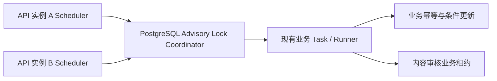

# API 进程内自动任务多实例协调实施计划

> **For agentic workers:** REQUIRED SUB-SKILL: Use superpowers:executing-plans to implement this plan task-by-task. 每完成一个任务先运行该任务的局部验证，再提交；遇到测试失败先使用 `superpowers:systematic-debugging`，全部完成前使用 `superpowers:verification-before-completion`。

**Goal（目标）：** 在不单独部署 Worker、不引入 Redis/MQ 的前提下，让四类 API 进程内定时任务支持多实例互斥、超时、故障接管和优雅停机，并修复内容审核领取后进程退出造成的任务丢失风险。

**Architecture（架构）：** Scheduler 继续驻留在 API 进程中；每次 `RunOnce` 由统一 Coordinator 使用 PostgreSQL session-level Advisory Lock 包裹。四类任务使用固定锁编号，可并行执行但同类任务全局单实例。内容审核额外使用资源表业务租约，确保数据库连接断开、进程崩溃或锁失效后仍可恢复，并阻止过期持有者覆盖新结果。业务层现有状态条件、唯一索引和幂等逻辑全部保留。

**Tech Stack（技术栈）：** Go 1.x、go-zero、PostgreSQL、`database/sql`、`sqlmock`、SQL migration、Node.js migration 静态检查。

**设计依据：** [多实例协调设计文档](/Users/ldh/code/wplink/docs/superpowers/specs/2026-08-04-multi-instance-scheduled-tasks-design.md)

## 全局实施约束

- 不新增 Worker 二进制、Redis、消息队列或任务管理平台。
- 不改变四类任务当前业务周期、批次规则和立即执行一次的语义。
- Advisory Lock 只负责减少重复执行，不能删除现有业务幂等保护。
- 锁必须通过同一个专用 `*sql.Conn` 获取和释放；不能在第三方调用外包裹长事务。
- 锁编号发布后禁止修改：资源生命周期 `1001`、内容审核重试 `1002`、支付补偿 `1003`、地图事件清理 `1004`。
- 所有任务必须有超时；锁冲突属于正常跳过，不计为任务失败。
- 内容审核领取后继续保持 `audit_retry`，只设置租约；所有终态、再次重试和转人工操作必须原子校验租约持有者并清理租约。
- 新日志使用中文可读信息，包含稳定事件名、任务名、实例 ID、锁编号、耗时和安全错误，不输出微信密钥、Token 或原始敏感响应。
- 先写失败测试，再写最小实现；每一任务结束时工作区必须能编译并通过对应测试。

## 文件改动总览

新增：

- `backend/app/internal/task/coordinator.go`
- `backend/app/internal/task/coordinator_test.go`
- `backend/app/internal/task/coordinator_integration_test.go`
- `backend/app/internal/task/scheduler_runtime.go`
- `backend/app/internal/task/scheduler_runtime_test.go`
- `backend/app/internal/task/content_audit_retry_task_test.go`
- `backend/migrations/000035_resource_audit_retry_lease.up.sql`
- `backend/migrations/000035_resource_audit_retry_lease.down.sql`

修改：

- `backend/app/app.go`
- `backend/app/internal/config/config.go`
- `backend/app/internal/config/load.go`
- `backend/app/internal/config/load_test.go`
- `backend/app/internal/config/production_validation.go`
- `backend/app/internal/config/production_validation_test.go`
- `backend/etc/app.yaml.example`
- `backend/etc/app.production.yaml.example`
- `backend/app/internal/task/resource_lifecycle_scheduler.go`
- `backend/app/internal/task/content_audit_retry_scheduler.go`
- `backend/app/internal/task/payment_reconciliation_scheduler.go`
- `backend/app/internal/task/merchant_map_event_cleanup_scheduler.go`
- `backend/app/internal/task/resource_lifecycle_scheduler_test.go`
- `backend/app/internal/task/merchant_map_event_cleanup_test.go`
- `backend/app/internal/task/content_audit_retry_task.go`
- `backend/app/internal/model/resource_model.go`
- `backend/app/internal/model/resource_model_test.go`
- `backend/app/internal/logic/resource/content_audit.go`
- `backend/app/internal/logic/resource/content_audit_test.go`
- `backend/scripts/validate_migrations.test.mjs`
- `docs/architecture.md`
- `docs/deployment.md`
- `docs/superpowers/specs/2026-08-04-multi-instance-scheduled-tasks-design.md`

---

### Task 1：增加任务总开关和四类任务超时配置

**Files:**

- Modify: `backend/app/internal/config/config.go`
- Modify: `backend/app/internal/config/load.go`
- Modify: `backend/app/internal/config/load_test.go`
- Modify: `backend/app/internal/config/production_validation.go`
- Modify: `backend/app/internal/config/production_validation_test.go`
- Modify: `backend/etc/app.yaml.example`
- Modify: `backend/etc/app.production.yaml.example`

- [ ] **步骤 1：先写配置默认值和显式关闭测试**

在 `load_test.go` 增加直接覆盖 `fileConfig.toConfig()` 的测试，避免为默认值测试复制整份 YAML：

```go
func TestFileConfigToConfigUsesTaskCoordinationDefaults(t *testing.T) {
	got := (fileConfig{}).toConfig().Tasks

	if !got.Enabled {
		t.Fatal("未配置 Tasks.Enabled 时应默认启用")
	}
	if got.ResourceLifecycleTimeout != 5*time.Minute ||
		got.ContentAuditRetryTimeout != 10*time.Minute ||
		got.MerchantMapEventCleanupTimeout != 10*time.Minute ||
		got.PaymentReconcileTimeout != 5*time.Minute {
		t.Fatalf("任务超时默认值不正确: %+v", got)
	}
}

func TestFileConfigToConfigAllowsTasksToBeDisabled(t *testing.T) {
	enabled := false
	got := (fileConfig{Tasks: fileTasksConfig{Enabled: &enabled}}).toConfig().Tasks

	if got.Enabled {
		t.Fatal("显式配置 Tasks.Enabled=false 应关闭自动任务")
	}
}
```

在现有严格 YAML 解析测试中加入新字段，验证 duration 解析：

```yaml
Tasks:
  Enabled: true
  ResourceLifecycleTimeout: 5m
  ContentAuditRetryTimeout: 10m
  MerchantMapEventCleanupTimeout: 10m
  PaymentReconcileTimeout: 5m
```

- [ ] **步骤 2：运行配置测试，确认失败原因是字段尚不存在**

Run: `cd backend && go test ./app/internal/config -run 'TestFileConfigToConfig(UsesTaskCoordinationDefaults|AllowsTasksToBeDisabled)' -count=1`

Expected: 编译失败，提示 `TasksConfig` / `fileTasksConfig` 缺少新增字段。

- [ ] **步骤 3：实现配置结构、兼容默认值和生产校验**

在 `config.go` 扩展结构：

```go
type TasksConfig struct {
	Enabled                        bool
	ResourceLifecycleInterval      time.Duration
	ResourceLifecycleTimeout       time.Duration
	ContentAuditRetryInterval      time.Duration
	ContentAuditRetryTimeout       time.Duration
	ContentAuditRetryBatchSize     int64
	MerchantMapEventCleanupInterval time.Duration
	MerchantMapEventCleanupTimeout  time.Duration
	MerchantMapEventRetentionDays   int
	PaymentReconcileInterval       time.Duration
	PaymentReconcileTimeout        time.Duration
	PaymentQueryDelay              time.Duration
	PaymentBatchSize               int64
}
```

在 `load.go` 使用 `*bool` 区分“未配置”和“显式 false”，并集中计算默认值：

```go
const (
	defaultResourceLifecycleTimeout       = 5 * time.Minute
	defaultContentAuditRetryTimeout       = 10 * time.Minute
	defaultMerchantMapEventCleanupTimeout = 10 * time.Minute
	defaultPaymentReconcileTimeout        = 5 * time.Minute
)

type fileTasksConfig struct {
	Enabled                         *bool          `yaml:"Enabled"`
	ResourceLifecycleInterval       configDuration `yaml:"ResourceLifecycleInterval"`
	ResourceLifecycleTimeout        configDuration `yaml:"ResourceLifecycleTimeout"`
	ContentAuditRetryInterval       configDuration `yaml:"ContentAuditRetryInterval"`
	ContentAuditRetryTimeout        configDuration `yaml:"ContentAuditRetryTimeout"`
	ContentAuditRetryBatchSize      int64          `yaml:"ContentAuditRetryBatchSize"`
	MerchantMapEventCleanupInterval configDuration `yaml:"MerchantMapEventCleanupInterval"`
	MerchantMapEventCleanupTimeout  configDuration `yaml:"MerchantMapEventCleanupTimeout"`
	MerchantMapEventRetentionDays   int            `yaml:"MerchantMapEventRetentionDays"`
	PaymentReconcileInterval        configDuration `yaml:"PaymentReconcileInterval"`
	PaymentReconcileTimeout         configDuration `yaml:"PaymentReconcileTimeout"`
	PaymentQueryDelay               configDuration `yaml:"PaymentQueryDelay"`
	PaymentBatchSize                int64          `yaml:"PaymentBatchSize"`
}

func (c fileTasksConfig) toConfig() TasksConfig {
	enabled := true
	if c.Enabled != nil {
		enabled = *c.Enabled
	}
	withDefault := func(value configDuration, fallback time.Duration) time.Duration {
		if value.Duration() != 0 {
			return value.Duration()
		}
		return fallback
	}
	return TasksConfig{
		Enabled:                          enabled,
		ResourceLifecycleInterval:        c.ResourceLifecycleInterval.Duration(),
		ResourceLifecycleTimeout:         withDefault(c.ResourceLifecycleTimeout, defaultResourceLifecycleTimeout),
		ContentAuditRetryInterval:        c.ContentAuditRetryInterval.Duration(),
		ContentAuditRetryTimeout:         withDefault(c.ContentAuditRetryTimeout, defaultContentAuditRetryTimeout),
		ContentAuditRetryBatchSize:       c.ContentAuditRetryBatchSize,
		MerchantMapEventCleanupInterval:  c.MerchantMapEventCleanupInterval.Duration(),
		MerchantMapEventCleanupTimeout:   withDefault(c.MerchantMapEventCleanupTimeout, defaultMerchantMapEventCleanupTimeout),
		MerchantMapEventRetentionDays:    c.MerchantMapEventRetentionDays,
		PaymentReconcileInterval:         c.PaymentReconcileInterval.Duration(),
		PaymentReconcileTimeout:          withDefault(c.PaymentReconcileTimeout, defaultPaymentReconcileTimeout),
		PaymentQueryDelay:                c.PaymentQueryDelay.Duration(),
		PaymentBatchSize:                 c.PaymentBatchSize,
	}
}
```

`fileConfig.toConfig()` 中改为 `Tasks: c.Tasks.toConfig()`。生产校验对四个 timeout 做 `> 0` 校验，并返回明确中文错误。两个已跟踪 YAML 模板显式写出全部新增字段，保证部署行为可审计。

- [ ] **步骤 4：运行配置测试和格式化**

Run: `cd backend && gofmt -w app/internal/config/config.go app/internal/config/load.go app/internal/config/load_test.go app/internal/config/production_validation.go app/internal/config/production_validation_test.go`

Run: `cd backend && go test ./app/internal/config -count=1`

Expected: PASS。

- [ ] **步骤 5：提交**

```bash
git add backend/app/internal/config backend/etc/app.yaml.example backend/etc/app.production.yaml.example
git commit -m "feat: 增加自动任务开关和超时配置"
```

---

### Task 2：实现 PostgreSQL Advisory Lock 协调器

**Files:**

- Create: `backend/app/internal/task/coordinator.go`
- Create: `backend/app/internal/task/coordinator_test.go`
- Create: `backend/app/internal/task/coordinator_integration_test.go`

- [ ] **步骤 1：先写锁编号、未获得锁、执行、超时和解锁测试**

测试至少覆盖以下表驱动场景：

```go
func TestTaskAdvisoryLockKeysAreStable(t *testing.T) {
	want := map[TaskName]int64{
		TaskResourceLifecycle:        1001,
		TaskContentAuditRetry:        1002,
		TaskPaymentReconciliation:   1003,
		TaskMerchantMapEventCleanup: 1004,
	}
	for taskName, lockKey := range want {
		if got := taskAdvisoryLockKeys[taskName]; got != lockKey {
			t.Fatalf("任务 %s 锁编号错误: got=%d want=%d", taskName, got, lockKey)
		}
	}
}

func TestCoordinatorSkipsWhenLockIsHeld(t *testing.T) {
	db, mock, err := sqlmock.New()
	if err != nil {
		t.Fatalf("创建 sqlmock 失败: %v", err)
	}
	t.Cleanup(func() { _ = db.Close() })
	mock.ExpectQuery(`SELECT pg_try_advisory_lock\(\$1\)`).
		WithArgs(int64(1001)).
		WillReturnRows(sqlmock.NewRows([]string{"pg_try_advisory_lock"}).AddRow(false))

	called := false
	result, err := NewPostgresCoordinator(db, "api-a").RunExclusive(
		context.Background(), TaskResourceLifecycle, time.Second,
		func(context.Context) error { called = true; return nil },
	)

	if err != nil || result.Acquired || called {
		t.Fatalf("锁占用时结果不正确: result=%+v called=%t err=%v", result, called, err)
	}
	if err := mock.ExpectationsWereMet(); err != nil {
		t.Fatalf("SQL 期望未满足: %v", err)
	}
}
```

获得锁的测试必须期望同一 `sql.Conn` 上的 unlock SQL，并验证业务错误仍是返回主错误；unlock 失败只写日志，不覆盖业务错误。超时测试中的 runner 等待 `ctx.Done()`，断言返回 `context.DeadlineExceeded` 且仍执行 unlock。未知任务名必须在申请数据库连接前返回错误。

- [ ] **步骤 2：运行测试，确认失败**

Run: `cd backend && go test ./app/internal/task -run 'Test(TaskAdvisoryLockKeysAreStable|Coordinator)' -count=1`

Expected: 编译失败，协调器类型尚不存在。

- [ ] **步骤 3：实现稳定接口和同连接锁生命周期**

`coordinator.go` 的公开契约固定为：

```go
type TaskName string

const (
	TaskResourceLifecycle        TaskName = "resource_lifecycle"
	TaskContentAuditRetry        TaskName = "content_audit_retry"
	TaskPaymentReconciliation   TaskName = "payment_reconciliation"
	TaskMerchantMapEventCleanup TaskName = "merchant_map_event_cleanup"
)

var taskAdvisoryLockKeys = map[TaskName]int64{
	TaskResourceLifecycle:        1001,
	TaskContentAuditRetry:        1002,
	TaskPaymentReconciliation:   1003,
	TaskMerchantMapEventCleanup: 1004,
}

type CoordinationResult struct {
	Acquired bool
	Duration time.Duration
}

type Coordinator interface {
	RunExclusive(context.Context, TaskName, time.Duration, func(context.Context) error) (CoordinationResult, error)
}

type PostgresCoordinator struct {
	db         *sql.DB
	instanceID string
	now        func() time.Time
}

func NewPostgresCoordinator(db *sql.DB, instanceID string) *PostgresCoordinator
func CurrentInstanceID() string
```

`CurrentInstanceID()` 返回 `hostname:pid`，hostname 失败时使用 `unknown-host`，最终截断到 128 字符。核心流程必须符合以下顺序：

```go
conn, err := c.db.Conn(ctx)
if err != nil {
	return CoordinationResult{}, fmt.Errorf("任务 %s 申请专用数据库连接失败: %w", taskName, err)
}
defer conn.Close()

var acquired bool
if err := conn.QueryRowContext(ctx, "SELECT pg_try_advisory_lock($1)", lockKey).Scan(&acquired); err != nil {
	return CoordinationResult{}, fmt.Errorf("任务 %s 获取协调锁失败: %w", taskName, err)
}
if !acquired {
	logx.WithContext(ctx).Infow("自动任务因锁被占用而跳过", logx.Field("event", "task_skipped_lock_held"))
	return CoordinationResult{Acquired: false}, nil
}

startedAt := c.now()
defer func() {
	unlockCtx, cancel := context.WithTimeout(context.Background(), 5*time.Second)
	defer cancel()
	var unlocked bool
	if unlockErr := conn.QueryRowContext(unlockCtx, "SELECT pg_advisory_unlock($1)", lockKey).Scan(&unlocked); unlockErr != nil || !unlocked {
		logx.Errorf("自动任务协调锁释放失败: task=%s lock_key=%d instance_id=%s unlocked=%t err=%v", taskName, lockKey, c.instanceID, unlocked, unlockErr)
	}
}()

runCtx, cancel := context.WithTimeout(ctx, timeout)
defer cancel()
runErr := run(runCtx)
duration := c.now().Sub(startedAt)
if runErr != nil {
	return CoordinationResult{Acquired: true, Duration: duration}, runErr
}
if err := runCtx.Err(); err != nil {
	return CoordinationResult{Acquired: true, Duration: duration}, err
}
return CoordinationResult{Acquired: true, Duration: duration}, nil
```

实现时补充以下边界：`timeout <= 0` 立即返回配置错误；runner panic 通过 defer 记录后继续 panic，同时仍释放锁；日志字段统一包含 `event/task/lock_key/instance_id/duration_ms`。

- [ ] **步骤 4：增加可选真实 PostgreSQL 集成测试**

`coordinator_integration_test.go` 从 `WPLINK_TEST_POSTGRES_DSN` 读取 DSN，未设置时 `t.Skip`。用两个独立 `*sql.DB` 验证：

```go
func TestCoordinatorIntegrationMultiInstanceMutualExclusionAndTakeover(t *testing.T) {
	dsn := os.Getenv("WPLINK_TEST_POSTGRES_DSN")
	if dsn == "" {
		t.Skip("未设置 WPLINK_TEST_POSTGRES_DSN")
	}
	dbA := openIntegrationDB(t, dsn)
	dbB := openIntegrationDB(t, dsn)

	entered := make(chan struct{})
	release := make(chan struct{})
	go func() {
		_, _ = NewPostgresCoordinator(dbA, "api-a").RunExclusive(context.Background(), TaskResourceLifecycle, time.Minute, func(context.Context) error {
			close(entered)
			<-release
			return nil
		})
	}()
	<-entered

	second, err := NewPostgresCoordinator(dbB, "api-b").RunExclusive(context.Background(), TaskResourceLifecycle, time.Second, func(context.Context) error {
		t.Fatal("持锁期间第二实例不应执行")
		return nil
	})
	if err != nil || second.Acquired {
		t.Fatalf("第二实例应跳过: result=%+v err=%v", second, err)
	}
	close(release)

	deadline := time.Now().Add(5 * time.Second)
	for time.Now().Before(deadline) {
		result, runErr := NewPostgresCoordinator(dbB, "api-b").RunExclusive(context.Background(), TaskResourceLifecycle, time.Second, func(context.Context) error { return nil })
		if runErr == nil && result.Acquired {
			return
		}
		time.Sleep(50 * time.Millisecond)
	}
	t.Fatal("第一实例释放锁后第二实例未能接管")
}
```

再增加数据库会话被强制终止后的接管测试。测试连接先查询自身 backend PID 并持锁，管理连接调用 `pg_terminate_backend`；测试账号无该权限时明确 `t.Skip`，有权限时必须验证实例 B 最终获取相同锁：

```go
func TestCoordinatorIntegrationTakeoverAfterBackendTermination(t *testing.T) {
	dsn := os.Getenv("WPLINK_TEST_POSTGRES_DSN")
	if dsn == "" {
		t.Skip("未设置 WPLINK_TEST_POSTGRES_DSN")
	}
	dbA := openIntegrationDB(t, dsn)
	dbB := openIntegrationDB(t, dsn)
	connA, err := dbA.Conn(context.Background())
	if err != nil {
		t.Fatalf("申请实例 A 连接失败: %v", err)
	}
	defer connA.Close()

	var backendPID int
	var acquired bool
	if err := connA.QueryRowContext(context.Background(), "SELECT pg_backend_pid(), pg_try_advisory_lock($1)", int64(1001)).Scan(&backendPID, &acquired); err != nil || !acquired {
		t.Fatalf("实例 A 获取测试锁失败: acquired=%t err=%v", acquired, err)
	}
	if _, err := dbB.ExecContext(context.Background(), "SELECT pg_terminate_backend($1)", backendPID); err != nil {
		t.Skipf("测试账号无权终止 PostgreSQL backend: %v", err)
	}

	deadline := time.Now().Add(5 * time.Second)
	for time.Now().Before(deadline) {
		result, runErr := NewPostgresCoordinator(dbB, "api-b").RunExclusive(context.Background(), TaskResourceLifecycle, time.Second, func(context.Context) error { return nil })
		if runErr == nil && result.Acquired {
			return
		}
		time.Sleep(50 * time.Millisecond)
	}
	t.Fatal("实例 A 数据库会话终止后实例 B 未能接管")
}
```

同文件再验证不同锁编号能并行获取。集成测试必须设置独立数据库最大连接数至少为 2，并在测试退出时关闭所有连接。

- [ ] **步骤 5：运行单元测试和格式化**

Run: `cd backend && gofmt -w app/internal/task/coordinator.go app/internal/task/coordinator_test.go app/internal/task/coordinator_integration_test.go`

Run: `cd backend && go test ./app/internal/task -run 'Test(TaskAdvisoryLockKeysAreStable|Coordinator)' -count=1`

Expected: PASS；未配置 DSN 时集成测试显示 SKIP，不影响普通测试。

- [ ] **步骤 6：提交**

```bash
git add backend/app/internal/task/coordinator.go backend/app/internal/task/coordinator_test.go backend/app/internal/task/coordinator_integration_test.go
git commit -m "feat: 增加定时任务数据库协调器"
```

---

### Task 3：统一 Scheduler 运行时并接入四类任务

**Files:**

- Create: `backend/app/internal/task/scheduler_runtime.go`
- Create: `backend/app/internal/task/scheduler_runtime_test.go`
- Modify: `backend/app/internal/task/resource_lifecycle_scheduler.go`
- Modify: `backend/app/internal/task/content_audit_retry_scheduler.go`
- Modify: `backend/app/internal/task/payment_reconciliation_scheduler.go`
- Modify: `backend/app/internal/task/merchant_map_event_cleanup_scheduler.go`
- Modify: `backend/app/internal/task/resource_lifecycle_scheduler_test.go`
- Modify: `backend/app/internal/task/merchant_map_event_cleanup_test.go`

- [ ] **步骤 1：先写统一运行时行为测试**

用 fake coordinator 验证：启动后立即触发一次、同一 Scheduler 不重入、取消后 `Wait()` 返回、锁未获得时不调用 runner、runner 错误不终止下一轮调度。

```go
type fakeCoordinator struct {
	mu       sync.Mutex
	calls    int
	acquired bool
}

func (f *fakeCoordinator) RunExclusive(ctx context.Context, _ TaskName, _ time.Duration, run func(context.Context) error) (CoordinationResult, error) {
	f.mu.Lock()
	f.calls++
	f.mu.Unlock()
	if !f.acquired {
		return CoordinationResult{Acquired: false}, nil
	}
	return CoordinationResult{Acquired: true}, run(ctx)
}

func TestSchedulerRuntimeStartsImmediatelyAndWaitsForShutdown(t *testing.T) {
	coordinator := &fakeCoordinator{acquired: true}
	runtime := newSchedulerRuntime(TaskResourceLifecycle, coordinator, time.Second)
	ctx, cancel := context.WithCancel(context.Background())
	called := make(chan struct{}, 1)

	runtime.start(ctx, time.Hour, func(context.Context) error {
		called <- struct{}{}
		return nil
	})
	select {
	case <-called:
	case <-time.After(time.Second):
		t.Fatal("Scheduler 启动后未立即执行")
	}
	cancel()
	runtime.wait()
}
```

- [ ] **步骤 2：运行测试，确认失败**

Run: `cd backend && go test ./app/internal/task -run TestSchedulerRuntime -count=1`

Expected: 编译失败，运行时尚不存在。

- [ ] **步骤 3：实现统一 Scheduler 运行时**

`scheduler_runtime.go` 实现单 goroutine 串行调度，防止同一个 Scheduler 周期重叠：

```go
type schedulerRuntime struct {
	taskName   TaskName
	coordinator Coordinator
	timeout    time.Duration
	wg         sync.WaitGroup
}

func newSchedulerRuntime(taskName TaskName, coordinator Coordinator, timeout time.Duration) *schedulerRuntime {
	return &schedulerRuntime{taskName: taskName, coordinator: coordinator, timeout: timeout}
}

func (r *schedulerRuntime) start(ctx context.Context, interval time.Duration, run func(context.Context) error) {
	if interval <= 0 {
		return
	}
	r.wg.Add(1)
	go func() {
		defer r.wg.Done()
		r.runOnce(ctx, run)
		ticker := time.NewTicker(interval)
		defer ticker.Stop()
		for {
			select {
			case <-ctx.Done():
				return
			case <-ticker.C:
				r.runOnce(ctx, run)
			}
		}
	}()
}

func (r *schedulerRuntime) runOnce(ctx context.Context, run func(context.Context) error) {
	if r.coordinator == nil {
		_ = run(ctx)
		return
	}
	_, _ = r.coordinator.RunExclusive(ctx, r.taskName, r.timeout, run)
}

func (r *schedulerRuntime) wait() {
	r.wg.Wait()
}
```

协调器负责统一生命周期日志，原 Scheduler 的 `RunOnce` 继续记录领域统计。不得在两层重复记录相同错误。测试注入 `nil` coordinator 时保留原有直接运行能力，便于小范围单元测试；生产装配必须始终传入 coordinator。

- [ ] **步骤 4：四个 Scheduler 统一构造和等待接口**

四个构造函数均增加 coordinator 与 timeout 参数，避免隐藏全局状态：

```go
func NewResourceLifecycleScheduler(runner ResourceLifecycleRunner, interval time.Duration, logger *log.Logger, coordinator Coordinator, timeout time.Duration) *ResourceLifecycleScheduler
func NewContentAuditRetryScheduler(runner ContentAuditRetryRunner, interval time.Duration, logger *log.Logger, coordinator Coordinator, timeout time.Duration) *ContentAuditRetryScheduler
func NewPaymentReconciliationScheduler(runner PaymentReconciliationRunner, interval time.Duration, logger *log.Logger, coordinator Coordinator, timeout time.Duration) *PaymentReconciliationScheduler
func NewMerchantMapEventCleanupScheduler(runner MerchantMapEventCleanupRunner, interval time.Duration, logger *log.Logger, coordinator Coordinator, timeout time.Duration) *MerchantMapEventCleanupScheduler
```

每个结构体持有 `runtime *schedulerRuntime`，并使用固定任务名：

```go
func (s *ResourceLifecycleScheduler) Start(ctx context.Context) {
	s.runtime.start(ctx, s.interval, s.RunOnce)
}

func (s *ResourceLifecycleScheduler) Wait() {
	s.runtime.wait()
}
```

对应映射：

| Scheduler | TaskName |
|---|---|
| `ResourceLifecycleScheduler` | `TaskResourceLifecycle` |
| `ContentAuditRetryScheduler` | `TaskContentAuditRetry` |
| `PaymentReconciliationScheduler` | `TaskPaymentReconciliation` |
| `MerchantMapEventCleanupScheduler` | `TaskMerchantMapEventCleanup` |

更新现有测试构造调用；保留原 `logger` 参数，在其后追加 `nil, 0`，新增协调行为统一由 `scheduler_runtime_test.go` 覆盖。

- [ ] **步骤 5：运行任务包测试**

Run: `cd backend && gofmt -w app/internal/task`

Run: `cd backend && go test ./app/internal/task -count=1`

Expected: PASS。

- [ ] **步骤 6：提交**

```bash
git add backend/app/internal/task
git commit -m "refactor: 统一定时任务调度运行时"
```

---

### Task 4：在 API 启动流程中装配协调器并优雅停机

**Files:**

- Modify: `backend/app/app.go`

- [ ] **步骤 1：先建立编译失败检查点**

先把四个 Scheduler 构造调用改为新签名，但暂不声明 coordinator，运行编译以确认改动位置完整：

```go
lifecycleScheduler := task.NewResourceLifecycleScheduler(
	resourceLifecycleTask,
	cfg.Tasks.ResourceLifecycleInterval,
	log.Default(),
	coordinator,
	cfg.Tasks.ResourceLifecycleTimeout,
)
```

Run: `cd backend && go test ./app/... -run '^$'`

Expected: 编译失败，提示 `coordinator` 未定义；如果还提示构造参数错误，说明存在漏改的 Scheduler 调用。

- [ ] **步骤 2：创建单例协调器并传给四个 Scheduler**

在数据库和 `svcCtx` 创建成功后创建一次：

```go
instanceID := task.CurrentInstanceID()
coordinator := task.NewPostgresCoordinator(svcCtx.DB, instanceID)
```

直接复用 `svcCtx.DB`，不额外打开连接池。四个 Scheduler 分别传入自己的 timeout。

- [ ] **步骤 3：使用全局开关控制启动并等待退出**

全局开关包裹现有逐任务启用条件；每个任务原有 `Enabled()`、内容审核依赖和支付依赖检查全部保留：

```go
if !cfg.Tasks.Enabled {
	logx.Infow("自动任务已通过配置关闭", logx.Field("event", "tasks_disabled"), logx.Field("instance_id", instanceID))
}
if cfg.Tasks.Enabled && lifecycleScheduler.Enabled() {
	lifecycleScheduler.Start(appCtx)
}
if cfg.Tasks.Enabled && svcCtx.ContentAuditor != nil && contentAuditRetryScheduler.Enabled() {
	contentAuditRetryScheduler.Start(appCtx)
}
if cfg.Tasks.Enabled && svcCtx.WechatPayOrderGateway != nil && paymentScheduler.Enabled() {
	paymentScheduler.Start(appCtx)
}
if cfg.Tasks.Enabled && merchantMapEventCleanupScheduler.Enabled() {
	merchantMapEventCleanupScheduler.Start(appCtx)
}

goZeroServer.Start()

cancel()
lifecycleScheduler.Wait()
contentAuditRetryScheduler.Wait()
paymentScheduler.Wait()
merchantMapEventCleanupScheduler.Wait()
```

确保 Scheduler `Wait()` 发生在数据库连接池关闭之前。不要增加第二套 OS signal 处理；沿用 go-zero server 当前停止机制。

- [ ] **步骤 4：格式化并验证 API 编译与任务测试**

Run: `cd backend && gofmt -w app/app.go`

Run: `cd backend && go test ./app/... -count=1`

Expected: PASS。

- [ ] **步骤 5：提交**

```bash
git add backend/app/app.go
git commit -m "feat: 接入多实例任务协调和优雅停机"
```

---

### Task 5：为内容审核重试增加数据库租约迁移

**Files:**

- Create: `backend/migrations/000035_resource_audit_retry_lease.up.sql`
- Create: `backend/migrations/000035_resource_audit_retry_lease.down.sql`
- Modify: `backend/scripts/validate_migrations.test.mjs`

- [ ] **步骤 1：先写 migration 静态约束测试**

在 `validate_migrations.test.mjs` 增加测试，读取 000035 up/down 并断言：新增两个字段、重建 due index、up/down 可逆，且 up 中没有把状态改成 `pending`。

```js
test('000035 adds recoverable content-audit leases', () => {
  const upFileName = '000035_resource_audit_retry_lease.up.sql'
  const downFileName = '000035_resource_audit_retry_lease.down.sql'
  assert.equal(fs.existsSync(path.resolve(migrationsDir, upFileName)), true, `${upFileName} should exist`)
  assert.equal(fs.existsSync(path.resolve(migrationsDir, downFileName)), true, `${downFileName} should exist`)
  const up = fs.readFileSync(path.resolve(migrationsDir, upFileName), 'utf8')
  const down = fs.readFileSync(path.resolve(migrationsDir, downFileName), 'utf8')

  assert.match(up, /audit_lease_until\s+TIMESTAMPTZ/i)
  assert.match(up, /audit_processing_by\s+VARCHAR\(128\)/i)
  assert.match(up, /ON\s+resources\s*\(audit_retry_at,\s*audit_lease_until,\s*updated_at\)/i)
  assert.doesNotMatch(up, /SET\s+status\s*=\s*'pending'/i)
  assert.match(down, /DROP\s+COLUMN\s+IF\s+EXISTS\s+audit_lease_until/i)
  assert.match(down, /DROP\s+COLUMN\s+IF\s+EXISTS\s+audit_processing_by/i)
})
```

复用测试文件已经导入的 `fs`、`path` 和 `migrationsDir`，不新增依赖或重复 helper。

- [ ] **步骤 2：运行静态测试，确认失败**

Run: `cd backend && node --test scripts/validate_migrations.test.mjs`

Expected: FAIL，迁移文件不存在。

- [ ] **步骤 3：编写可逆迁移**

`000035_resource_audit_retry_lease.up.sql`：

```sql
ALTER TABLE resources
    ADD COLUMN audit_lease_until TIMESTAMPTZ,
    ADD COLUMN audit_processing_by VARCHAR(128);

COMMENT ON COLUMN resources.audit_lease_until IS '内容审核重试租约到期时间；到期后允许其他实例重新领取';
COMMENT ON COLUMN resources.audit_processing_by IS '当前内容审核重试实例标识';

DROP INDEX IF EXISTS idx_resources_audit_retry_due;
CREATE INDEX idx_resources_audit_retry_due
    ON resources (audit_retry_at, audit_lease_until, updated_at)
    WHERE status = 'audit_retry'
      AND deleted_at IS NULL;
```

`000035_resource_audit_retry_lease.down.sql`：

```sql
DROP INDEX IF EXISTS idx_resources_audit_retry_due;

ALTER TABLE resources
    DROP COLUMN IF EXISTS audit_processing_by,
    DROP COLUMN IF EXISTS audit_lease_until;

CREATE INDEX idx_resources_audit_retry_due
    ON resources (audit_retry_at, updated_at)
    WHERE status = 'audit_retry'
      AND deleted_at IS NULL;
```

注意：领取条件属于业务 SQL，不要试图写进 partial index predicate；PostgreSQL 不允许在索引谓词中使用 `NOW()` 这样的非 immutable 表达式。

- [ ] **步骤 4：运行 migration 静态检查**

Run: `cd backend && node --test scripts/validate_migrations.test.mjs`

Expected: PASS。

- [ ] **步骤 5：使用可用测试数据库执行真实迁移验证**

Run: `cd backend && go run ./scripts/verify_migrations.go -config etc/app.yaml`

Expected: up/down/up 全部成功。如果本地配置没有可连接 PostgreSQL，记录为环境限制，但不得用静态测试替代最终上线前的真实库验证。

- [ ] **步骤 6：提交**

```bash
git add backend/migrations/000035_resource_audit_retry_lease.up.sql backend/migrations/000035_resource_audit_retry_lease.down.sql backend/scripts/validate_migrations.test.mjs
git commit -m "feat: 增加内容审核重试租约字段"
```

---

### Task 6：实现内容审核租约领取、持有者校验和崩溃恢复

**Files:**

- Modify: `backend/app/internal/model/resource_model.go`
- Modify: `backend/app/internal/model/resource_model_test.go`
- Modify: `backend/app/internal/logic/resource/content_audit.go`
- Modify: `backend/app/internal/logic/resource/content_audit_test.go`
- Modify: `backend/app/internal/task/content_audit_retry_task.go`
- Create: `backend/app/internal/task/content_audit_retry_task_test.go`
- Modify: `backend/app/app.go`

- [ ] **步骤 1：先写 Model 领取租约测试**

新的领取契约：

```go
type ResourceAuditRetryClaim struct {
	ResourceID   string
	RetryCount   int64
	ManualReview bool
	ProcessingBy string
}

func (m *ResourceModel) ClaimDueResourceAuditRetries(
	ctx context.Context,
	batchSize int64,
	maxRetryCount int64,
	processingBy string,
	leaseDuration time.Duration,
) ([]ResourceAuditRetryClaim, error)
```

sqlmock 测试断言 SQL 同时满足：

```sql
WHERE status = 'audit_retry'
  AND audit_retry_at <= NOW()
  AND (audit_lease_until IS NULL OR audit_lease_until <= NOW())
FOR UPDATE SKIP LOCKED
```

未超过最大重试次数的记录必须保持 `status = 'audit_retry'` 并设置租约；已达到上限的记录沿用现有行为，原子转成 `manual_review` 且不设置租约：

```sql
SET status = CASE WHEN audit_retry_count >= $2 THEN 'manual_review' ELSE 'audit_retry' END,
    audit_processing_by = CASE WHEN audit_retry_count >= $2 THEN NULL ELSE $3 END,
    audit_lease_until = CASE
        WHEN audit_retry_count >= $2 THEN NULL
        ELSE NOW() + ($4 * INTERVAL '1 millisecond')
    END,
    audit_retry_count = CASE
        WHEN audit_retry_count >= $2 THEN audit_retry_count
        ELSE audit_retry_count + 1
    END,
    audit_retry_at = CASE WHEN audit_retry_count >= $2 THEN NULL ELSE audit_retry_at END,
	updated_at = NOW()
```

`RETURNING` 同时返回 `status = 'manual_review'` 和 `COALESCE(audit_processing_by, '')`，确保普通重试 claim 带实例 ID，转人工 claim 的实例 ID 为空。

先增加以下测试名：

```go
func TestClaimDueResourceAuditRetriesSetsLeaseWithoutChangingStatus(t *testing.T)
func TestClaimDueResourceAuditRetriesRejectsEmptyProcessingBy(t *testing.T)
func TestClaimDueResourceAuditRetriesRejectsNonPositiveLease(t *testing.T)
func TestClaimDueResourceAuditRetriesCanReclaimExpiredLease(t *testing.T)
```

- [ ] **步骤 2：先写过期持有者不能覆盖结果的 Model 测试**

增加只供租约重试路径使用的 guard：

```go
type ResourceAuditGuard struct {
	ResourceID   string
	ProcessingBy string
}
```

重试入口必须传实例 ID，只允许处理由该实例持有且未过期的 `audit_retry` 资源。新增 lease-aware Model 方法统一使用以下原子条件：

```sql
AND status = 'audit_retry'
AND audit_processing_by = $2
AND audit_lease_until > NOW()
```

现有无租约方法及其签名保持不变，继续服务创建、提交和微信媒体回调的 `pending` 流程，避免扩大接口改动和测试替身范围。

为以下状态转换分别增加“匹配持有者成功”和“过期/不匹配返回未更新”测试：

- 创建媒体审核任务。
- 自动审核通过并发布。
- 自动审核拒绝。
- 再次标记重试。
- 转人工审核。

成功转换必须统一清理：

```sql
audit_lease_until = NULL,
audit_processing_by = NULL
```

对于“创建媒体审核任务”这种仍需等待微信回调的转换，应先把资源转回 `pending` 再清租约；异步回调继续走原有 `pending` 状态保护。

- [ ] **步骤 3：运行 Model 测试，确认失败**

Run: `cd backend && go test ./app/internal/model -run 'Test(ClaimDueResourceAuditRetries|.*Audit.*Lease|.*Audit.*ProcessingBy)' -count=1`

Expected: 编译失败或 SQL 期望失败。

- [ ] **步骤 4：实现 Model 的 lease-aware 方法和原子条件更新**

保留现有公开方法，新增以下最小接口：

```go
type ResourceAuditLeaseStore interface {
	GetLeasedResourceAuditSnapshot(context.Context, model.ResourceAuditGuard) (model.ResourceAuditSnapshot, error)
	CreateLeasedResourceContentAuditTasks(context.Context, model.ResourceAuditGuard, []model.ResourceContentAuditTaskInput) error
	PublishLeasedResourceAfterAudit(context.Context, model.ResourceAuditGuard) (model.ReviewResourceResult, error)
	RejectLeasedResourceAfterAudit(context.Context, model.ResourceAuditGuard, string) (model.ReviewResourceResult, error)
	MarkLeasedResourceAuditRetry(context.Context, model.ResourceAuditGuard, string) (int64, error)
	MarkLeasedResourceManualReview(context.Context, model.ResourceAuditGuard, string) error
}
```

`ResourceModel` 实现这六个新方法。内部可抽取接收 guard 的私有事务 helper 复用发布、拒绝和媒体任务逻辑，但旧公开方法继续使用原来的 `pending` 条件。不得用可选参数或调用栈判断路径。

`GetLeasedResourceAuditSnapshot` 的 SELECT 必须校验资源 ID、租约持有者和 `audit_lease_until > NOW()`。其余五个写方法必须在同一事务内先锁定并校验租约，再完成业务更新，防止“先检查、后更新”之间被新实例接管。

对于条件更新 `RowsAffected() == 0`，以及租约 SELECT 返回 `sql.ErrNoRows`，统一转换成可识别错误：

```go
var ErrResourceAuditLeaseLost = errors.New("资源审核租约已失效")
```

该错误属于并发接管的正常保护结果，上层记录 warning 后停止处理，不能再次修改资源。

五条租约写路径的状态规则固定为：

| 方法 | 新状态 | 租约处理 |
|---|---|---|
| `CreateLeasedResourceContentAuditTasks` | `pending` | 创建媒体任务的同一事务中清空 |
| `PublishLeasedResourceAfterAudit` | `published` | 发布的同一事务中清空 |
| `RejectLeasedResourceAfterAudit` | `rejected` | 拒绝的同一事务中清空 |
| `MarkLeasedResourceAuditRetry` | `audit_retry` | 写入下次 `audit_retry_at` 后清空 |
| `MarkLeasedResourceManualReview` | `manual_review` | 转人工的同一事务中清空 |

`MarkStaleContentAuditTasksForRetry` 也显式清空两个租约字段，防御历史异常数据。

领取前验证：

```go
if strings.TrimSpace(processingBy) == "" {
	return nil, errors.New("内容审核重试实例标识不能为空")
}
if leaseDuration <= 0 {
	return nil, errors.New("内容审核重试租约时长必须大于 0")
}
```

租约时长以整数毫秒作为 SQL 参数，避免拼接 interval 字符串。

- [ ] **步骤 5：先写 Task/Logic 的租约传递测试**

`content_audit_retry_task_test.go` 使用 fake store 和 fake auditor 验证：

```go
func TestContentAuditRetryTaskClaimsAndProcessesWithInstanceLease(t *testing.T) {
	store := &fakeContentAuditRetryStore{
		claims: []model.ResourceAuditRetryClaim{{ResourceID: "resource-1", RetryCount: 1, ProcessingBy: "api-a"}},
	}
	task := NewContentAuditRetryTask(store, fakeAuditor{}, 20, 3, "api-a", 2*time.Minute)

	result, err := task.Run(context.Background())

	if err != nil {
		t.Fatalf("执行内容审核重试失败: %v", err)
	}
	wantGuard := model.ResourceAuditGuard{ResourceID: "resource-1", ProcessingBy: "api-a"}
	if store.claimProcessingBy != "api-a" || store.claimLeaseDuration != 2*time.Minute || store.processedGuard != wantGuard {
		t.Fatalf("租约参数传递错误: owner=%s duration=%s guard=%+v", store.claimProcessingBy, store.claimLeaseDuration, store.processedGuard)
	}
	if result.RetriedCount != 1 {
		t.Fatalf("重试数量错误: got=%d want=1", result.RetriedCount)
	}
}
```

再增加：领取失败；单条租约丢失不覆盖且继续下一条；任务 context 超时立即停止批次；旧实例与新实例处理同一资源时只有新租约持有者可完成。

- [ ] **步骤 6：在 Logic 和 Task 中贯穿 guard**

新增一个仅在重试逻辑内部使用的 adapter，把现有 `applyResourceAutoAuditResult` 需要的无 guard 接口转发到 lease-aware 方法。这样创建、提交和微信媒体回调不需要改签名：

```go
type leasedResourceAuditAdapter struct {
	store ResourceAuditLeaseStore
	guard model.ResourceAuditGuard
}

func (a leasedResourceAuditAdapter) GetResourceAuditSnapshot(ctx context.Context, _ string) (model.ResourceAuditSnapshot, error) {
	return a.store.GetLeasedResourceAuditSnapshot(ctx, a.guard)
}

func (a leasedResourceAuditAdapter) PublishResourceAfterAudit(ctx context.Context, _ string) (model.ReviewResourceResult, error) {
	return a.store.PublishLeasedResourceAfterAudit(ctx, a.guard)
}
```

adapter 必须完整实现 snapshot、创建媒体任务、发布、拒绝、再次重试、转人工六个转发方法；每个方法忽略上层重复传入的 resource ID，只使用构造时不可变的 guard。若底层 store 同时实现 `ResourceAuditDecisionStore`，adapter 继续转发审核决策记录，保持现有审计日志能力。

修改重试入口签名：

```go
func RetryResourceContentAudit(
	ctx context.Context,
	store ResourceAuditLeaseStore,
	auditor ContentAuditor,
	guard model.ResourceAuditGuard,
) (autoAuditOutcome, error)
```

函数入口验证 `ResourceID` 和 `ProcessingBy` 均非空，然后构造 adapter，复用现有自动审核结果处理。Scheduler 重试路径使用：

```go
guard := model.ResourceAuditGuard{
	ResourceID:   claim.ResourceID,
	ProcessingBy: claim.ProcessingBy,
}
```

`ContentAuditRetryTask` 增加 `instanceID` 和 `leaseDuration` 字段，构造函数完整签名为：

```go
const DefaultContentAuditRetryLeaseDuration = 2 * time.Minute

func NewContentAuditRetryTask(
	store ContentAuditRetryStore,
	auditor resource.ContentAuditor,
	batchSize int64,
	maxRetryCount int64,
	instanceID string,
	leaseDuration time.Duration,
) *ContentAuditRetryTask
```

API 装配时复用任务协调器的 `instanceID`，租约时长使用 `DefaultContentAuditRetryLeaseDuration`。2 分钟大于当前单次微信请求超时、短于 10 分钟批次超时；即使批次后部记录在处理前租约已过期，guard 也会阻止旧持有者继续处理，并在下一周期安全重领。

当收到 `model.ErrResourceAuditLeaseLost` 时记录：`event=content_audit_retry_lease_lost`、`resource_id`、`instance_id`，然后继续下一条；不得调用任何无 guard 的补偿更新。

`app.go` 构造任务时显式传入固定最大重试次数 `5`，不新增本次范围外的配置：

```go
task.NewContentAuditRetryTask(
	svcCtx.APIStore,
	svcCtx.ContentAuditor,
	cfg.Tasks.ContentAuditRetryBatchSize,
	5,
	instanceID,
	task.DefaultContentAuditRetryLeaseDuration,
)
```

- [ ] **步骤 7：运行 Model、Logic、Task 测试**

Run: `cd backend && gofmt -w app/internal/model/resource_model.go app/internal/model/resource_model_test.go app/internal/logic/resource app/internal/task/content_audit_retry_task.go app/internal/task/content_audit_retry_task_test.go app/app.go`

Run: `cd backend && go test ./app/internal/model ./app/internal/logic/resource ./app/internal/task -count=1`

Expected: PASS。

- [ ] **步骤 8：提交**

```bash
git add backend/app/internal/model backend/app/internal/logic/resource backend/app/internal/task/content_audit_retry_task.go backend/app/internal/task/content_audit_retry_task_test.go backend/app/app.go
git commit -m "fix: 为内容审核重试增加可恢复租约"
```

---

### Task 7：补齐架构、部署和运维文档

**Files:**

- Modify: `docs/architecture.md`
- Modify: `docs/deployment.md`
- Modify: `docs/superpowers/specs/2026-08-04-multi-instance-scheduled-tasks-design.md`

- [ ] **步骤 1：在架构文档增加运行时拓扑和模块职责**

文档必须明确两层保护和四个稳定锁编号，并包含以下 Mermaid 图：



逐模块写明：触发周期、锁名/编号、业务幂等依据、失败恢复方式、关键日志事件、主要代码入口。

- [ ] **步骤 2：在部署文档增加配置、连接预算和排障手册**

文档必须给出：

```yaml
Tasks:
  Enabled: true
  ResourceLifecycleTimeout: 5m
  ContentAuditRetryTimeout: 10m
  MerchantMapEventCleanupTimeout: 10m
  PaymentReconcileTimeout: 5m
```

并说明：

- 四类任务最坏占用四条专用数据库连接，连接池需为业务请求保留余量。
- `Enabled: false` 仅用于应急停用，不是主从实例部署策略。
- 如何从日志区分 `task_started`、`task_skipped_lock_held`、`task_succeeded`、`task_failed`、`task_timeout`、`task_unlock_failed`。
- 如何查询 `pg_locks` 观察 Advisory Lock。
- 如何查询过期内容审核租约，以及为什么不能直接把记录手工改成 `pending`。
- 滚动发布时无需指定唯一任务实例；旧连接释放后新实例自动接管。

- [ ] **步骤 3：更新设计文档状态和实现差异**

将设计文档状态从“待实施”改为“已实施”，补充最终代码入口和验证日期。如果实施中接口名发生了经过测试证明合理的微调，必须在“实现差异”小节记录原因，不能让设计文档与代码静默分叉。

- [ ] **步骤 4：人工检查文档链接和命令**

Run: `rg -n 'Worker|Advisory|audit_lease|Tasks.Enabled|task_skipped' docs/architecture.md docs/deployment.md docs/superpowers/specs/2026-08-04-multi-instance-scheduled-tasks-design.md`

Expected: 新架构、配置、日志和租约说明均可检索到，且没有声称需要独立 Worker。

- [ ] **步骤 5：提交**

```bash
git add docs/architecture.md docs/deployment.md docs/superpowers/specs/2026-08-04-multi-instance-scheduled-tasks-design.md
git commit -m "docs: 补充多实例自动任务运维说明"
```

---

### Task 8：全量验证多实例安全性和回归

**Files:**

- Verify only；若发现问题，只修改与本方案直接相关的文件，并先增加回归测试。

- [ ] **步骤 1：运行格式和静态检查**

Run: `cd backend && test -z "$(gofmt -l app)"`

Expected: 退出码 0。

Run: `cd backend && node --test scripts/validate_migrations.test.mjs`

Expected: PASS。

- [ ] **步骤 2：运行相关包测试**

Run: `cd backend && go test ./app/internal/config ./app/internal/model ./app/internal/logic/resource ./app/internal/task -count=1`

Expected: PASS。

- [ ] **步骤 3：运行项目统一检查**

Run: `make check`

Expected: 全部 PASS；如果仓库的 `make check` 包含环境依赖，分别记录代码失败和环境失败，不能笼统声称通过。

- [ ] **步骤 4：运行真实 PostgreSQL 协调器测试**

Prerequisite: 在当前 shell 中设置 `WPLINK_TEST_POSTGRES_DSN`，值为隔离的 PostgreSQL 测试库 DSN。

Run: `cd backend && go test ./app/internal/task -run TestCoordinatorIntegration -count=1`

Expected:

- 同一任务两个实例同时触发时只有一个 runner 进入。
- 持锁连接关闭或正常释放后另一个实例能获得锁。
- 两个不同任务锁可以同时获得。

DSN 只通过本地环境注入，禁止写入文档、测试日志或提交记录。

- [ ] **步骤 5：执行真实 migration up/down/up 验证**

Run: `cd backend && go run ./scripts/verify_migrations.go -config etc/app.yaml`

Expected: PASS，并确认 000035 回滚后旧索引恢复、再次升级后租约字段和新索引存在。

- [ ] **步骤 6：人工并发验收内容审核租约**

使用测试数据执行以下场景并记录资源状态：

1. 实例 A 领取 `audit_retry` 后停止进程，资源仍保持 `audit_retry` 且带 A 租约。
2. 租约未过期时实例 B 不能领取。
3. 租约过期后实例 B 成功领取并把 `audit_processing_by` 改为 B。
4. A 恢复后尝试提交结果，收到 `ErrResourceAuditLeaseLost`，资源不改变。
5. B 成功处理后租约字段清空；通过、拒绝、再次重试、转人工四条路径均验证。

- [ ] **步骤 7：人工并发验收其他三类任务**

同时启动两个 API 实例，观察至少两个调度周期：

- 每类任务每个周期只有一个 `task_started`，另一实例出现 `task_skipped_lock_held`。
- 支付补偿同一周期只查询一次相同微信订单。
- 资源生命周期不会产生重复业务消息。
- 地图清理不会并发扫描同一保留窗口。
- 停止持锁实例后下一周期由另一实例接管。
- 停止服务时先取消 Scheduler，所有 `Wait()` 返回后再关闭数据库连接池。

- [ ] **步骤 8：最终审查并提交必要的测试修正**

Run: `git status --short`

Expected: 只包含本方案相关文件；若任务 8 没有产生修正，不创建空提交。若有修正：

```bash
git commit -m "test: 完善多实例自动任务回归验证"
```

提交前对实际修正文件逐一执行 `git add`，禁止使用 `git add -A` 把无关改动带入提交。

## 完成定义

满足以下全部条件才可标记完成：

- 四个 Scheduler 在多实例下均通过固定 Advisory Lock 互斥，同类任务不并发、不同任务可并行。
- 锁连接断开或实例退出后无需人工干预即可接管。
- 每个任务超时可取消并最终释放专用连接；Scheduler 支持优雅 `Wait()`。
- 支付补偿、资源生命周期、地图清理保留原有业务幂等条件。
- 内容审核领取不再提前改成 `pending`；过期租约可重新领取，旧持有者不能覆盖新结果。
- 配置文件、生产校验、架构文档和运维文档全部同步。
- 局部 Go 测试、migration 静态检查、`make check`、真实 PostgreSQL 锁测试和 migration up/down/up 验证均通过，或明确记录不可控环境阻塞而不虚报成功。
