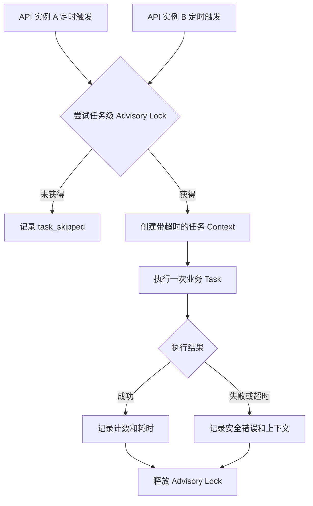

# API 进程内自动任务多实例协调设计

日期：2026-08-04

状态：已实施

实现验证日期：2026-08-04

## 1. 背景

方案提出时，API 服务启动会在每个进程内同时启动以下四类定时任务：

- 资源生命周期处理
- 内容审核自动重试
- 微信支付补偿
- 商家地图行为清理

Scheduler 使用本地 `time.Ticker`，每个 API 实例启动后立即执行一次，再按配置周期执行。实施前单实例部署逻辑可正常运行；直接扩展到多个 API 实例后，每个实例会在相近时间扫描和处理同一批数据。

现有实现已经具备部分幂等保护：

- 资源过期使用条件更新，生命周期消息有唯一索引。
- 内容审核重试查询使用 `FOR UPDATE SKIP LOCKED` 并在同一 SQL 中更新领取状态。
- 支付到账和订单关闭使用条件更新，重复处理不会覆盖已完成状态。
- 地图行为清理按时间条件执行 DELETE，重复执行不会破坏剩余数据。

这些机制保护了大部分最终数据，但不能消除重复扫描、重复第三方调用和进程中断后的恢复缺口。

## 2. 目标

本次优化需要在不部署独立 Worker 的前提下实现：

1. 多个 API 实例可以同时开启 Scheduler。
2. 同一时刻每类批处理任务只有一个实例执行。
3. 执行实例退出或数据库连接断开后，其他实例可以自动接管。
4. 任务执行具有明确超时，不无限占用数据库连接或第三方调用资源。
5. 内容审核任务领取后发生进程中断时，可以在租约到期后重新处理。
6. 支付补偿不会因多实例重复扫描而重复查询或关闭同一批微信订单。
7. 保留业务层幂等，不能把分布式锁作为唯一正确性保障。
8. 日志能够区分执行、跳过、成功、失败和超时。

## 3. 非目标

本次不包含：

- 不新增独立 Worker 二进制或 systemd 服务。
- 不引入 Redis、消息队列或第三方任务平台。
- 不建设通用工作流编排系统。
- 不改变现有四类任务的业务规则和执行周期。
- 不增加面向运营人员的任务管理页面。
- 不以任务锁替代支付、消息、审核状态流转中的数据库幂等约束。

## 4. 实施前风险

### 4.1 资源生命周期

`MarkExpiredResources` 通过状态条件更新资源，并补查缺少过期消息的历史记录。多个实例同时运行时，最终资源状态和消息数量通常正确，但会产生重复查询、重复消息插入尝试和额外日志。

### 4.2 内容审核重试

`ClaimDueResourceAuditRetries` 使用 `FOR UPDATE SKIP LOCKED` 领取记录，但领取时会立即把资源从 `audit_retry` 改为 `pending`，随后才调用微信审核接口。

如果进程在领取成功后、第三方调用完成前退出，该资源可能停留在 `pending`，且没有新的 pending 图片任务可供超时扫描识别，导致后续 Scheduler 无法再次领取。这是本次必须修复的恢复缺口。

### 4.3 支付补偿

`ListPendingPaymentOrders` 只查询 pending 订单，没有领取字段或跨实例锁。多个实例可能同时调用微信查单和关单接口。虽然本地状态更新有幂等保护，但仍可能：

- 重复消耗微信接口配额。
- 一个实例完成关单后，另一个实例收到已关闭或订单不存在响应并记录误报警。
- 同一批订单挤占后续批次处理机会。

### 4.4 地图行为清理

多个实例会对同一时间范围执行 DELETE。数据结果安全，但会重复扫描索引和竞争数据库资源。

### 4.5 调度器通用问题

- 没有跨实例运行协调。
- 没有统一任务超时。
- 没有优雅等待正在执行任务的机制。
- 锁冲突、任务跳过和执行失败没有统一结果语义。
- 没有稳定的任务名称与锁编号映射。

## 5. 方案比较

### 5.1 只允许指定实例启用任务

通过配置让一个 API 实例运行 Scheduler，其他实例关闭。

优点：实现最简单。

缺点：任务实例退出后不能自动接管；部署配置错误可能导致全部开启或全部关闭；滚动发布需要额外编排。

结论：只保留全局任务开关作为应急能力，不作为主要协调方案。

### 5.2 PostgreSQL Advisory Lock

每次任务执行前尝试获取 PostgreSQL 会话级 Advisory Lock。成功的实例执行任务，失败的实例记录跳过。连接关闭后数据库自动释放锁。

优点：不新增基础设施；改动集中；自动故障接管；适合当前四个低并发批处理任务。

缺点：任务执行期间占用一个数据库连接；连接异常导致锁释放后仍需依赖业务幂等；不能单独解决内容审核领取后的崩溃恢复。

结论：作为本次任务级协调的主方案。

### 5.3 数据库任务租约表

使用通用任务表保存 `locked_by`、`locked_until`、执行次数和最后结果。

优点：状态持久化，可观察性和租约恢复能力强。

缺点：需要维护通用任务状态机和记录清理；对于当前四个固定任务复杂度偏高。

结论：本次不建设通用任务表；只为内容审核增加业务级租约字段。未来需要后台任务监控时再增加轻量任务状态表。

## 6. 总体设计

采用两层保护：

1. 任务级 PostgreSQL Advisory Lock：避免不同 API 实例同时运行同一类批处理。
2. 业务级幂等和内容审核租约：保证锁失效、连接异常或进程崩溃时数据仍可恢复。



任务锁是减少重复执行的协调层，不是业务正确性的唯一保障。消息唯一索引、支付条件更新、审核状态条件和 DELETE 时间条件必须继续保留。

## 7. 任务协调器

### 7.1 职责

在 `backend/app/internal/task/` 增加 PostgreSQL 协调器，负责：

- 为稳定任务名称解析固定锁编号。
- 从连接池申请专用 `*sql.Conn`。
- 尝试获取会话级 Advisory Lock。
- 未获得锁时返回可识别的 skipped 结果，而不是错误。
- 获得锁后创建带超时的任务 Context。
- 执行任务函数并记录结果。
- 使用同一连接释放锁。
- 无论任务成功、失败或 panic，都执行释放和清理。

建议接口：

```go
type TaskName string

const (
    TaskResourceLifecycle       TaskName = "resource_lifecycle"
    TaskContentAuditRetry       TaskName = "content_audit_retry"
    TaskPaymentReconciliation  TaskName = "payment_reconciliation"
    TaskMerchantMapEventCleanup TaskName = "merchant_map_event_cleanup"
)

type CoordinationResult struct {
    Acquired bool
    Duration time.Duration
}

type Coordinator interface {
    RunExclusive(
        ctx context.Context,
        taskName TaskName,
        timeout time.Duration,
        run func(context.Context) error,
    ) (CoordinationResult, error)
}
```

Scheduler 保留周期控制，Coordinator 只包裹单次 `RunOnce`，不感知业务结果结构。

### 7.2 锁编号

锁编号使用代码中固定的 `int64` 常量，不使用 Go 运行时哈希：

| 任务 | 锁编号 |
|---|---:|
| `resource_lifecycle` | 1001 |
| `content_audit_retry` | 1002 |
| `payment_reconciliation` | 1003 |
| `merchant_map_event_cleanup` | 1004 |

这些编号属于当前数据库内的应用级命名空间，新增任务只能追加编号，不能修改已发布映射。

### 7.3 锁生命周期

协调器使用：

```sql
SELECT pg_try_advisory_lock($1);
SELECT pg_advisory_unlock($1);
```

必须使用同一个专用 `*sql.Conn` 获取和释放锁。不能通过普通 `db.QueryRowContext` 获取后归还连接池，否则释放操作可能落在另一条数据库连接上。

不使用 `pg_try_advisory_xact_lock`，因为任务包含微信接口调用和批量处理，不能让数据库事务覆盖整个任务运行周期。

如果释放锁失败，需要记录任务名称、锁编号和错误，但不能覆盖原始任务错误。连接关闭时 PostgreSQL 会释放该会话持有的锁。

### 7.4 数据库连接预算

四类任务使用不同锁，可以并发运行，极端情况下占用四条专用连接。当前生产模板 `MaxOpenConns: 30` 可以容纳。

每个任务必须配置超时，避免专用连接无限占用。未来降低连接池上限时，需要保证业务请求连接和任务连接都有余量。

## 8. Scheduler 调整

### 8.1 统一执行流程

每个 Scheduler 的单次执行流程调整为：

1. 检查 Scheduler 和全局任务开关是否启用。
2. 调用 Coordinator 尝试执行对应任务。
3. 未获得锁时记录 `task_skipped_lock_held`，不计为失败。
4. 获得锁后调用现有 Runner。
5. 输出统一运行结果和领域计数。

现有 Runner 和 Task 的业务接口尽量保持不变，避免把数据库锁逻辑散落到四个业务 Task 中。

### 8.2 启动和停止

启动时仍允许立即触发一次任务。多个实例同时启动时只有获得锁的实例执行，其余实例快速跳过。

Scheduler 需要提供等待能力：

```go
type Scheduler interface {
    Start(ctx context.Context)
    Wait()
}
```

最终应用退出顺序与 go-zero 的阻塞式 `Start()` 生命周期对齐：HTTP 服务停止并使 `Start()` 返回后，应用取消任务根 Context、停止产生新的 Tick、依次 `Wait()` 正在执行的任务，最后才由 `defer` 关闭数据库连接。

不能在任务仍使用数据库时提前关闭连接池。

### 8.3 配置

保留现有周期和批量配置，新增：

```yaml
Tasks:
  Enabled: true
  ResourceLifecycleTimeout: 5m
  ContentAuditRetryTimeout: 10m
  MerchantMapEventCleanupTimeout: 10m
  PaymentReconcileTimeout: 5m
```

规则：

- `Enabled: false` 用于运维紧急关闭全部自动任务，不用于常态指定主实例。
- 生产模式要求四个超时均大于零。
- 超时应大于正常单次执行时间，小于异常任务可接受的最长占用时间。
- 单次任务执行时间超过调度周期时，当前 Scheduler 不并发启动第二次运行。

## 9. 各任务执行策略

### 9.1 资源生命周期

使用任务级锁 `1001` 包裹整个 `ResourceLifecycleTask.Run`。

继续保留：

- `resources.status = 'published'` 的条件更新。
- 生命周期消息唯一索引。
- `CreateMessage` 的 `ON CONFLICT DO NOTHING`。
- 对已过期但缺少消息的数据进行补偿查询。

锁只减少重复扫描，数据库幂等仍保证异常情况下不会重复创建消息。

### 9.2 支付补偿

使用任务级锁 `1003` 包裹完整批次，确保一个批次只有一个实例调用微信查单和关单。

继续保留：

- 本地订单状态条件更新。
- 支付金额、商户订单号和业务订单 ID 校验。
- 支付到账事务幂等。
- `sql.ErrNoRows` 表示其他路径已推进状态时的幂等处理。

单个订单查询失败不能中断整个批次，继续统计到 `FailedCount`。任务级数据库错误、Coordinator 错误或 Context 超时才使本次任务整体失败。

### 9.3 地图行为清理

使用任务级锁 `1004` 包裹整个清理任务。

继续按 `created_at < cutoff` 删除。锁避免多个实例重复执行大范围 DELETE。任务超时后由 Context 取消 SQL，下一周期可重新执行相同条件。

### 9.4 内容审核重试

第一阶段使用任务级锁 `1002` 限制单实例批量处理，同时增加业务级租约解决进程中断恢复。

未来审核量超过单实例处理能力时，可以移除外层任务锁，让多个实例依靠 `FOR UPDATE SKIP LOCKED + 租约` 并行处理；该扩展不在本次范围。

## 10. 内容审核可恢复租约

### 10.1 数据字段

在 `resources` 增加：

```sql
audit_lease_until timestamptz NULL,
audit_processing_by varchar(128) NULL
```

字段含义：

- `audit_retry_at`：下一次允许开始重试的业务时间。
- `audit_lease_until`：某实例领取后的独占处理截止时间。
- `audit_processing_by`：诊断用实例标识，不参与权限或业务判断。

不复用 `audit_retry_at` 表示租约，避免“下一次重试时间”和“处理中失效时间”混为一个字段。

### 10.2 领取规则

领取条件：

```text
status = audit_retry
audit_retry_at <= now()
audit_lease_until IS NULL OR audit_lease_until <= now()
deleted_at IS NULL
```

领取 SQL 继续使用 `FOR UPDATE SKIP LOCKED`，并在同一条 SQL 中：

- 增加 `audit_retry_count`。
- 设置 `audit_lease_until = now() + lease_duration`。
- 设置 `audit_processing_by = instance_id`。
- 保持资源状态为 `audit_retry`，不提前改为普通 `pending`。

达到最大重试次数时直接转为 `manual_review`，并清空租约字段。

### 10.3 完成规则

审核通过、驳回、进入图片等待、再次延期或转人工时，都必须在对应条件更新中清空：

```text
audit_lease_until
audit_processing_by
```

处理结果：

| 结果 | 状态处理 |
|---|---|
| 文字和图片均通过 | `published` |
| 文字或图片违规 | `rejected` |
| 已创建异步图片任务 | `pending` |
| 第三方临时失败 | 保持 `audit_retry`，设置下一次 `audit_retry_at` |
| 达到最大次数 | `manual_review` |

状态更新需要校验资源仍处于当前实例持有的租约中。租约已经过期并被其他实例重新领取时，旧实例结果不能覆盖新处理结果。

### 10.4 崩溃恢复

实例领取后退出时不会执行释放操作，但资源仍保持 `audit_retry`。租约到期后，下一实例可以再次领取。

领取时增加的重试次数会保留。连续进程崩溃也会最终转人工，避免资源无限循环。转人工日志必须包含资源 ID、重试次数和最后错误。

### 10.5 租约时长

租约时长应大于单条微信内容审核的请求超时，并小于整个批次超时。建议初始值 2 分钟。

租约时长作为 Task 内部常量起步，不增加新的生产配置；如果实际运行中需要调整，再提升为配置项。

## 11. 实例标识

实例标识仅用于日志和内容审核诊断，建议格式：

```text
<hostname>:<pid>
```

要求：

- 最大长度不超过 128 字符。
- 不包含密钥、容器 Token 或用户数据。
- 同一进程生命周期内保持稳定。
- 不作为锁拥有权的唯一安全依据；真正的任务锁由 PostgreSQL 会话持有。

## 12. 超时与错误处理

### 12.1 结果分类

统一区分：

- `executed_success`
- `executed_failed`
- `skipped_lock_held`
- `timed_out`
- `coordinator_failed`

未获得锁属于正常竞争结果，不返回业务错误，不触发失败告警。

### 12.2 Context

Coordinator 在获得锁后创建任务超时 Context。所有 Model 和第三方 Gateway 必须继续使用传入 Context，禁止在 Task 内改用 `context.Background()`。

任务超时后：

- 数据库调用应取消。
- 微信请求应通过 HTTP Client Context 取消。
- Scheduler 记录超时并等待下一周期。
- 业务中间状态依靠条件更新和租约恢复。

### 12.3 Panic

Coordinator 应使用 `defer` 确保连接释放，并将 panic 记录后重新抛出或转换为进程级错误。不能静默吞掉 panic 后继续让服务处于未知状态。

### 12.4 Advisory Lock 失效边界

数据库连接异常时，会话锁可能自动释放，而当前业务函数可能尚未立即退出。因此各任务仍必须保持幂等，内容审核必须校验租约拥有者，支付必须校验订单状态和金额。

## 13. 日志与监控

最终实现由 Coordinator 统一记录协调日志，真实事件名为：

- `task_skipped_lock_held`：未获得锁，正常跳过。
- `task_coordination_completed`：Runner 成功完成。
- `task_coordination_runner_failed`：Runner 返回错误。
- `task_coordination_runner_context_done`：任务 Context 超时或取消。
- `task_coordination_unlock_failed`：释放锁失败。
- `task_coordination_connection_error`、`task_coordination_lock_error`：专用连接或加锁失败。
- `task_coordination_runner_panicked`：Runner panic，记录安全类型后继续抛出。

最终日志字段按 go-zero 项目约定使用 snake_case：

- `task`
- `instance_id`
- `lock_key`
- `duration_ms`
- `event`
- 安全错误信息和场景附加字段

早期设计语义 `task_started`、`task_succeeded`、`task_failed`、`task_timed_out` / `task_timeout`、`task_unlock_failed` 与最终事件名的映射及查询方式见[部署与运维文档](../../deployment.md)。当前代码不单独输出每轮 `task_started`，不能从 Scheduler 启用日志推断某轮已经获得锁。

不得记录数据库 DSN、微信密钥、支付私钥、用户 OpenID 或完整第三方敏感载荷。

建议初始告警：

| 任务 | 连续无成功记录阈值 |
|---|---|
| 支付补偿 | 5 分钟 |
| 内容审核重试 | 5 分钟 |
| 资源生命周期 | 2 小时 |
| 地图行为清理 | 48 小时 |

第一阶段基于日志平台配置告警，不新增任务运行历史表。

## 14. 文件影响范围

最终新增：

- `backend/app/internal/task/coordinator.go`
- `backend/app/internal/task/coordinator_test.go`
- `backend/migrations/000035_resource_audit_retry_lease.up.sql`
- `backend/migrations/000035_resource_audit_retry_lease.down.sql`

主要最终修改：

- `backend/app/app.go`
- `backend/app/internal/config/config.go`
- `backend/app/internal/config/load.go`
- `backend/app/internal/config/load_test.go`
- `backend/app/internal/config/production_validation.go`
- `backend/app/internal/config/production_validation_test.go`
- `backend/etc/app.yaml.example`
- `backend/etc/app.production.yaml.example`
- `backend/app/internal/task/*_scheduler.go`
- 对应 Scheduler 测试
- `backend/app/internal/model/resource_model.go`
- `backend/app/internal/model/resource_model_test.go`
- `backend/app/internal/logic/resource/content_audit.go`
- `backend/app/internal/logic/contentaudit/media_callback_logic.go`
- 内容审核 Logic、回调和 Task 测试
- `backend/scripts/validate_migrations.test.mjs`
- `docs/architecture.md`
- `docs/deployment.md`
- `docs/superpowers/specs/2026-08-04-multi-instance-scheduled-tasks-design.md`

## 15. 测试设计

### 15.1 Coordinator 单元测试

- 获得锁时执行一次回调并释放锁。
- 未获得锁时不执行回调，返回 skipped。
- 回调失败仍释放锁。
- Context 超时后释放连接。
- 获取锁失败返回协调错误。
- 释放锁失败保留原始任务错误并记录附加错误。
- 未知任务名拒绝执行，避免锁编号默认为零。

### 15.2 双实例 PostgreSQL 集成测试

使用两个独立数据库连接模拟两个 API 实例：

- 同一任务锁只有一个实例获得。
- 不同任务锁可以并行获得。
- 持锁连接关闭后另一个实例可以获得同一锁。

纯 SQL Mock 不能证明 Advisory Lock 的连接级语义，该部分需要真实临时 PostgreSQL。

### 15.3 Scheduler 测试

- 全局任务关闭时不尝试获取锁。
- 锁被占用时记录跳过，不调用 Runner。
- 获得锁时传递正确超时和任务名称。
- 取消根 Context 后不再触发新任务。
- `Wait` 等待正在执行任务退出。

### 15.4 内容审核租约测试

- 领取后状态仍为 `audit_retry`，并写入租约与实例 ID。
- 有效租约不能被第二实例领取。
- 过期租约可以重新领取。
- 达到最大次数转人工并清空租约。
- 成功、驳回、异步图片等待和再次重试都会清空租约。
- 旧实例在租约过期并被重新领取后不能覆盖新结果。
- 模拟领取后进程退出，租约到期后能够恢复。

### 15.5 现有幂等回归

- 生命周期任务并发执行仍只创建一条对应消息。
- 支付重复通知和补偿仍只到账一次。
- 已关闭支付订单的重复关闭视为幂等结果。
- 地图清理重复执行不删除保留期内数据。

## 16. 发布与回滚

### 16.1 发布顺序

1. 在临时 PostgreSQL 完整验证 000035 up/down。
2. 部署包含新字段和兼容读取的应用版本。
3. 所有实例保持 `Tasks.Enabled: true`，观察锁竞争日志。
4. 验证同一周期只有一个实例输出 `task_coordination_completed`、`task_coordination_runner_failed` 或 `task_coordination_runner_context_done` 终态。
5. 验证其他实例输出 `task_skipped_lock_held`。
6. 人工构造一条审核租约过期记录，确认能够重新领取。
7. 观察支付查单量和任务耗时。

数据库迁移必须先于依赖新字段的应用逻辑生效。部署脚本当前先迁移后重启，符合该顺序。

### 16.2 紧急降级

如果协调器或任务逻辑出现异常：

1. 将 `Tasks.Enabled` 设置为 `false` 并滚动重启，暂停全部自动任务。
2. 保留支付回调、内容审核回调和普通 API 服务。
3. 修复后重新开启任务；幂等和租约机制负责补偿积压数据。

不要通过删除数据库锁记录恢复，因为 Advisory Lock 没有业务表记录。需要解除异常持锁时，应先定位持锁数据库会话并安全终止对应应用实例或连接。

### 16.3 回滚

应用回滚到旧版本前必须先关闭所有自动任务，避免旧版本把带租约的 `audit_retry` 记录提前改成 `pending`。确认没有有效审核租约后再回滚应用。

新增租约字段允许为空，应用回滚确认安全后可以保留字段；不要求立即执行 down 迁移。

## 17. 验收标准

实现完成后必须满足：

1. 两个 API 实例同时触发同一任务时，只有一个实例执行 Runner。
2. 持锁实例退出后，另一实例能在下一周期接管。
3. 不同任务可以并行运行。
4. 支付 pending 订单在同一周期只被一个实例查询。
5. 内容审核领取后模拟进程中断，租约到期后可以重新处理。
6. 旧实例不能用过期租约覆盖新实例处理结果。
7. 资源生命周期消息不重复。
8. 任务超时会取消执行并释放专用数据库连接。
9. 任务跳过不作为错误告警。
10. `make check` 全部通过，并完成真实 PostgreSQL 锁与迁移验证。

## 18. 后续扩展条件

出现以下任一情况时，再评估独立 Worker 或通用任务表：

- 内容审核单实例批量处理持续跟不上新增量。
- 自动任务明显抢占 API 请求连接或 CPU。
- 任务类型从四个增长到十个以上。
- 需要人工重跑、暂停单个任务、查看历史运行记录。
- 需要按优先级、延迟队列或事件驱动处理。
- API 服务扩展到多个地域或多个数据库集群。

在这些条件出现前，API 进程内 Scheduler、PostgreSQL Advisory Lock 和业务租约能够以较低复杂度满足当前多实例需求。

## 19. 最终代码入口

截至 2026-08-04，方案已落到以下入口：

- API 装配、全局开关、四个 Scheduler 启停：[`backend/app/app.go`](../../../backend/app/app.go)
- 固定任务名、锁号、专用连接、超时和协调日志：[`backend/app/internal/task/coordinator.go`](../../../backend/app/internal/task/coordinator.go)
- 串行触发和等待：[`backend/app/internal/task/scheduler_runtime.go`](../../../backend/app/internal/task/scheduler_runtime.go)
- 四类 Scheduler / Runner：[`backend/app/internal/task/`](../../../backend/app/internal/task/)
- 配置加载与生产校验：[`backend/app/internal/config/`](../../../backend/app/internal/config/)
- 生产配置模板：[`backend/etc/app.production.yaml.example`](../../../backend/etc/app.production.yaml.example)
- 内容审核租约迁移：[`backend/migrations/000035_resource_audit_retry_lease.up.sql`](../../../backend/migrations/000035_resource_audit_retry_lease.up.sql)
- 审核租约领取与 guard 条件更新：[`backend/app/internal/model/resource_model.go`](../../../backend/app/internal/model/resource_model.go)
- 审核重试任务与领域日志：[`backend/app/internal/task/content_audit_retry_task.go`](../../../backend/app/internal/task/content_audit_retry_task.go)
- 最终架构与运维说明：[`docs/architecture.md`](../../architecture.md)、[`docs/deployment.md`](../../deployment.md)

## 20. 实现差异

实施中对早期设计作了以下经过测试约束的微调：

1. `CoordinationResult` 最终只保留 `Acquired` 和 `Duration`，执行成功、失败、超时继续通过 Go `error` 与 Context 语义表达，没有新增 `executed_success` 等枚举。Scheduler 测试约束了固定任务名和超时透传，Coordinator 测试覆盖成功、跳过、错误和超时。
2. 为避免 Scheduler 与 Coordinator 对同一错误重复记录，最终结构化事件采用 `task_coordination_*` 命名，并由 Coordinator 输出一次终态日志；仅锁竞争沿用 `task_skipped_lock_held`。早期 `task_started` 没有单独落地，`task_succeeded`、`task_failed`、`task_timeout`、`task_unlock_failed` 的实际映射见第 13 节和运维文档。
3. 日志字段从早期 camelCase 调整为项目统一的 snake_case：`task`、`instance_id`、`lock_key`、`duration_ms`。领域计数仍由各 Scheduler 的中文完成日志输出，不复制进 Coordinator 的通用结果结构。
4. 解锁查询报错时，最终实现不仅记录 `task_coordination_unlock_failed`，还通过 `driver.ErrBadConn` 丢弃锁状态未知的物理连接，避免带锁连接回池后因 Advisory Lock 可重入而长期阻塞；测试同时约束解锁失败不能覆盖原 Runner 错误。
5. Runner panic 最终只记录 `panic_type` 并继续抛出，不记录可能包含密钥或业务数据的 panic 原值；栈展开仍执行解锁。相关测试约束敏感 panic 原值不得进入日志。
6. 原设计预计更新 `docs/product/technical-architecture.md` 与 `docs/product/deployment-config.md`，最终实施计划将交付入口收敛为根目录下的 `docs/architecture.md` 和 `docs/deployment.md`，用于集中说明本次多实例任务架构与运维手册。
